# Structure Without Reading

What the Barthel transliteration of the rongorongo corpus shows about its texts when you look for structure and refuse to guess at meaning. Started from the verso of the Keiti tablet.

| | |
|---|---|
| Corpus | 26 objects, 301 lines, 11,216 units |
| Source | CEIPP numerical transliteration, kohaumotu.org |
| Tracings | Thomas Barthel, 1958, via Wikimedia Commons |
| Status | Working report, September 2026 |


*The verso of the Keiti tablet, eight lines, Ev1 at the top. Photographed in Papeete in the early 1880s, some thirty years before the tablet was destroyed at Louvain in 1914; this print has the glyphs filled white for legibility. Public domain, via Wikimedia Commons.*

## What rongorongo is

Rongorongo is the script of Easter Island, or Rapa Nui, the Chilean island in the south-east Pacific some 3,500 kilometres from the South American coast and about as far from the nearest inhabited land in Polynesia. It survives on about two dozen wooden objects, mostly tablets, plus a staff, two breast ornaments, and a figurine, holding around 14,000 glyphs in all. The glyphs are carved in lines that alternate direction and orientation: a reader finishes one line, turns the tablet through a half turn, and reads the next. Barthel's catalogue of 1958 numbers the signs, and depending on how variants and compounds are counted the inventory runs from about fifty basic elements to several hundred. Eight of the commonest signs, in Barthel's numbering, as he drew them:


Europeans first recorded the script in 1864, and within a decade the islanders who might have been able to read it were gone, lost to slave raids by Peruvian ships in 1862 and the epidemics that followed. Islanders who chanted "readings" for missionaries in the 1870s and 1880s were reciting, not reading, and their chants match no tablet sign for sign. Whether rongorongo is true writing, a mnemonic aid for recitations, or something in between remains open, and no decipherment has won acceptance. The Keiti tablet in the photograph above, collected in 1870 and sent to Belgium, burned with the library of Louvain in 1914 and is known only from photographs, rubbings, and a tracing.

## About this project

I am Piotr Rochala, a software engineer from Poland with a long-standing fascination for ancient cultures and the scripts they left behind. I am not a linguist, an archaeologist, or a Pacific specialist, and this repository makes no claim to a decipherment. What it offers is the thing a software engineer can bring to a hundred-year-old problem: a reproducible pipeline over the published data, with every measurement scripted, every result paired with a control or a null, and every caveat stated where the number is. The corpus and the sign catalogue are Barthel's and the CEIPP's; the tracings are Barthel's; the Rapa Nui text is Thomson's. My contribution is the questions, the code, and the discipline of not guessing at meaning.

The work started with a single photograph of the Keiti tablet and the question of what could be said about it without reading it. It grew into the analyses below. Where a result is likely already known to specialists I say so; where I think it may be new I say that too, and I would be glad to be corrected on either. Issues and pull requests are welcome, and so is a message from anyone who works on this material.

Rongorongo is undeciphered and this report does not change that. It records nine structural results obtained by scripting over the published numerical transliteration and Barthel's sign catalogue, each with its evidence and its caveat, so that they can be checked against the literature and built on. Every result is reproducible from the scripts in this repository.

## What we found, in plain English

**What the texts are.**

- **Some tablets are copies of one another.** Three large tablets in Santiago and St Petersburg carry the same two texts, and a small London tablet is a shortened copy of a Santiago one. Most of the rest, Keiti included, share almost nothing with any other tablet, though the back of Keiti has two short passages that also appear elsewhere. Sections 2 and 3.
- **The corpus sorts into five kinds of text.** Copied texts in two families, delimited lists, the two triadic texts, three texts with their own refrains, and a dozen sides that match nothing. The dozen turned out to be ordinary texts in the common idiom that were never copied, not a hidden genre; Tahua, the largest tablet, is the most alternation-heavy of all. Sections 19 and 26.
- **Several tablets contain lists.** One sign behaves like a comma, separating short groups of one to five signs. Most groups occur only once, the way names do in a register. Section 4.
- **The Santiago Staff is built of three-sign groups,** each marked by one attached sign, and the carver's own dividing marks respect those groups. But the groups do not behave like the entries of a family tree, which is what one scholar claimed they were. They look more like the lines of a long chant. Sections 14 to 16.
- **The Mamari calendar rebuilds itself from the transcription,** eight marker groups around 28 crescents, near a month's length. Its two longest runs match the two stretches of the month that share a name, but its markers do not fall where the named phases change. Section 21.
- **Lines were physical units, not units of text,** on every object, and no text anywhere repeats at a fixed verse-like interval. Section 26.

**How the script is put together.**

- **There are too many signs for a sound-based script.** An alphabet or syllabary needs a few dozen signs, all used often. Barthel's catalogue has hundreds, most of them rare. Merging signs that look alike trims the count by a quarter, and testing whether the rare signs are built from the common ones finds no support. Sections 8, 9 and 12.
- **Whole glyphs are nothing like syllables, and not quite like words.** Counting each compound glyph as one item gives two thousand kinds, most seen once, where a syllabary gives forty-five. Checked against Māori and Tahitian texts cut to the corpus's exact size, the glyphs are more varied than the words of a running text and lack the handful of very common words every language leans on. Main signs match words in number of kinds. The picture is a vocabulary of content words with the grammar left out or carried by the attached marks. Sections 8, 10 and 13.
- **The small attached marks behave like a grammar.** They are not ordinary signs that happen to be fused: their frequencies have the shape of a language's class of grammatical particles, they occur as often per glyph as Rapa Nui uses a particle per word, and copyists changed them freely while keeping the main signs. Sections 6, 7 and 24.
- **The plain strokes are not grammatical endings.** They attach to anything and follow anything. But when several strokes stand together they keep a fixed order, the way digits do. Section 6.
- **Signs keep company.** The same sign is often doubled, and certain pairs travel together across tablets, which is what words and phrases do and random marks do not. Section 11.
- **Against real Rapa Nui,** recorded in 1886 and 1940, glyphs are shorter than words, and the script leaves out the small grammatical words or carries them in the attached marks. Section 13.
- **These conclusions do not depend on which sign list is right.** Recomputed under six different inventories, the families, the sign count, the entropy, the collocations and the Staff's triads barely move. Section 20.

**What the witnesses and the tools can and cannot do.**

- **The islander who chanted over the tablets in 1873 was not reading them,** but he did give each sign shape the same name almost every time, so his chant is a usable record of which signs he saw as the same, and merging the sign pairs his words propose makes more text align between tablets than merging random pairs does. A second islander, reciting over the same tablet thirteen years later, produced words with no relation to his. Sections 17, 18 and 22.
- **A computer cannot crack it, and we can say why.** The method that decoded an ancient script against a related language was tried on the commonest signs against Rapa Nui. It fails its own test: given a real Rapa Nui text disguised as signs, it cannot recover the text. Giving it Rapa Nui's relatives to learn from, three million syllables of Māori and Tahitian scripture, helps a little and not enough. The limit is the text itself: on a known Māori text the search needs about eight thousand syllables to succeed, and the tablets offer a third of that among their frequent signs. No statistical assignment of the frequent signs to syllables can be verified with the text that exists, ours or anyone's. Section 23.
- **The drawings have been checked against the wood.** Ten thousand glyphs cut from Barthel's tracings show carvers narrowing their glyphs toward the ends of lines, as if fitting a fixed text. The tracings were then registered to the retouched photographs, line by line, and the same measurement on the photographs agrees: the narrowing is the carver's, and Barthel's proportions are faithful. Whose hand carved what is still open, and the report now says why: the shape matcher cannot see stroke weight, and in a retouched print the stroke is the retoucher's. Sections 9 and 25.

Nothing here says what any sign means. What it says is what kind of thing the texts are and how they are put together, which is the ground a real decipherment would have to stand on.

**The same, in the report's own terms.** The corpus divides into three families of copied texts, a set of 380.1-delimited lists whose entries are mostly unique and word-length, two sign-76 triadic texts, three texts with internal refrains, and a residue of isolated sides that are ordinary compositions in the common vocabulary. Keiti's verso is isolated but borrows two list entries from the Small Santiago tablet and one eight-sign formula shared by three tablets. Alternating series are two devices, not one. The free-standing stroke signs fail a host-selectivity test for suffixes but chain in a fixed order; the affix-like behaviour lives in the fused components, whose frequency profile and density match the Rapa Nui particle class and which copyists varied freely while keeping head signs. Counted by head sign the inventory is far too large for a syllabary under every candidate merge; counted by whole compound unit it has the statistics of words; shape-based merging and template decomposition cannot bring it near a syllabary, and stroke-based descriptors do no better than pixels on Barthel's variant pairs. The Staff's triads survive a shuffled null and its carved dividers respect them, but the triads neither chain nor repeat parents nor keep separate slot vocabularies. Metoro named sign shapes consistently against a shuffled null and Ure Vaeiko's recitation for the same tablet bears no relation to his. A one-to-one syllabic assignment search fails its positive control on a Rapa Nui model of six thousand syllables. Glyph instances from the tracings narrow along lines and show no carver's hand, since the hand is Barthel's.

## Where each question stands

| Question | Standing | Where |
|---|---|---|
| Which texts are copies of which? | Answered: three families, confirmed under every inventory | 2, 20 |
| What are the 380.1 lists? | Characterised: word-length entries, mostly unique, partly shared between G, K and Keiti | 4, 18 |
| Are the plain strokes suffixes? | Answered no; they chain in a fixed order | 6, 20 |
| Are the attached marks a grammatical layer? | Supported: particle-like profile and density, varied freely by copyists | 7, 24 |
| Is the script a syllabary? | Answered no by head-sign count, under every merge tried | 8, 9, 12, 20 |
| Are whole glyphs words? | Not syllables, by a wide margin at matched size; more varied than running-text words, with no function-word head; head signs match words in type count | 8, 13 |
| Is the Staff a genealogy? | Triads real; genealogical reading unsupported by sequence | 14, 15, 16 |
| Is the Mamari calendar a lunar month? | Structure reproduced; count 28 against 30 names; markers not phase boundaries | 21 |
| Was Metoro reading? | No, but consistent; a second reciter contradicts him | 17, 22 |
| Can the frequent signs be assigned syllables statistically? | Bounded: not with the text that exists, under any language model; the search needs three times more text than the tablets give | 23 |
| Are the twelve isolated sides a hidden genre? | Answered no | 26 |
| Whose hand carved which tablet? | Open; the prints are now registered and cut, but the shape matcher is blind to stroke weight and the retouched prints carry the retoucher's stroke | 25 |
| What does any sign mean? | Open, and not addressed | |

## How to read this report

Each section opens with a paragraph in italics that says in plain words what was asked and how. The rest of the section gives the evidence. A few terms recur throughout:

- **Signs and their numbers.** Thomas Barthel numbered every glyph in 1958, and specialists refer to signs by those numbers. Sign 600 is a frigatebird, 700 a fish, 200 a seated figure, 1 a plain stroke. The numbers are labels, not meanings.
- **Units, heads, and attachments.** Scribes often fused two or more signs into one glyph. Barthel writes such a compound with dots, 380.1 for sign 380 with stroke 1 attached. In this report the whole compound is a *unit*, its first sign is the *head*, and the rest are *attachments*. Most comparisons use heads only, so that a sign written with or without a small extra mark still counts as the same sign.
- **Line names.** Each object has a letter and each line a number: Ev4 is the fourth line on the verso of tablet E, Keiti; Gr5 is line 5 on the recto of G, Small Santiago.
- **One witness per family.** Three tablets copy each other and a fourth copies a fifth. Where counting would otherwise count the same text several times, the copies are dropped.
- **Nulls and p values.** Many results are compared with a *null*: the same measurement on the data with its order shuffled, or with a sign placed at random, repeated hundreds of times. If the real text scores no better than the shuffled versions, the pattern is chance. The p value is the share of shuffles that scored at least as high as the real text; a p of 0.02 means two shuffles in a hundred did.

## Contents

1. [Keiti's verso against Barthel](#1-keitis-verso-against-barthel)
2. [Parallel passages and families](#2-parallel-passages-and-families)
3. [Two plates: what Keiti shares](#3-two-plates-what-keiti-shares)
4. [The 380.1 lists](#4-the-3801-lists)
5. [Alternating series](#5-alternating-series)
6. [The affix test](#6-the-affix-test)
7. [Allographs and how copies differ](#7-allographs-and-how-copies-differ)
8. [The inventory](#8-the-inventory)
9. [Shape similarity of the signs](#9-shape-similarity-of-the-signs)
10. [Genre by vocabulary, and entropy](#10-genre-by-vocabulary-and-entropy)
11. [A collocation lexicon](#11-a-collocation-lexicon)
12. [Compound decomposition](#12-compound-decomposition)
13. [Units against Rapa Nui words](#13-units-against-rapa-nui-words)
14. [The list format against the creation chant](#14-the-list-format-against-the-creation-chant)
15. [Do the triads chain?](#15-do-the-triads-chain)
16. [The carved dividers](#16-the-carved-dividers)
17. [Metoro's readings](#17-metoros-readings)
18. [Three witnesses for merging signs](#18-three-witnesses-for-merging-signs)
19. [A catalogue of texts and signs](#19-a-catalogue-of-texts-and-signs)
20. [Which findings survive a change of inventory](#20-which-findings-survive-a-change-of-inventory)
21. [The Mamari calendar, rebuilt](#21-the-mamari-calendar-rebuilt)
22. [Two islanders on one tablet](#22-two-islanders-on-one-tablet)
23. [A decipherment attempt, and why it cannot work yet](#23-a-decipherment-attempt-and-why-it-cannot-work-yet)
24. [Attachments as particles](#24-attachments-as-particles)
25. [The glyphs as carved](#25-the-glyphs-as-carved)
26. [The untyped sides](#26-the-untyped-sides)
27. [Charts](#27-charts)
28. [What it means and what it does not](#28-what-it-means-and-what-it-does-not)
29. [Method, data, reproducibility](#29-method-data-reproducibility)

## 1. Keiti's verso against Barthel

*In plain words: before analysing anything, we checked that the photograph, the standard drawing, and the sign-by-sign transcription all agree on which line is which and where the damage is. Everything after this rests on the transcription, not on our reading of the photograph.*

Tablet E, Keiti, was destroyed in the burning of Louvain in 1914 and survives as photographs, rubbings, and Barthel's 1958 tracing. The photograph that started this work shows the verso, eight lines, Ev1 at the top. Alignment with Barthel's tracing and with the CEIPP transliteration confirmed the orientation from the opening signs of Ev1, and confirmed that the three signs Barthel marked illegible on the verso all fall on Ev1, where the photograph shows holes.

A first reading from the photograph alone got the glyph classes right and the specifics mostly wrong, which is the expected result at roughly 30 pixels per glyph. Everything below rests on the transliteration, not on the photograph.

Three features of the verso set the agenda for the rest of the report: the compound 380.1 occurs 22 times across Ev2 to Ev5 and never twice in a row; Ev7 holds two alternating series, sign 35 five times and sign 92 eight times; and the recto's last line joins the verso's first through a sequence shared with other tablets, which Pozdniakov used to confirm Barthel's line order.

## 2. Parallel passages and families

*In plain words: we looked for stretches of text that appear on more than one tablet, the way you would spot a paragraph copied between two documents. A stretch counts when at least five signs in a row match, or four with one allowed to differ. Tablets that share many such stretches are copies of one another; we call those groups families.*

The whole corpus was searched for runs of signs that occur in two places, whether on two different objects or twice on one. A run is extended as far as the two places keep matching, so each is the longest shared stretch at that spot. Only the head sign of each unit is compared, so a sign written with an extra attached mark in one copy still matches. Two settings were run: strict, five or more signs with no difference allowed, and fuzzy, four or more signs with one substitution allowed inside the run.

| Setting | Shared runs | Families | Hr and Qr, covered signs | Share of Qr with a parallel | Share of Keiti verso |
|---|---|---|---|---|---|
| Strict, 5+ exact | 134 | 3 | 162 | 47% | 4% |
| Fuzzy, 4+ with one substitution | 248 | 3 | 210 | 61% | 7% |

The same three families come out under both settings: the rectos of the Great Santiago, Great St Petersburg, and Small St Petersburg tablets; the versos of the same three; and the Small Santiago recto with the Small London tablet, which the fuzzy setting extends to London's verso. Recto and verso families never cross, so H, P, and Q each carry two texts copied as a set. The longest single shared run is 15 signs between Hr3 and Qr3.

Everything else is nearly isolated. Tahua, Aruku Kurenga, Mamari, the Santiago Staff, and Keiti's recto share no run of five with any other object, and under the fuzzy setting their coverage stays below five percent. Keiti's recto instead has a strong internal refrain, the run 40, 40, 300.28, 4.430, 22, 203, which recurs on Er1, Er2, Er3, and Er6. Mamari's internal repeats on Ca7 and Ca8 are its calendar section.

> **Caveat.** These families are known to specialists; Pozdniakov and Horley catalogued the H, P, Q group and the G, K relation by hand alignment. Rediscovering them from scratch is a check on the data and method, not a new result. The isolation of the other texts holds only at the granularity tested; looser alignments may connect them.

## 3. Two plates: what Keiti shares

*In plain words: these are the two passages the Keiti tablet shares with other tablets, shown in the drawings so the match can be seen with the eye and not just counted.*

Keiti's verso has two external parallels of substance, both verified against Barthel's drawings glyph for glyph.

### Ev4 and Gr5: two consecutive list entries

Ev4 opens with two entries separated by the 380.1 delimiter: an oval, a stroke, a forked sign, a stroke; then the turtle sign 280 twice, each followed by a stroke. Gr5, on the Small Santiago tablet, carries the same two entries in the same order as its fourth and fifth of six, with the delimiter written 380.1.3. The Small Santiago version adds sign 521 after each turtle's stroke and a third turtle; Keiti stacks sign 61 onto the last stroke of the first entry.

The signs involved, from Barthel's catalogue:


Gr5 from unit 16, Barthel's tracing:


`380.1.3 · 88 · 1 · 47 · 1 · 380.1.3 · 280 · 1 · 521 · 280 · 1 · 521 · 1 · 22.61 · 280 · 380.1.3 · 1`

Ev4 from unit 1, Barthel's tracing:


`380.1 · 88 · 1 · 47 · 1.61 · 380.1 · 280 · 1 · 280 · 2 · 1 · 380.1 …`

The two full lines, for context. Gr5:


Ev4:


Entry by entry, with `|` marking the delimiter:

```
Gr5  62x.7 1 | 216s 20 7 320.70 600 | 290.20 79 280 2 280 30a | 88 1 47 1    | 280 1 521 280 1 521 1 22.61 280 | 1
Ev4                                                            | 88 1 47 1.61 | 280 1 280 2 1                   | 1f 57 1 1f 163 200 1.62 522fy | 607 607 650y | 200.70.3 | 376s 1 1V | 405s 522f 405s 22f 10.700 10.53 430 430 407 405 407
```

### Ev6, Hv12, Ra5: an eight-sign formula on three tablets

The run 27, 77, 34, 4, 522, 700, 600, 59 appears on Keiti, on the last line of the Great Santiago verso, and on the fifth line of the Small Washington tablet, three objects in three countries. Fish 700 is followed by frigatebird 600 every time, so the pair is a slot in a formula, not a description of animals. Keiti writes the first four signs as two ligatures, 27.6 and 77.34, where the others write them separately. What precedes the run differs on each tablet, so it is a reusable unit placed in different surroundings.

The eight signs of the run, from Barthel's catalogue:


Ev6:


`244s · 27.6 · 77.34 · 4 · 522fy · 700 · 600 · 59f · 324 · 4.4`

Hv12:


`254.71 · 27 · 77 · 34 · 4 · 522y · 700 · 600 · 59f · 220.4.64 · 220.132`

Ra5. The Commons tracing of tablet R is small and the enlargement blurred:


`illegible · 27? · 77? · 34 · 4 · 522 · 700 · 600 · 59f · 4.64 · 6:700`

```
Ev6   244s      | 27.6  77.34   4  522fy  700  600  59f | 324        4.4
Hv12  254.71    | 27    77  34  4  522y   700  600  59f | 220.4.64   220.132
Ra5   illegible | 27?   77? 34  4  522    700  600  59f | 4.64       6:700
```

## 4. The 380.1 lists

*In plain words: on several tablets one particular sign turns up again and again, always separating short groups of one to five signs, the way commas separate items in a list. We cut the text at that sign and looked at what lies between the cuts, and whether the same items appear on more than one tablet.*

The compound 380.1, a seated figure with an attached stroke, is a list delimiter on six tablets: Small Santiago 30 occurrences, Keiti 22, Small London 22, Mamari 20, Small Vienna 7, Great Washington 4. Cutting every stretch between two consecutive delimiters gives 93 entries.


*Sign 380 and stroke 1 as Barthel drew them separately. On the tablets the stroke is fused to the figure, written 380.1; Small Santiago and Small London add sign 3, Small Vienna adds 52:*


| Measure | Value | Reading |
|---|---|---|
| Entries of 1 to 5 units | 82 of 93 | Word or name length |
| Entries repeated exactly on another tablet | 6 clusters, all G and K | London copies Santiago in order, differing only in ligatures |
| Entries in a family sharing a sign pair | 31, in 12 families | Keiti's only cross-tablet matches are with Small Santiago |
| Unique entries | 62 | Two thirds of content is not shared anywhere |
| Entries ending in stroke 1 | 16 | Commonest final sign; strokes fall last more often than first |
| Mamari Ca3 entries opening with sign 22 | all | A list built as "22 plus item", a different shape from Keiti's |

The format is formulaic and the content mostly is not. That is what lists of distinct names or items look like, a genealogy for example, rather than a liturgy repeated across tablets. Keiti's borrowed entries from Small Santiago are a fragment inside an otherwise unique list, which strengthens the reading of those entries as fixed items.

## 5. Alternating series

*In plain words: sometimes one sign repeats with a single different sign between each repeat, in the pattern A x A y A z. We found every such run in the corpus and asked what the in-between signs are. It turns out there are two kinds: runs where the in-between signs are simple strokes, and runs where they are complex signs that look like list items.*

A series is a run X a X b X c with the same head sign at every second position and one unit between. With at least three heads, and bare strokes excluded as heads, the corpus holds 61 such series on 14 objects. Classifying by what fills the gaps splits them into two devices.

| Kind | Series | Fillers | Examples |
|---|---|---|---|
| Affix-like | 35 | Simple signs below 100, mostly strokes | Fish 700 on H with 20, 1, 90. Fish 710 on Q with 20, 1, 90. Sign 92 on Keiti with 1, 9, 5, 22, 90. Sign 62.6 on H and P with a stroke six times. |
| List-like | 26 | Complex signs, each rare in the corpus | The 380.1 lists. The hand 73.6 on G and K with 206, 200, 222, 451, identical on both tablets. Sign 22 on Tahua with five 500-series figures. |

The affix-like fillers form a small shared set. Stroke 1 follows ten different head signs on eight objects; signs 20 and 90 each follow four heads and are five and three times more frequent in these slots than in the corpus overall. The H and Q fish series share their fillers because H and Q copy each other, so Keiti's Ev7 is the only independent witness to the set.

Head signs of the series named above, then the fish 710 with two of its fillers:


## 6. The affix test

*In plain words: the simplest signs, single strokes, are so common that they might be grammatical endings, like the -s and -ed of English. An ending is fussy about what it attaches to and indifferent to what comes after. We measured that fussiness for each stroke, with ordinary picture signs as a comparison, and also checked whether strokes standing next to each other keep a fixed order.*

If the small signs are suffixes they should select their host on one side and be indifferent on the other. For each candidate the distribution of the sign before it and after it was compared with the corpus background by Kullback-Leibler divergence in bits, with contexts on the copying tablets down-weighted so a passage counts once. Content signs served as controls.

The candidates, the simple signs below 100:


The controls:


| Sign | Left choosiness | Right choosiness | Difference | Distinct left neighbours |
|---|---|---|---|---|
| 1 | 0.98 | 1.18 | -0.19 | 127 |
| 2 | 0.90 | 0.98 | -0.08 | 119 |
| 4 | 1.91 | 1.68 | +0.22 | 86 |
| 20 | 2.61 | 2.57 | +0.04 | 38 |
| 90 | 2.23 | 2.55 | -0.32 | 43 |
| fish 700, control | 1.27 | 1.36 | -0.09 | 81 |
| frigatebird 600, control | 1.19 | 1.16 | +0.03 | 99 |

**The free-standing strokes fail.** No candidate shows the one-sided pattern. Strokes 1 and 2 are the least choosy signs in the corpus on both sides, which is how a very common syllable or a general particle behaves, not a host-selective affix. Signs 20 and 90 are choosy toward specific partners, the fish signs and sign 80, which is the alternating passages again rather than a general rule.

**Two things survive.** When strokes stand side by side their order is fixed: 2 before 1 in 18 cases against 8, 4 before 2 in 17 against 7, 1 before 9 in 10 against none, 2 before 3 in 5 against none. That gives a chain 4, 2, 1, 9, which is what affix chains and numeral systems both produce. Section 20 shows the 2-before-1 preference holds under every candidate inventory, while the 4-before-2 preference weakens to 1.8 to 1 if signs 4 and 22 are merged, as two witnesses in section 18 suggest they should be. And the fused components are host-selective in exactly the way free strokes are not: sign 3 is bound in 404 of 433 occurrences, sign 9 in 142 of 194, and bound stroke 1 attaches to sign 380 in 107 of 430 cases. If anything here is an affix, it is the small sign fused into a larger one.

## 7. Allographs and how copies differ

*In plain words: when the same passage exists on two tablets, the places where the two copies differ show which signs the scribes treated as interchangeable, like two spellings of one word. We collected those differences and asked whether merging such signs changes any earlier result.*

The fuzzy parallel runs align copies with one sign swapped. Each swap is a pair of signs in the same slot of the same passage, and recurring pairs are candidate allographs, variant spellings of one sign. This is the mechanism by which Pozdniakov reduced Barthel's inventory.

The layer is thin. The runs contain 48 substitutions in 42 distinct pairs; only three recur in separate passages, 8 with 551, 316 with 356, and 400 with 430, and 17 one-off pairs sit in the same Barthel series and are plausible look-alikes. Merging was tested by rerunning the strict parallel map: the three recurring pairs raise shared runs from 134 to 145; adding the 17 look-alikes raises them to 165 and lifts Great Santiago's covered share from 42 to 46 percent. The families do not change and no isolated text connects to anything.

**Copies vary in attachments, not in head signs.** Scribes kept the main sign and changed what was fused to it. Sign 22 stands bare on one tablet and carries 380 on another eight times; sign 200 carries 50 in one copy and 132 in the other six times. Components 10, 50, 132, 380, 1, and 430 come and go most. Barthel's compound notation is recording a layer that copyists treated as optional.


*Sign 22, which one copy writes bare and another with 380 attached; sign 200, which carries 50 in one copy and 132 in the other.*

> **Caveat.** Copied passages are too few and too faithful for empirical allograph reduction to reach anywhere near 52 signs. Pozdniakov's reduction rests mainly on visual similarity, which section 9 tests directly.

### Rare signs against the common sign of their series

*In plain words: the hand pass over the boxes keeps finding carved glyphs that look the same but carry two different catalogue numbers from the same family of shapes. Are the rare numbers just variants of the common one? Where two tablets copy one text this can be read off the copies, but most signs never appear in a copy. So the whole corpus was asked instead: does a rare sign keep the same company as the common sign it is drawn like? The answer is that the corpus is too small to tell.*

Barthel numbers his signs in series, the 600s birds, the 200s and 300s human figures, and splits each by details of the drawing. The hand pass (`data/boxes/notes.md`) found 607 and 650y carved alike on Keiti's verso, and 680 and 684 likewise. A context test was run for every rare sign, 2 to 12 occurrences with one witness per family, that has a common series-mate of 20 or more: how well the common sign's left and right neighbours predict the rare sign's, ranked among all 104 common signs. A variant should rank its own sign first.

| | |
|---|---|
| Rare signs tested | 315 |
| Series-mate ranked in the top three | 81 |
| Expected with series labels shuffled among the common signs | 91, with 81 or more in 84 percent of 2,000 shuffles |
| Positive control, the two pairs that copies substitute | ranks 1 and 8 |
| 650 against 607 | rank 5 of 104; print glyphs as alike as 607s are to each other, 0.21 against 0.20 |
| 684 against 680 | rank 47 of 104; catalogue drawings alike at 0.59, print glyphs 0.20 against 0.23 within 680 |

- **Context cannot identify a rare sign.** With two to twelve occurrences a sign has four to twenty-four neighbours, and that is not enough to pick its own sign out of a hundred: the series-mates rank in the top three no more often than shuffled labels do. The positive control has only two pairs and cannot rescue the test. This is the same wall as section 23's, met from the other side: the corpus is too short to tell rare signs apart by the company they keep.
- **What is left is shape, and it needs more hand boxes.** On the prints 650y is as similar to the 607s as they are to one another, which is consistent with a variant but proves nothing at two instances against fifteen at this resolution. The pairs stay in the log as candidates. The way to settle them is the one the editor now allows: boxes drawn by hand on the prints of the sides where the pairs occur, and a shape comparison at the print's resolution rather than the catalogue's.

## 8. The inventory

*In plain words: how many different signs are there, and how is the text spread across them? A system that spells sounds, like an alphabet or a syllabary, needs few signs, all used often. A system that draws words needs many signs, most of them rare. We counted three ways: main signs alone, attached marks alone, and whole compounds.*

Three inventories were counted with one witness per family, so copies do not inflate the numbers: head signs, the first component of every unit; attached components, everything fused onto a head; and whole units as written.

| Inventory | Tokens | Distinct | Once only | Signs for 50% | 90% | 99% | Zipf slope |
|---|---|---|---|---|---|---|---|
| Head signs | 8,688 | 649 | 30% | 34 | 223 | 563 | 1.36 |
| Attached components | 3,088 | 224 | 35% | 9 | 66 | 194 | 1.42 |
| Whole units | 8,688 | 2,067 | 63% | 80 | 1,199 | 1,981 | 0.93 |

**Head signs, as Barthel numbered them, are not a syllabary.** Rapa Nui has about 55 syllables. The 55 most frequent head signs cover about 62 percent of the text and the next 600 carry the remaining third. For a reduction to roughly 52 basic signs to hold, some 600 of Barthel's numbers must be compounds or variants of those 52, and they account for over a third of all tokens.

**Attached components are a compact set.** Nine cover half of all attachments; one sign, 76, is nearly a fifth of them, followed by 3, 1, 10, and 6. A small closed set attached to a large open one is the shape of a grammatical layer on a lexical one, and it is the same set the affix test singled out.

The eight components most often attached to a head sign:


**Whole units have the statistics of words.** A natural-language text of about 9,000 tokens typically has around 2,000 distinct words, more than half occurring once, with a Zipf slope near one. Units come out at 2,067 distinct, 63 percent once only, slope 0.93. Neither head signs nor components separately fit that profile; the units do.

Barthel's series confirm the split: the geometric signs below 100 are 139 distinct signs and 54 percent of the text, while each pictorial series, human figures, birds, fish, holds between 4 and 10 percent. The script is mostly abstract marks with pictorial signs through it, not a picture script with a few marks.

### Against Polynesian words and syllables, at matched sample size

*In plain words: the claim above rested on a rule of thumb, what a text of nine thousand words usually looks like. Now it can be checked properly. The Māori and Tahitian texts fetched for section 23 are long enough to cut into many pieces of exactly the corpus's size, and the same counts made on those pieces show what real words, and real syllables, look like at this size. The glyphs are nowhere near syllables. But they are not quite words either: whole glyphs are more varied than the words of a running text, and main signs have a word's number of types without the few very common words that every language leans on.*

Three hundred contiguous windows of 8,688 tokens, the size of the glyph stream with one witness per family, were drawn from the Māori and Tahitian streams, as words and as syllables, and the same statistics computed on each: distinct types, hapax share, the share of tokens in the ten commonest types, and the Zipf slope over the top 200 ranks. The bands are the 2.5 to 97.5 percentile range.

| Series | Distinct types | Hapax share of types | Tokens in the ten commonest | Zipf slope, top 200 |
|---|---|---|---|---|
| Whole units | 2,067 | 63% | 19% | 0.85 |
| Head signs | 649 | 30% | 27% | 0.97 |
| Māori words | 601 to 1,479 | 39% to 63% | 35% to 44% | 1.01 to 1.18 |
| Tahitian words | 523 to 830 | 40% to 51% | 43% to 49% | 1.14 to 1.31 |
| Māori syllables | 46 to 49 | 0% to 4% | 54% to 61% | 1.14 to 1.48 |
| Tahitian syllables | 39 to 43 | 0% to 7% | 72% to 77% | 1.56 to 1.89 |

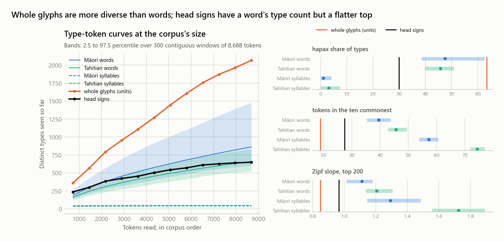

- **Nothing in the script counts like a syllabary.** At this size a Polynesian syllable stream has about forty-five types, almost none of them rare, and its ten commonest carry well over half the text. Head signs have 649 types and units 2,067; both lie far above the syllable band on every measure. This is the section's conclusion restated with a control, and it holds.
- **Whole units are more varied than words.** They have more types than any window of Māori or Tahitian words, a hapax share at the top of the word band, a flatter Zipf slope, and only a fifth of their tokens in the ten commonest types where words carry two fifths. A running Polynesian text is dominated by a few particles, *te*, *i*, *e*, *ki*, *a*; the unit stream has no such head. The paragraph above said units have the statistics of words; the matched comparison says they have the diversity of words and more, without the concentration.
- **Head signs have a word's type count and a flatter top.** Their 649 types sit inside both word bands, but their hapax share and top-ten share fall below them and the slope is shallower. This is the profile the earlier sections predict: a vocabulary of content words with the grammatical words left out or carried by the attachments (sections 13 and 24). Against Rapa Nui's own recitations, at their size of 2,947 tokens, head-sign windows match the words' top-ten share and slope, 29 percent and 0.99 against 29 percent and 0.92, and differ only in type count.
- **Genre may carry part of this.** The corpus contains registers of names, which have many types seen once, and the Māori and Tahitian references are scripture and narrative. A window of a genealogy would look more like the units. The comparison says what the glyphs are not, a syllabary, and what they are not quite, running prose; it does not settle what they are.

> **Caveat.** Barthel's catalogue splits what may be one sign into several numbers, so 649 is an upper bound and the tail is shorter than it looks. The word-like statistics of units are suggestive, not probative, because an over-split catalogue also inflates the unit count, and the matched comparison above shows they exceed the word band rather than sit in it.

## 9. Shape similarity of the signs

*In plain words: Barthel gave separate numbers to signs that may be the same sign drawn a little differently. We compared the drawings of all six hundred signs by shape to see how many of his numbers collapse into look-alike groups, and whether that brings the count anywhere near the fifty-odd signs a syllabary would need.*

Barthel's catalogue drawings, 601 signs and 713 drawings including the variants he drew for 112 of them, were fetched from kohaumotu and compared by shape. Each drawing is normalised to a 40 pixel square and described by a lightly blurred silhouette and by gradient-orientation histograms over a five by five grid; similarity is the cosine of the descriptors, best of direct and mirrored, penalised for aspect-ratio mismatch.

Barthel's own variant pairs are the ground truth. The threshold was set where only one unrelated pair in 200 passes, and at that setting it recovers 22 percent of the genuine variant pairs. Classes are cliques: a sign joins only if it passes against every current member. A first attempt with single linkage chained the whole catalogue into one class, which is a warning about how continuous the shape space is.

The closest pairs, from the contact sheet the script writes:


| Inventory, one witness per family | Distinct | Signs for 50% | 90% | 99% |
|---|---|---|---|---|
| Barthel head signs | 649 | 34 | 223 | 563 |
| After shape merging, strict | 485 | 25 | 151 | 399 |

- **113 look-alike classes absorb 171 signs.** The closest pairs are real: the figures 212 and 216, the ovals 22 and 24, the birds 622 and 624, the fish 700 and 710, the fork signs 90 and 91.
- **Shape merging does not get near 52.** Even the over-merged single-linkage pass only reached 380 classes. Pozdniakov's reduction cannot be a look-alike merge; it has to treat most of Barthel's numbers as compounds of a few dozen elements, which is a different claim and one this method does not test.
- **The copy-derived allograph pairs split by shape.** Same-series pairs from the copied passages score high, 254 with 256 at 0.83, 316 with 356 at 0.69, 630 with 631 at 0.68, against a median of 0.34 for random pairs. But 400 with 430, seen in two passages, scores 0.30, and 8 with 551 scores 0.55. Those are genuine substitutions in copying, not spelling variants.

> **Caveat.** The descriptor is crude and the recall figure says so: most of Barthel's own variant pairs fall below the strict threshold, so the merge is conservative. A few classes remain doubtful, such as the ovals 22 to 24 grouped with the fish 700, whose drawing is an elongated oval. This measures similarity of Barthel's type drawings, not of the signs as carved, which vary more.

### A stroke-based descriptor, tested

The natural objection to a pixel descriptor on line drawings is that it compares ink where it should compare strokes. That was tried, with scikit-image's skeletonisation, in four forms: counts and histograms of the skeleton's branches, endpoints, junctions and loops; the skeleton kept as an image, blurred, with gradient histograms, which removes stroke-width differences; shape contexts, the standard matcher for handwritten symbols, on points sampled along the skeleton; and the pixel and skeleton descriptors combined. All five were calibrated on the same test, Barthel's 130 variant pairs of one sign against 6,000 random pairs of different signs.

| Descriptor | Recall at the 99.5th percentile | At the 95th | Rank AUC |
|---|---|---|---|
| Pixel, as above | 35% | 65% | 0.82 |
| Pixel plus skeleton | 31% | 65% | 0.82 |
| Skeleton image | 26% | 58% | 0.81 |
| Shape contexts | 18% | 44% | 0.78 |
| Stroke counts and histograms | 5% | 22% | 0.69 |

None beats the pixel descriptor, and the one that discards arrangement for counts is far worse. The lesson is about the drawings rather than the method: at 40 pixels a variant differs from its sign in the placement and proportion of limbs, which the silhouette already captures, not in stroke width or topology, which the skeleton isolates. A matcher that would do better needs either larger drawings or a learned similarity, and Barthel's 130 variant pairs are too few to train one. The look-alike classes, the decomposition null of section 12 and the instance variation of section 25 therefore stand on the pixel descriptor as the best available, with its 35 percent recall as the stated limit. The recall here is higher than the 22 percent quoted above because this calibration pairs drawings rather than signs; the ranking is what matters.

## 10. Genre by vocabulary, and entropy

*In plain words: two questions. First, which tablets use the same vocabulary of signs, even when they do not copy each other, the way two cookbooks share words that a cookbook and a legal contract do not? Second, how much does one sign let you guess the next? In real text the previous word narrows what can follow; in a random list it does not.*

Copying groups texts that share passages. A second grouping asks which texts share a vocabulary, whether or not they share passages. Each side with at least 40 units is profiled by the head signs it favours relative to the corpus, tf-idf weighted, and sides are compared by cosine similarity. Thirty-one sides qualify.


- **The copied families are also vocabulary families**, which is a sanity check: Hr with Qr at 0.84, Hv with Pv at 0.75, Gr with Kv at 0.67.
- **Keiti's verso keeps company with the other list tablets.** Its nearest neighbours by vocabulary are Small Vienna side a and Great Washington side a, with Small London verso close behind, none of which copy it. The 380.1 lists share a vocabulary as well as a format.
- **Keiti's recto belongs elsewhere.** Its nearest neighbour is the recto of Aruku Kurenga, and its own verso ranks only fourth. Small Santiago and Small Vienna have sides even less alike, at ranks 19 and 25 of 30, so several objects carry two texts of different kinds. Tahua, Mamari, and Great Santiago have sides that resemble each other.
- **The Santiago Staff and the Honolulu tablet stand apart together.** Their vocabularies resemble each other at 0.53 and nothing else above 0.38. That matches Fischer's grouping of the two, made on other grounds.

Entropy asks how much a sign is predicted by the sign before it. For each layer the unigram entropy and the conditional entropy given the previous token are computed one witness per family, and the same for the tokens shuffled, which keeps the frequencies and destroys the order. The difference is the information carried by adjacency.

| Layer | Tokens | H1 | H2 as written | H2 shuffled | Adjacency gain, bits |
|---|---|---|---|---|---|
| Head signs | 8,569 | 7.49 | 4.60 | 4.89 | 0.29 |
| Whole units | 8,569 | 9.10 | 3.49 | 3.74 | 0.25 |
| Components | 11,666 | 7.29 | 4.75 | 5.20 | 0.45 |


Adjacency carries a consistent quarter to half a bit per token at every vocabulary size tested, so the order of signs is not random. The gain is modest, which fits texts dominated by lists of distinct items, where the previous item says little about the next. Components show the largest gain because a compound's parts follow each other in a fixed way, which is the ligature layer again.

> **Caveat.** Conditional entropy on a finite sample sits below the unigram entropy even for random order, because rare pairs are never observed. The shuffled column is the fair baseline, not H1. Published entropy comparisons across scripts use varied conventions, so these values should be compared with others only after matching the method.

## 11. A collocation lexicon

*In plain words: which pairs of signs sit next to each other far more often than chance would put them there, the way "New" and "York" do in English? Pairs found on many tablets are habits of the script; pairs found on one tablet only are that tablet's refrain.*

The entropy result says adjacency carries a modest amount of information. Collocations are where it sits. Every adjacent head-sign pair seen at least four times, one witness per family, was scored with the log-likelihood ratio, and a pair counts as a collocation at p below 0.001. Of 301 candidate pairs, 73 pass. The number of sides a pair occurs on separates two kinds: a pair confined to one or two sides is a refrain inside a text, a pair spread over three or more is a habit of the script. There are 37 of the first kind and 36 of the second.


- **Doubling is the commonest collocation in the script.** Of the 37 spread collocations, 18 are a sign followed by itself: crescent 40 on 7 sides, fish 700 on 11, and 48, 79, 67, 300, 605, 91, 607, 95, 200, 381, 63, plus the stroke chains 2, 5, 20, 22, and 90 doubled. Rapa Nui, like all Polynesian languages, uses reduplication as a productive grammatical device, so a script that doubles signs this often is at least consistent with writing that language. It is also consistent with tallying, so this is a lead, not a result.
- **A few non-doubled pairs are genuine script-wide habits.** Sign 7 before the frigatebird 600 on 10 sides, 80 before stroke 4 on 3 sides and 14 times, 27 before 77 on 4 sides, which is the opening of the Ev6 formula, turtle 280 before stroke 1 on 10 sides, and stroke 1 before the delimiter 380 on 7 sides, the closing-stroke pattern from the lists.
- **The local collocations are the two refrains we already knew.** Mamari's calendar sequence 390, 378, 41, 670, 8 and Keiti's recto refrain 300, 4, 22 account for most of them, along with a few triple repeats confined to single texts.
- **Stroke chains float free.** For each chain of two or more strokes, the sign immediately before it was tallied. Only one chain has a preferred host: 4 then 22 follows sign 300 in 10 of 21 cases, and that is Keiti's refrain. Every other chain follows a scatter of different signs. This agrees with the affix test: the chains have internal order but no host.
- **Whole units collocate more sharply than head signs.** Counting ligatures as distinct, 69 unit pairs pass, and the strongest are refrain fragments with their attachments intact, such as 4.430 before 22.380, which occurs 10 times against an expectation near zero. The attachments travel with the phrase.

Four of the script-wide pairs, the doubled crescent and fish, 7 before the frigatebird, the turtle before a stroke, and the opening of the Ev6 formula:


> **Caveat.** With a corpus this small a pair needs only four occurrences to be tested, so the tail of the collocation list is fragile. The 18 doublings and the handful of spread pairs with more than 10 occurrences are the robust part.

## 12. Compound decomposition

*In plain words: are the rare, complicated signs just combinations of the common simple ones, like letters making words? We tried to rebuild each rare drawing out of pieces of the fifty-five commonest drawings, and checked whether that works any better than rebuilding it out of random other drawings. It does not.*

The largest open question from section 8 is whether the 600 rare head signs are compounds of a few dozen basic ones, which is what Pozdniakov's reduction to about 52 signs requires. This section tests it directly on Barthel's drawings, with controls in both directions.

The method: take the 55 most frequent head signs as the basic set, and explain each of the 547 other drawings greedily by up to three basic drawings, each tried mirrored and at five scales, slid over the target by batched FFT correlation. Matching is tolerant: a target pixel counts as explained when it lies within a set distance of part ink, and a part pixel counts as a hit when it lies within that distance of target ink; a placement is scored by the F1 of those two rates and must explain at least a tenth of the target. A rare sign decomposes when 80 percent of its ink is explained with 70 percent precision. Two controls: the same fit with 55 random rare signs as templates, run three times, and a positive control fitting Barthel's own variant drawings of the basic signs with the basic templates, which ought to be explained by their own sign. The test was run at tolerances of two pixels and one pixel on a 48-pixel canvas.


| Tolerance | Template set | Share of rare signs decomposing | Positive control at threshold | Variants matching their own sign first |
|---|---|---|---|---|
| 2 px | 55 most frequent signs | 77% | 100% | 33% |
| 2 px | Random rare signs, three runs | 76% to 79% | | |
| 1 px | 55 most frequent signs | 29% | 64% | 42% |
| 1 px | Random rare signs, three runs | 22% to 27% | | |

**The frequent signs explain the rare ones no better than random rare signs do.** At two pixels of tolerance almost everything decomposes, whichever 55 shapes serve as parts: the matcher is permissive enough to build any thin drawing from three pieces. At one pixel the rate drops to a third and the frequent set leads the random sets by about five points, which is the shared stroke vocabulary the shape-similarity section already showed, not composition from a basic inventory. A genuine compound system would put the frequent set far ahead of random shapes at every tolerance.

**What the positive control says about the method.** At two pixels every variant of a basic sign is explained by the basic set, but only a third by its own sign first; at one pixel two thirds reach the threshold and 42 percent match themselves first. The matcher sees shapes but not identity well: a continuous shape space where many signs resemble many others, which is the same picture as section 9. That limits what any pixel-level method can say here. Stroke-based matching was tried afterwards (section 9, last subsection) and did not improve on pixels, so the question cannot be pressed further with these drawings.

**Consequence for the inventory.** Nothing in the drawings supports collapsing Barthel's 649 head signs toward 52 by treating the rare ones as compounds of the frequent ones. Section 8's conclusion stands: as drawn, the head-sign inventory is far too large for a syllabary, and if a small basic inventory exists it is not recoverable from shape by this route.

> **Caveat.** A first version of this test scored placements by rigid pixel overlap and failed its positive control outright, at 42 percent coverage for a sign on its own variants. The tolerant score fixed that and exposed the opposite problem, so both tolerances are reported. The 2-pixel outputs are kept in out/ with a _tol2 suffix.

## 13. Units against Rapa Nui words

*In plain words: if each compound glyph stands for a word of the Rapa Nui language, then glyphs should be about as long as Rapa Nui words, and the commonest glyphs should be the short little words a language uses most, like "the" and "of". We checked against a Rapa Nui text recorded in 1886, the only free one of the right kind.*

Section 8 found that whole units have the statistics of words. That gives a prediction that needs no reading: if units are words in Rapa Nui, their length distribution should resemble Rapa Nui word length, their doubling rate should resemble Rapa Nui reduplication, and the most frequent units should be short the way particles are.

The Rapa Nui sample has two parts. The recitations Ure Vaeiko gave in 1886, printed in Rapa Nui in Thomson's 1891 Smithsonian report, public domain: 1,365 word tokens from five recitations. And the legends, chants and lists printed in Rapa Nui with translations in Métraux's 1940 ethnology, from 43 page scans saved by hand and OCR'd: 1,582 tokens. Together 2,947 tokens, 785 distinct. In both, a token counts as Rapa Nui only if it parses entirely into (C)V syllables with Rapa Nui consonants, which rejects English on phonotactics alone, and only lines made mostly of such tokens are kept; Métraux's pages interleave the original with its translation, so this filter matters, and a looser one let English in. Word length is counted in syllables, which in Rapa Nui equals the number of vowels. OCR noise remains and long vowels count as two syllables, so the Rapa Nui lengths are slightly inflated.


| | Rapa Nui words | Rongorongo units |
|---|---|---|
| Length 1 | 34% | 69% |
| Length 2 | 41% | 27% |
| Length 3 or more | 25% | 4% |
| Mean length | 2.04 syllables | 1.36 components |
| Doubling, inside the item or immediate repeat | 3.9% | 6.8% |
| Share of tokens in the fifteen most frequent items | 33% | 23% |
| Mean length of those fifteen | 1.3 syllables | 1.0 components |

- **Components are not syllables.** If each component wrote one syllable and each unit one word, the two length distributions would match. They do not: two thirds of units are a single sign, while a third of Rapa Nui words are monosyllables, and units of three or more components are rare where three-syllable words are common. A single sign must on average carry more than one syllable, which is the logographic side of a mixed script, not a syllabary.
- **Doubling is in the same range.** Reduplication and immediate repeats make up about 4 percent of the Rapa Nui tokens and about 7 percent of the rongorongo units. The script doubles somewhat more than the language reduplicates, which is compatible with reduplication being written and with some doubling being something else, such as tallying.
- **The particle layer is thinner in the script.** In the Rapa Nui texts the fifteen commonest words are the grammatical particles te, ki, e, to, he, a, o, ko and a few nouns, and they carry a third of the text. The fifteen commonest units carry under a quarter. Either the script leaves particles unwritten, which early and mixed scripts commonly do, or the attached components carry them, which is what the affix test and the entropy of components suggested.

**A second source: the lexicon.** Roussel's 1908 vocabulary, the largest early record of the language, survives in English in Churchill's 1912 book, which is public domain. Parsed from its OCR it yields 1,645 headwords after English intrusions are filtered, with a residue of a few percent the filters miss. It is a list of word types, not running text, so it measures the language's stock of words rather than their use, and the two differ in the expected way: headwords average 3.4 syllables where running-text words average 2.1, because the short particles that dominate speech are few in a dictionary and the long compound words are many. Three things it settles that the recitations could not:

| | Lexicon, 1,645 headwords |
|---|---|
| Distinct (C)V syllables | 47, against 48 in the recitations; only *ngu* differs |
| Headwords that are full reduplications | 16.7% |
| Headwords of four or more syllables | 47% |

The syllable count is the one that matters for section 8: an independent source built from a different genre by a different hand gives the same inventory of about 47 syllables, so the figure the syllabary argument rests on is not an artefact of one small text. The reduplication share says the language builds a sixth of its vocabulary by doubling, which is the background against which the script's doubling of signs should be read. Thomson's own word list in the 1891 report is set in two columns that the OCR interleaved and could not be recovered.

> **Caveat.** This is one small sample of one genre, transcribed by ear in 1886 and OCR'd from an 1891 print. The direction of each difference is robust to the noise; the exact percentages are not. A cleaner Rapa Nui text of comparable genre would sharpen all three comparisons; the lexicon confirms the syllable inventory but cannot supply the running text that sections 13 and 23 need.

## 14. The list format against the creation chant

*In plain words: an islander in 1886 recited a creation chant for a tablet, and the chant is a list of forty entries, each naming two beings that produce a third. One scholar has argued that the Santiago Staff writes exactly such three-part entries. We compared the shape of the chant's entries with the shape of the Staff's groups and with the lists of section 4, without reading any of them.*

Among the recitations in Thomson's report is the one Ure Vaeiko gave for the Small Washington tablet, a creation genealogy of forty entries. Each entry names a parent, joins it with a fixed phrase to a second name, and yields a third: a three-slot formula with constant connective words. Fischer built his 1997 reading of the Santiago Staff on the claim that the Staff writes exactly this, as triads in which the first sign carries the attached sign 76 as the connective. The 380.1 lists of section 4 are the other candidate for a written genealogy. Both can be compared with the chant on shape alone.

Sign 76, which marks the Staff's triads, and the three signs that most often open a stretch between its carved dividers, 90, 604 and 606:


The chant's forty entries were parsed from the OCR with the fixed phrase intact, and lengths counted in content words, the connective phrase and the particles excluded. The 380.1 entries were counted in content units, strokes excluded. The Staff was cut before every unit carrying sign 76, which is Fischer's segmentation, and the same cut was applied to the two texts he grouped with the Staff, Gv and Ta. Since a cut at a frequent sign yields short segments whatever the text, each 76 cut was compared with a null in which the same number of 76-bearing units is shuffled to random positions.


| Series | n | Median length | Exactly 3 | 2 to 4 | Shuffled null, exactly 3 |
|---|---|---|---|---|---|
| Chant entries | 40 | 3 | 72% | 85% | |
| 380.1 entries, content units | 93 | 2 | 15% | 55% | |
| Staff cut at sign 76 | 555 | 3 | 56% | 82% | 15% |
| Gv cut at sign 76 | 40 | 4 | 25% | 57% | 12% |
| Ta cut at sign 76 | 30 | 3 | 23% | 57% | 15% |

- **The Staff has the chant's shape; the 380.1 lists do not.** Cut at sign 76, the Staff falls into segments of exactly three units 56 percent of the time and of two to four units 82 percent of the time, against 72 and 85 percent for the chant. Shuffling the positions of the 76 units drops the three-unit share to 15 percent, so the regularity is in the text, not in the density of the sign. The 380.1 lists, by contrast, have a median entry of two content units and no preference for three.
- **The Staff is triadic beyond doubt; what the triads say is another matter.** This is structural support for the first half of Fischer's claim, that the Staff is built of three-part units marked by sign 76 and that their shape matches a Rapa Nui creation genealogy. It says nothing about his second half, that each triad reads as one being copulating with another to produce a third. Any three-slot formula would give the same shape, and the shape is also that of a tally of three items or a line of a chant with a fixed refrain.
- **Gv and Ta are triadic, but weakly.** Both beat their nulls, at 25 and 23 percent against 12 and 15, but fall well short of the Staff. Fischer grouped them with the Staff on the strength of sign 76; the shape supports a relation without making them the same kind of text.
- **The two written list formats are different genres.** The 380.1 lists have short, mostly unique entries and one delimiter; the Staff has three-unit segments marked by an attached sign and grouped, by its own carved dividers, into stretches of a median nine units, or about three triads. If one of them is a genealogy in the chant's form, it is the Staff.
- **Recurrence points the same way.** In the chant 30 percent of entries share a name with another, mostly the parent repeated over consecutive entries. In the 380.1 lists 13 percent of entries repeat another entry's content exactly.

> **Caveat.** The chant is one recitation, taken down by ear in 1886 from a man who may have been improvising for a visitor; its shape is at least a Rapa Nui recitation's shape, whatever its relation to the tablet it was recited for. The 76 cut was defined by Fischer with the chant in mind, so the match is a test of his segmentation rather than a discovery independent of it; the shuffled null is what makes the match evidential.

## 15. Do the triads chain?

*In plain words: in a family tree, the child in one entry becomes the parent in a later one, and one parent often has several entries in a row. If the Staff's three-part groups are a genealogy, they should behave that way. We checked whether they do, and whether the chant does.*

Section 14 showed that the Staff is made of three-unit segments marked by sign 76, shaped like the entries of the 1886 creation chant. A genealogy is more than a row of triads, though: its entries chain, with the offspring of one returning as the parent of a later one, and a parent is often repeated over consecutive entries. Fischer's reading predicts both for the Staff. Both are countable.

For each segment the first and last head signs were taken, and three shares measured: how often a segment's last unit reappears as the first unit of any later segment, how often it equals the very next segment's first unit, and how often consecutive segments share a first unit. Each was compared with the mean over 500 shuffles of segment order, which keeps every segment intact and destroys only the sequence. The chant was measured the same way from its parsed entries.


| Text | Segments | Last returns as a later first, observed / shuffled | Consecutive same first, observed / shuffled | p |
|---|---|---|---|---|
| Chant | 40 | 0% / 0% | 12.8% / 1.0% | 0.00 |
| Staff | 555 | 62% / 64% | 3.8% / 3.8% | 0.54 |
| Gv | 40 | 10% / 18% | 5.1% / 1.9% | 0.17 |
| Ta | 30 | 10% / 11% | 3.4% / 3.6% | 0.69 |

- **The Staff's triads do not chain.** A segment's last sign returns as a later first sign 62 percent of the time, but shuffling the order gives 64 percent: with 555 segments drawn from a few hundred signs, that much recurrence is expected by chance. Consecutive segments share a first sign exactly as often as shuffled ones do.
- **The chant does not chain either, but it repeats its parents.** No offspring in the 1886 recitation returns as a parent, so the offspring-to-parent chain is not a feature of this genre as recited. What the chant does have is runs of entries with the same parent, 12.8 percent of consecutive pairs against 1 percent under shuffling. The Staff shows nothing of the kind.
- **The slots do not have separate vocabularies.** In the chant the parent, spouse and offspring slots draw on almost disjoint name sets, with pairwise overlap near zero. On the Staff the first, middle and last slots overlap substantially, Jaccard 0.27 to 0.40, and the same sign serves in every position. Of 313 three-unit segments only one occurs twice.
- **Ta shows one marginal signal**, the next segment's first unit equalling the previous last 6.9 percent of the time against 1.5 percent, at p 0.05 on 30 segments. Too small to build on.

**What this does to the Staff hypothesis.** The triadic shape survives; the genealogical reading of it does not gain the sequential support it predicted. Three-slot segments whose slots share a vocabulary, never repeat, and never refer back are the shape of a long chant with a fixed line structure, or of a tally, at least as much as of a lineage. The result narrows Fischer's claim to its structural half, which the shuffled null in section 14 established, and leaves its semantic half without evidence from sequence.

> **Caveat.** The chain measure compares head signs only, so a lineage written with changing attachments would be caught, but one written with different signs for the same name would not. The chant sample is one recitation of forty entries, which is enough to show parent repetition and too little to rule out chaining in other genealogies.

## 16. The carved dividers

*In plain words: the person who carved the Staff also cut small marks into it at intervals, the only punctuation anywhere in the corpus. We asked whether those marks line up with the three-part groups, how much text they enclose, and whether the enclosed stretches begin or end with particular signs.*

The Santiago Staff is the one object whose carver marked divisions in the text: 96 vertical strokes, coded 999 in the CEIPP file, cutting the 1,620 legible units into 95 complete stretches. Sections 14 and 15 established that the Staff is built of three-unit segments marked by sign 76. The question here is what the carver's own divisions group.

Each measure is compared with a null that keeps the number of dividers and places them at random among the units.


| Measure | Observed | Random dividers |
|---|---|---|
| Stretches opening on a 76-bearing unit | 95% | 34% |
| Stretches holding exactly three triads | 17% | 10%, p 0.02 |
| Stretches holding one to three triads | 55% | |
| Length variation, coefficient of variation | 1.30 | 0.96 |
| Stretch sequences that recur | 0 of 95 | |

- **The dividers respect the triads.** Ninety-five percent of stretches begin with a 76-bearing unit, which is where a triad begins, against 34 percent if the dividers fell at random. The carver was dividing the text at the same joints that sign 76 marks. That makes the triad structure of section 14 a feature the writer was conscious of, not an artefact of the segmentation rule.
- **The stretches are not verses of fixed length.** They run from a single triad to 55, more variable than random placement would give, with a preference for one to three triads that accounts for over half of them. Whatever a stretch is, it is a unit of content, not of metre.
- **A few signs like to open a stretch.** Sign 90 opens 15 of the 95, two and a half times its share of the Staff, and the bird signs 604 and 606 open nine between them at four to five times their share. Nothing similarly marked closes a stretch. A preferred opener is what a formula or a heading looks like.
- **Stretches are not cohesive and never repeat.** Triads inside a stretch share a first sign no more often than triads across a divider, and no stretch's sign sequence occurs twice. The dividers group triads without making the groups internally uniform or formulaic.

Put together with the previous two sections: the Staff is a long text of three-unit segments, marked by an attached sign and punctuated by the carver into groups of variable size that tend to open with a few particular signs, whose segments neither repeat nor chain. That is the profile of a continuous composition with a fixed line structure, punctuated into sections, rather than of a genealogy or a tally. What the lines say remains as unknown as before.

> **Caveat.** Sign 999 is the CEIPP's code for the divider; if any were missed in transliteration the stretch lengths shift, though the alignment result would only strengthen. Partial stretches at the ends of lines are dropped.

## 17. Metoro's readings

*In plain words: in 1873 an islander named Metoro chanted over four tablets for Bishop Jaussen, who wrote down what he said for each sign. Nobody thinks he was reading, but the record can be tested: did he say the same word for the same sign each time? If so, his chant encodes sign identities, whatever else it does or does not encode.*

Jaussen's notebook, published in 1893, gives Metoro's words sign by sign, one word group per sign, for Tahua, Aruku Kurenga, Mamari, and Keiti. Metoro divided the text into signs differently from Barthel, so the groups cannot simply be paired with the units: 83 lines give 3,690 Barthel units against 4,200 word groups. Instead each line was treated as a sentence pair and a word-alignment model of the kind used in early machine translation estimated, for every sign, the distribution of words Metoro said for it. A sign's consistency is the probability of its single most likely word. The null keeps every line's words but pairs them with the wrong lines of the same tablet, so any consistency above it comes from the signs actually in front of him.


| | Weighted mean probability of a sign's top word |
|---|---|
| Observed | 0.36 |
| Lines paired at random within each tablet, 20 shuffles | 0.21 |

- **Metoro was consistent.** Across signs seen eight or more times, the most likely word accounts for 36 percent of what he said, against 21 percent when his lines are paired with the wrong signs. For the commonest signs the figures are far higher: stroke 1 is *henua*, land, 70 percent of the time; sign 5 is *hau tea* 81 percent; the crescent 40 is *marama*, moon, 57 percent; sign 7 is *rei* 63 percent; sign 522 is *ariki*, chief, 62 percent.
- **He named what the signs look like.** The frigatebird 600 is *manu*, bird; the fish 700 is *ika*, fish; the hand 6 is *rima*, hand; the crescent is the moon; the seated figure 380 is *kiore*, rat, and the 300-series figures are *tagata*, man. This is Métraux's reading of Metoro, that he was describing the pictures, and here it is with numbers: his vocabulary tracks Barthel's pictorial series.
- **His consistency was highest on the simplest signs.** The strokes and the crescent, which carry no obvious picture, got the most fixed words of all. Whatever *henua* and *hau tea* meant to him for a stroke, he held to them across four tablets and thousands of signs.
- **What this does and does not license.** A consistent labelling of sign shapes is not a reading, and Metoro's words for a sign say nothing about what a scribe meant by it. But the consistency makes his chant usable for one thing: as an independent, nineteenth-century judgment of which glyphs are the same sign. Where Metoro said the same word for two of Barthel's numbers, that is evidence for merging them, from a witness who had never seen Barthel's catalogue.

The eight signs named above, in Barthel's drawings, in the order stroke 1, 5, crescent 40, frigatebird 600, fish 700, hand 6, seated figure 380, and 522:


> **Caveat.** The alignment model assumes Metoro's word for a sign does not depend on its neighbours, which is false for a chant with grammar. Particles were stripped from his word groups so that *te henua* and *henua* count as one word. Guy showed that Metoro read the second sides of Mamari and Keiti in a disordered way; those lines are included, which can only lower the measured consistency.

## 18. Three witnesses for merging signs

*In plain words: three independent sources can say whether two of Barthel's numbers are really one sign: Metoro used the same word for both, the drawings look alike, or a copyist swapped one for the other. We listed every pair Metoro's chant proposes, checked it against the other two witnesses, and then tested each set of merges the only way a merge can be tested: by seeing whether more text lines up between tablets afterwards, compared with merging random signs of the same frequency.*

Metoro's chant proposes a pair when two signs, each chanted at least eight times, share the same most likely word with a consistency of at least 35 percent on both. Words he used as the top word for four or more signs are treated as generic fillers and excluded; that removes *henua*, which he said for the plain stroke and for a seated figure alike. Four pairs survive.

| Pair | Metoro's word | Shape similarity | Copy substitution | Witnesses |
|---|---|---|---|---|
| 4 and 22 | *hokohuki* | 0.71, above the 99.5th percentile | | Metoro, shape |
| 400 and 600 | *manu*, bird | 0.68, above the 95th percentile | one passage | all three |
| 40 and 41 | *marama*, moon | 0.14 | one passage | Metoro, copies |
| 206 and 380 | *kiore*, rat | 0.26 | | Metoro only |

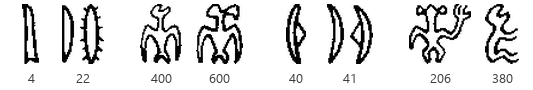

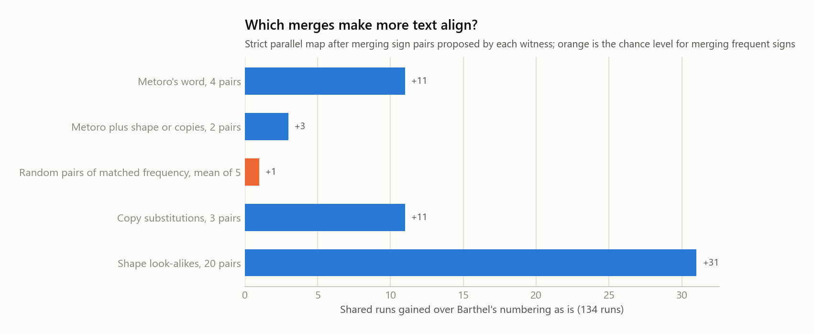

| Merge table | Signs merged | Shared runs in the strict parallel map |
|---|---|---|
| Barthel's numbering as is | 0 | 134 |
| Metoro's four pairs | 4 | 145 |
| Metoro's pairs backed by shape or copies | 2 | 137 |
| Random pairs of matched frequency, mean of five | 4 | 135 |
| Copy substitutions, section 7 | 3 | 145 |
| Shape look-alikes, loose, section 9 | 20 | 165 |

- **Metoro's merges are real.** Merging his four pairs raises the number of shared runs from 134 to 145. Merging four random pairs of signs of the same frequency raises it to 135. The gain is the same as from the three copy-substitution pairs, which were found by an entirely different route, so two witnesses who never met agree on the size of the effect.
- **Two pairs have more than one witness.** Signs 4 and 22 are both a stroke with side marks, look alike by the strict shape test, and got the same word; Metoro and shape agree. Signs 400 and 600 are both birds to Metoro, look alike, and were swapped by a copyist: all three witnesses. The crescents 40 and 41 are both *marama*, the moon, and a copyist swapped them, but the drawings score low, which says more about the shape descriptor than about the crescents.
- **Shape look-alike classes are not sign identities in Metoro's eyes.** Of the 17 look-alike pairs from section 9 for which Metoro chanted both members, he gave the same word to none. Random pairs of the signs he chanted agree 1 percent of the time. Whatever the shape classes capture, Metoro was naming something finer, and the loose shape merge that gains 31 runs in the parallel map does so partly by merging signs he kept apart.
- **What a defensible reduced inventory looks like.** It is not one method's list. It is the pairs on which independent witnesses agree, and at this point that is two pairs firmly and two more with a single supporter each. The number is small because the chanted tablets are four and the copied passages few; both witnesses run out of evidence long before the inventory does.

> **Caveat.** The parallel-map gain is a coarse yardstick, since a merge can be right and add no runs, or wrong and add several by chance; the random control bounds only the second. Metoro's chant covers about a third of the corpus and its word alignment is statistical, so a pair he never chanted, or chanted rarely, cannot appear here at all.

## 19. A catalogue of texts and signs

*In plain words: the eighteen sections above each say something about particular tablets and particular signs, but scattered across many tables. Here it is gathered into two reference lists, one row per text and one row per sign, so that anyone can look up what is known about a given tablet side or a given glyph in one place.*

### The texts

One row per side with at least 40 legible units. "Parallel elsewhere" is the share of the side's signs inside a passage found on another tablet under the fuzzy setting. "380.1" counts the list delimiter; "series" counts alternating runs; "dividers" counts the carved marks, which only the Staff has. "Closest vocabulary" is the side whose sign frequencies are most alike, with the similarity. The type label is a rule applied to the row, in this order: a copied family, then sign 76 on more than a quarter of units, then crescent runs with internal repeats, then four or more delimiters, then internal repeats, else isolated. The full table with every column is `out/typology.csv`.

| side | object | units | parallel elsewhere | 380.1 | series | units with 76 | dividers | closest vocabulary | Metoro | type |
|---|---|---|---|---|---|---|---|---|---|---|
| Aa | Tahua | 678 | 4% |  | 4 | 0% |  | Ab (0.51) | yes | isolated |
| Ab | Tahua | 659 | 4% |  | 2 | 0% |  | Ra (0.62) | yes | isolated |
| Br | Aruku Kurenga | 437 | 2% |  | 5 | 1% |  | Er (0.55) | yes | isolated, with refrains |
| Bv | Aruku Kurenga | 510 | 4% |  | 1 | 1% |  | Hr (0.61) | yes | isolated |
| Ca | Mamari | 396 | 1% | 8 | 2 | 0% |  | Cb (0.61) | yes | calendar-like, crescent runs, with lists |
| Cb | Mamari | 363 | 0% | 12 | 2 | 0% |  | Ca (0.61) | yes | delimited list |
| Da | Échancrée | 106 | 3% |  |  | 0% |  | Hv (0.49) |  | isolated |
| Db | Échancrée | 73 | 0% |  |  | 0% |  | Ab (0.48) |  | isolated |
| Er | Keiti | 338 | 3% |  | 5 | 1% |  | Br (0.55) | yes | isolated, with refrains |
| Ev | Keiti | 309 | 7% | 22 | 4 | 0% |  | Na (0.63) | yes | delimited list |
| Gr | Small Santiago | 239 | 37% | 30 | 3 | 1% |  | Kv (0.67) |  | copied text, Small Santiago group |
| Gv | Small Santiago | 243 | 0% |  | 1 | 18% |  | Hv (0.47) |  | isolated |
| Hr | Great Santiago | 586 | 53% |  | 3 | 1% |  | Qr (0.84) |  | copied text, Great Santiago group |
| Hv | Great Santiago | 632 | 29% |  | 6 | 0% |  | Pv (0.75) |  | copied text, Great Santiago group |
| Ia | Santiago Staff | 1619 | 0% |  |  | 35% | 97 | Ta (0.53) |  | triadic, marked by sign 76 |
| Kr | Small London | 82 | 57% | 10 | 2 | 0% |  | Gr (0.65) |  | copied text, Small Santiago group |
| Kv | Small London | 62 | 41% | 12 | 1 | 0% |  | Gr (0.67) |  | copied text, Small Santiago group |
| La | Reimiro 2 | 44 | 0% |  | 1 | 0% |  | Hv (0.16) |  | isolated |
| Ma | Great Vienna | 48 | 6% |  | 1 | 0% |  | Oa (0.42) |  | isolated |
| Na | Small Vienna | 97 | 5% | 7 | 2 | 0% |  | Ev (0.63) |  | delimited list |
| Nb | Small Vienna | 65 | 0% |  | 1 | 2% |  | Bv (0.28) |  | isolated |
| Oa | Berlin | 78 | 0% |  |  | 0% |  | Ab (0.43) |  | isolated |
| Pr | Great St Petersburg | 605 | 34% |  | 1 | 1% |  | Hr (0.83) |  | copied text, Great Santiago group |
| Pv | Great St Petersburg | 556 | 37% |  | 4 | 0% |  | Hv (0.75) |  | copied text, Great Santiago group |
| Qr | Small St Petersburg | 369 | 61% |  | 2 | 2% |  | Hr (0.84) |  | copied text, Great Santiago group |
| Qv | Small St Petersburg | 331 | 36% | 1 | 2 | 0% |  | Pv (0.68) |  | copied text, Great Santiago group |
| Ra | Small Washington | 194 | 14% |  |  | 0% |  | Ab (0.62) |  | isolated |
| Rb | Small Washington | 161 | 2% |  | 1 | 0% |  | Hr (0.53) |  | isolated |
| Sa | Great Washington | 280 | 3% | 4 | 3 | 0% |  | Ev (0.61) |  | delimited list |
| Sb | Great Washington | 304 | 0% |  | 2 | 1% |  | Hr (0.62) |  | isolated, with refrains |
| Ta | Honolulu 1 | 110 | 0% |  |  | 29% |  | Ia (0.53) |  | triadic, marked by sign 76 |

Read as a whole, the corpus has five kinds of text and one residue. Nine sides are copies within two families. Five carry delimited lists, one of them the Mamari side that also holds the calendar. Two are the triadic texts marked by sign 76. Three isolated texts carry their own refrains, Keiti's recto among them. Twelve sides, including both sides of Tahua, the largest tablet, remain isolated and untyped: nothing they contain recurs in the corpus at the resolution of these tests. Section 26 examines them and finds ordinary texts in the common idiom that were never copied, not a hidden genre.

### The signs

One row per head sign with at least 20 tokens, 104 signs in all, in `out/sign_dossier.csv`. For each: frequency and Barthel series, how often it stands bare, which components attach to it and which heads it attaches to, its strongest neighbours before and after, its shape look-alikes, Metoro's word and consistency, the signs copyists swapped it with, and its roles as alternation head, list member, and Staff triad slot. The six commonest signs, in a selection of columns:

| Sign | Tokens | Bare | Top attachments | Attaches to | Before it | After it | Shape neighbours | Metoro | Copies swap with | Staff slots first/middle/last |
|---|---|---|---|---|---|---|---|---|---|---|
| 1 | 432 | 64% | 6, 9, 62 | 380, 260, 62 | 280, 88, 62 | 9, 380, 7 | 73, 65 | *henua* 0.70 | 4, 25, 66 | 6/3/4 |
| 2 | 361 | 82% | 10, 76, 3 | 10, 595, 200 | 2 | 2, 595, 34 | 83, 20 | *inoino* 0.40 | | 7/3/9 |
| 4 | 291 | 53% | 64, 430, 600 | 600, 4, 400 | 80, 81, 300 | 22, 760 | 10, 62 | *hokohuki* 0.35 | 1, 290 | 0/5/0 |
| 600 | 233 | 74% | 4, 76, 7 | 4, 1, 200 | 7 | | 690, 610 | *manu* 0.40 | 78, 400 | 2/12/20 |
| 22 | 219 | 72% | 380, 243, 10 | 200, 300, 61 | 15, 4, 22 | 203, 22, 25 | 24, 23 | *hokohuki* 0.38 | | 2/0/0 |
| 700 | 215 | 75% | 76, 10, 3 | 6, 10, 605 | 700 | 700 | 710, 23 | *ika* 0.43 | | 12/7/15 |

The dossier makes some contradictions visible that the sections did not. Stroke 1 is the most frequent sign, stands bare two times in three, attaches to the list delimiter 380 more than to anything else, and is what Metoro called *henua*, land, with the highest consistency of any common sign; a sign that is at once the commonest filler and the most firmly named is not what either the affix test or the picture-naming view alone would predict. The frigatebird 600 sits in the last slot of a Staff triad ten times more often than in the first, which no other common sign does, so the triads have at least one positional preference after all. Sign 4 attaches to 64 in 54 of its 291 occurrences and to nothing else nearly as often, which makes 4.64 a candidate unit of its own.

## 20. Which findings survive a change of inventory

*In plain words: several of the results depend on treating Barthel's numbers as the true list of signs, and sections 7, 9, 17 and 18 each proposed merging some of them. So every headline measure was recomputed under six different sign lists, from Barthel's as is to a union of every proposed merge. A finding that barely moves is one that does not depend on who is right about the inventory.*

The six inventories: Barthel's numbering; the three copy-substitution merges; the loose shape merge of twenty pairs; Metoro's four pairs; the two pairs backed by two witnesses; and the union of all of them, 23 merges. Stable means every change from Barthel's numbering stays within 10 percent; moves, within 25; inventory-dependent, beyond that.

| Measure | Barthel | Copies | Shape | Metoro | Consensus | Union | Max change | Verdict |
|---|---|---|---|---|---|---|---|---|
| Copy families | 3 | 3 | 3 | 3 | 3 | 3 | 0% | stable |
| Shared runs, strict | 134 | 145 | 167 | 145 | 137 | 170 | 27% | rises with merging, as it must |
| Distinct heads | 649 | 646 | 629 | 645 | 647 | 626 | 4% | stable |
| Heads for 90% of tokens | 223 | 220 | 204 | 219 | 221 | 201 | 10% | stable |
| Adjacency gain, bits | 0.29 | 0.30 | 0.29 | 0.28 | 0.29 | 0.29 | 4% | stable |
| Doubling share | 5.6% | 5.6% | 5.8% | 6.1% | 6.0% | 6.2% | 11% | moves, upward only |
| Collocations | 73 | 75 | 75 | 72 | 72 | 72 | 3% | stable |
| Order 2 before 1, ratio | 2.17 | 2.17 | 2.17 | 2.17 | 2.17 | 2.17 | 0% | stable |
| Order 4 before 2, ratio | 2.75 | 2.75 | 2.75 | 1.76 | 1.76 | 1.76 | 36% | inventory-dependent |
| Staff segments of exactly 3 | 56% | 56% | 56% | 56% | 56% | 56% | 0% | stable |
| Distinct units | 2,067 | 2,061 | 2,032 | 2,048 | 2,052 | 2,015 | 3% | stable |
| Unit hapax share | 64% | 64% | 64% | 63% | 64% | 64% | 0% | stable |

- **The families, the inventory size, the entropy, the collocations, the unit statistics and the Staff triads do not depend on the inventory.** The same three copy families appear under all six lists. The head inventory stays above 620 signs and the number needed for 90 percent of the text above 200 under every merge, so the syllabary argument of section 8 is safe. The word-like unit statistics and the Staff's triadic share do not move at all.
- **One claim needs qualifying.** The stacking order of section 6 rests on two ratios. Stroke 2 before 1 holds at 2.2 to 1 under every inventory. Stroke 4 before 2 holds at 2.8 to 1 under Barthel, copies and shape, but drops to 1.8 to 1 once Metoro's merge of 4 with 22 is applied, because 22 sits after 2 as often as before it. The order is real but its strength for sign 4 depends on whether 4 and 22 are one sign, which two witnesses say they are. The section 6 text now says so.
- **Two measures rise with merging by construction.** Shared runs must increase when signs are merged, and doubling rises because merged neighbours become identical; both are shown for completeness, not as findings.

> **Caveat.** The list measures here are computed one witness per family, so the 380.1 entry count is 73 rather than the 93 of section 4, which included the London copies. The measures are unaffected by every inventory because none of the proposed merges touches sign 380.

## 21. The Mamari calendar, rebuilt

*In plain words: one short passage of rongorongo is accepted by specialists as a lunar calendar, on the Mamari tablet, because it is full of crescent signs. Here we rebuilt its structure from the transcription alone, without assuming that reading, and then asked whether the counts fit a month of the moon.*

Lines Ca6 to Ca9 of Mamari hold 118 units. Each was classified by rule: a crescent if it contains sign 40; a marker if it lies inside the recurring group that opens with 390.41 and closes with the unit containing 711; other if neither. The sequence was then cut into crescent runs separated by marker groups.

The crescent and the marker group's signs, from Barthel's catalogue:

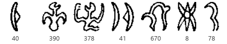

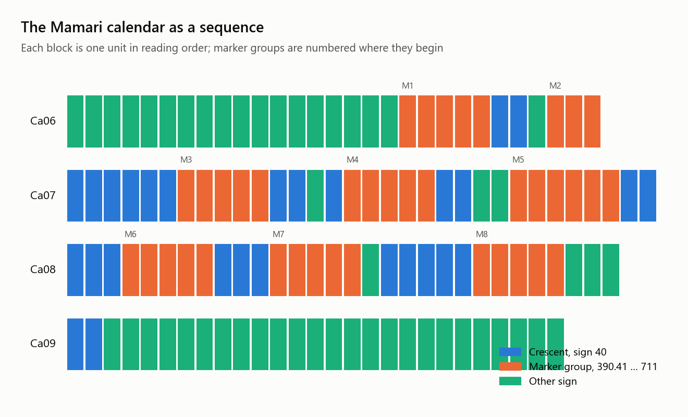

| Marker group | Line | Head signs |
|---|---|---|
| 1 | Ca6 | 390.41, 315, 41, 670, 8.78.711 |
| 2 | Ca6 | 390.41, 375, 41, and no tail |
| 3, 4, 6, 7, 8 | Ca7, Ca8 | 390.41, 378, 41, 670, 8.78.711 |
| 5 | Ca7 | the same, with 600 fused onto the opening sign |

| Run | Crescents | Other signs inside the run |
|---|---|---|
| 1 | 2 | 30 |
| 2 | 6 | |
| 3 | 3 | 59 |
| 4 | 2 | 143, 152 |
| 5 | 5 | |
| 6 | 3 | |
| 7 | 5 | 600 |

- **The structure reproduces without assuming it.** Eight marker groups, five of them identical in their head signs, frame seven runs of crescents: 2, 6, 3, 2, 5, 3, 5. That is a regular, repeated framing device around a counted sign, which is what a calendar looks like and what nothing else in the corpus looks like.
- **The count is close to a month but not equal to it.** Twenty-six crescents lie between the first and last groups, and two more follow the last, 28 in all. A synodic month is 29.5 days and Polynesian calendars name 29 or 30 nights. Five other signs stand inside the runs; if some of them stand for nights too, as Guy proposed for certain of them, the count reaches 30. The rebuild cannot decide that; it can say the arithmetic leaves room for exactly such a reading and not much more.
- **The runs are not the moon's quarters.** A quartered month would give runs near 7. These run 2 to 6, and the cumulative counts 2, 8, 11, 13, 18, 21, 26 do not fall on quarters. Whatever the marker groups mark, it is finer than phases, or it is not phases.
- **Two marker groups are defective in the same way twice.** Group 1 replaces 378 with 315 and group 2 has no tail; both are on Ca6, where the calendar begins. Whether that is a preamble, a scribal slip, or a different kind of marker is beyond what counts can say.

The calendar is the one passage where a reading and our structure can be compared, and they agree: an accepted reading predicts a repeated frame around counted crescents summing near a month, and that is what the transcription contains. It also sets the scale of what "reading" means here. Knowing that these are nights does not tell us what the marker groups say, and their six signs, apart from the fish 670, appear elsewhere in the corpus in contexts that have nothing to do with the moon.

### Against the named nights

Métraux's ethnology prints the thirty night names of the Rapa Nui month, assembled from Thomson's informant and later lists, and the page was added to the scans. The list is uneven in a way that can be compared with the calendar without reading anything: most nights have a name of their own, but two stretches are counted with one base name and an ordinal, six *Kokore* nights from the 5th to the 10th and five from the 19th to the 23rd, and the 26th and 27th share a base. The calendar's runs are 2, 6, 3, 2, 5, 3, 5.

| Test | Result | Chance |
|---|---|---|
| The two longest runs are 6 then 5, as the two Kokore stretches are 6 then 5 | matches | a random division of 26 crescents into 7 runs shows a 6 before a 5 in 8% of trials |
| Marker groups fall where a shared-name stretch begins or ends, crescents taken as nights in order, best offset | 3 of 6 | random placement reaches 3 in 40% of trials |

- **The run lengths are suggestive, not conclusive.** A six-run followed by a five-run is what the named month has and what the calendar has, and it arises by chance one time in twelve. At the offset that fits best, the calendar's run of six crescents falls exactly on the first Kokore stretch, nights 5 to 10, framed by marker groups on both sides.
- **The marker groups are not name-class boundaries.** Three of six fall on a boundary at the best offset, which random placement matches two times in five. Whatever the groups mark, the naming pattern of the month does not predict where they stand; the second Kokore stretch in particular is not framed.
- **The count stays where it was.** Twenty-eight crescents against thirty names, with five other signs inside the runs that a night reading would have to absorb.

The named list therefore leaves the calendar reading as it found it: a repeated frame around counted nights, with one internal correspondence, the first Kokore stretch, that may be real, and no support for the markers as phase boundaries in the named sense.

> **Caveat.** The classification rule was written after looking at the lines, so it is a formalisation of what is visible, not a discovery. The night list itself is a reconstruction; Métraux notes the sequence was already confused among his informants and that the names were used as descriptions of phases rather than as a working calendar, so the boundaries tested are those of a list that had lost its system.

## 22. Two islanders on one tablet

*In plain words: two different islanders recited over the same tablets thirteen years apart, Metoro in 1873 over the originals and Ure Vaeiko in 1886 over photographs. If either of them was drawing on anything in the tablet beyond the look of the signs, their words for the same tablet should resemble each other more than their words for different tablets. We measured that.*

Thomson's report says which photograph each of Ure Vaeiko's recitations answered: "Apai" was given for Keiti and the love song "Ate-a-renga" for Mamari, both tablets Metoro had chanted over for Jaussen. Ure's texts are continuous, not divided by sign, so the comparison is by vocabulary: the cosine similarity of content-word frequencies, particles stripped, between each of Ure's five texts and each of Metoro's four chants. The two same-tablet pairs are then ranked among the eighteen pairs that are not the same tablet.

| Ure's text | Words | For tablet | Metoro on Tahua | on Aruku Kurenga | on Mamari | on Keiti |
|---|---|---|---|---|---|---|
| Apai | 532 | Keiti | 0.198 | 0.179 | 0.171 | **0.119** |
| Atua Matariri, second half | 105 | Small Washington | 0.033 | 0.025 | 0.037 | 0.033 |
| Eaha to ran ariiki kete | 234 | Great Washington | 0.016 | 0.032 | 0.022 | 0.023 |
| Ka ihi uiga, dirge | 41 | Échancrée | 0.060 | 0.109 | 0.026 | 0.048 |
| Ate-a-renga, love song | 55 | Mamari | 0.055 | 0.043 | **0.029** | 0.027 |

- **No tablet-specific agreement.** Ure's Keiti recitation resembles Metoro's Keiti chant less than it resembles Metoro's chants for the other three tablets, and the love song for Mamari resembles Metoro's Mamari chant less than it resembles his Tahua chant. Neither same-tablet pair ranks above the pairs that share no tablet: p 0.17 for Keiti, 0.67 for Mamari.
- **What the two men share is ordinary Rapa Nui.** The words common to Ure's Apai and Metoro's Keiti chant are *rei*, *mata*, *mai*, *koe*, *ika*, *tea*, *oho*, *vai*: everyday vocabulary that both used on every tablet. A quarter of Ure's Keiti words occur somewhere in Metoro's Keiti chant, and a third occur in Metoro's Tahua chant, which is simply the longer text.
- **Apai is a different kind of text altogether.** Metoro produced one to two words per sign, tied to the sign in front of him. Ure produced a narrative with roads, a land, and named people, and Thomson's own note says stretches of the tablet were skipped as "ancient language". Its resemblance to Metoro is the resemblance of any Rapa Nui recitation to any other.

**What this closes.** Section 17 showed Metoro named sign shapes consistently. This section shows that consistency was his own: a second islander, given the same tablet, produced words with no measurable relation to Metoro's. Whatever the two men were doing, they were not reading the same text off the same signs. It also settles a smaller point: Ure's recitations cannot serve as readings of the tablets they were given for, since the one for Keiti is no closer to Keiti's signs, by way of Metoro's naming of them, than to any other tablet's.

> **Caveat.** The measure is vocabulary overlap, which would miss two readings that agreed in meaning but not in words, and the two short songs give little to compare. The Keiti pair rests on 532 words against 1,240, enough to show an effect of the size Metoro's own consistency produces, had there been one.

## 23. A decipherment attempt, and why it cannot work yet

*In plain words: this is the closest thing to a decipherment the evidence allows, done the way computers have cracked substitution ciphers and, once, an ancient script. Treat the forty commonest signs as unknown syllables and search for the assignment under which the tablets read most like Rapa Nui. The result is not a reading. It is a measurement of whether such a search could succeed at all with this much text, and the answer is no: the search cannot even recover Rapa Nui from Rapa Nui.*

The method is the one used on Ugaritic against Hebrew. A syllable bigram model of Rapa Nui was built from the 1886 recitations together with the legends, chants and lists printed in Rapa Nui in Métraux's 1940 ethnology, 6,000 syllables in 47 types; a first run on the recitations alone, 2,900 syllables, gave the same verdict. The forty most frequent head signs, 2,593 adjacent pairs among them with copies dropped, were assigned one syllable each, no two alike, by simulated annealing to maximise the log-likelihood of the sign sequence under the model, twelve restarts of forty thousand steps. Four controls decide what the score means: the sequence shuffled, which keeps sign frequencies and destroys order; the sequence reversed; the wrong language, English letter bigrams from Thomson's own prose, on the 24 signs a 26-letter alphabet allows; and a positive control in which a genuine Rapa Nui recitation, Apai, is treated as unknown signs against a model trained on the other recitations, to see whether the search recovers the truth when the truth is there.

| Condition | Log-likelihood per pair | Gain over shuffled |
|---|---|---|
| Real signs under Rapa Nui, 40 signs | -3.674 | +0.061 |
| Real signs reversed, Rapa Nui | -3.672 | |
| Real signs under Rapa Nui, 24 signs | -3.385 | +0.031 |
| Real signs under English letters, 24 signs | -3.453 | +0.025 |
| Positive control, Apai as unknown signs, searched | -3.438 | +0.178 |
| Positive control, Apai under the true assignment | -3.642 | |

- **The positive control fails, and that is the finding.** Given a real Rapa Nui text as unknown signs, the search recovers 5 percent of the syllables, and the assignment it finds scores well above the true one: with 47 syllables, a model from some 5,000 syllables, and a text of 1,100, there are many false assignments that read "more like Rapa Nui" than Rapa Nui does. The search is not finding truth; it is finding whatever the model rewards, and doubling the model with Métraux's texts did not change that.
- **So the sign scores mean nothing either way.** The tablets gain 0.061 over their shuffles under Rapa Nui and, on the 24 signs the two languages can share, 0.031 under Rapa Nui against 0.025 under English; reversed reads as well as forward. Those numbers are of the size the search produces from any structured sequence, and the wrong language does nearly as well as the right one. No syllabic reading of the frequent signs can be supported or refuted by this route at this scale.
- **What it would take.** The method works on Ugaritic because the related language, Hebrew, has a corpus of millions of words and the cipher text has thousands of distinct words to constrain the mapping. Here the language model rests on six thousand syllables and the sign corpus has fewer than three thousand pairs among its frequent signs. A model that could recover a known text would need to be larger by orders of magnitude, more Rapa Nui of the old genres than was ever written down. The remaining public-domain sources add nothing: Jaussen's 1894 volume is a scan of handwritten notes whose OCR is noise, and Routledge's 1919 book holds no Rapa Nui passages.

### A related-language model, and the length of the text

*In plain words: the search failed because it had too little Rapa Nui to learn from. So it was given the next best thing, Rapa Nui's close relatives. Māori and Tahitian scripture and story collections from the nineteenth century, out of copyright, run to three million syllables each, a thousand times the Rapa Nui. The search does better with them, and still fails. Then the other input was tested: not how much language the search knows, but how much text it is given to crack. With a known Māori text the search needs many times more text than the tablets contain before it recovers the truth.*

The Ugaritic result rested on a Hebrew corpus of millions of words. Rapa Nui's closest well-attested relatives have corpora of that size in the public domain: the 1868 Māori Bible, the 1841 New Testament and Grey's 1853 and 1854 collections of songs and traditions; the 1878 Tahitian Bible and the 1853 New Testament. All six were fetched from archive.org as OCR text and reduced to Rapa Nui-shaped tokens: Māori *wh* and *w* mapped to *h* and *v*, the correspondences of the cognates (*whare* and *hare*, *wai* and *vai*), Tahitian *f* to *h* and its glottal stop dropped, and every word kept that consists of open syllables over Rapa Nui's nine consonants. Tahitian has no *k* and no *ng*, which Rapa Nui keeps, so its model lacks a fifth of the syllabary; Māori has both. The same search and the same four controls were run under each model, with Apai still held out.

| Model | Syllables in the model | Positive control: syllables recovered | Searched against true | Tablets' gain over shuffles |
|---|---|---|---|---|
| Rapa Nui alone | 6,000 | 5% | -3.438 against -3.642 | +0.061 |
| plus Māori | 2.8 million | 12% | -3.397 against -3.561 | +0.065 |
| plus Tahitian | 2.6 million | 12% | -3.593 against -4.341 | +0.065 |
| plus both | 5.4 million | 20% | -3.396 against -3.570 | +0.052 |

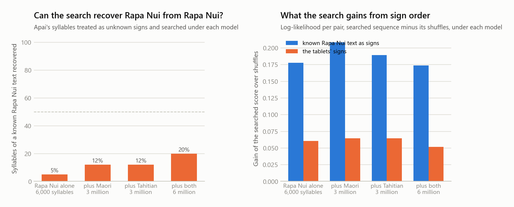

- **A larger model helps, and not enough.** Recovery of the known text rises from one syllable in twenty to one in five as the model grows a thousandfold. Under every model the assignment the search finds scores well above the true one, by 0.16 to 0.20 per pair, the same margin as before. The relatives are not the problem: under the Māori model the true Rapa Nui text scores better than under the Rapa Nui model itself, since a model from six thousand syllables is mostly smoothing. Tahitian, lacking *k* and *ng*, gives the true text a poor score and the search a false one to beat it with.
- **The tablets do not move.** Their gain over shuffles stays at 0.05 to 0.07 under every model, a third of what the known text gains, and reversed reads as well as forward in each case. Nothing in the sign sequence responds to a better model of the language.

**How much text the search needs.** The Māori corpus is large enough to answer the question the Rapa Nui one cannot: hold out Grey's 1854 traditions entirely, train the model on the rest, and give the search the first L syllables of the held-out text as unknown signs, forty signs, one syllable each, exactly as the tablets are handled.

| Syllables given to the search | Pairs among the 40 signs | Recovered | Searched against true |
|---|---|---|---|
| 500 | 497 | 10% | -3.211 against -3.595 |
| 1,000 | 984 | 25% | -3.324 against -3.350 |
| 2,000 | 1,970 | 25% | -3.410 against -3.257 |
| 4,000 | 3,936 | 62% | -3.274 against -3.223 |
| 8,000 | 7,856 | 100% | -3.120 against -3.120 |
| 16,000 to 64,000 | 15,716 to 62,554 | 100% | equal |

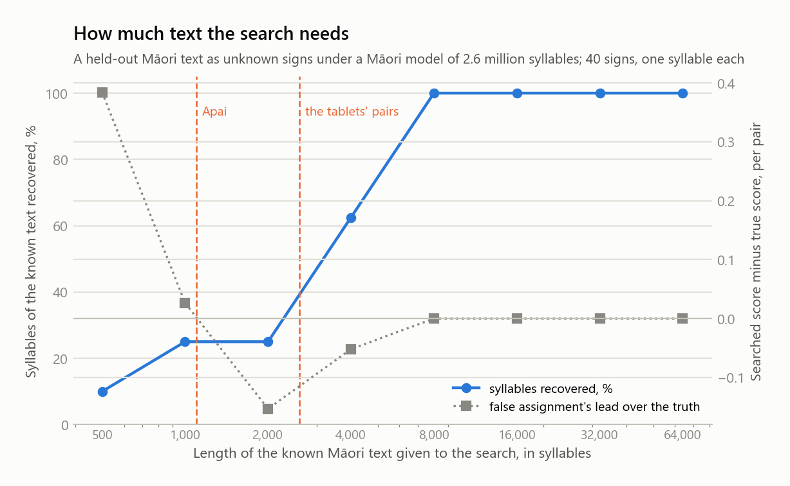


- **Two regimes, and the tablets sit in the first.** Below about a thousand syllables a false assignment scores above the true one, so no search could succeed; the language model is not at fault, the text is too short to pin the mapping down. Between two and four thousand the true assignment is the best there is, and the search, eight restarts of forty thousand steps, cannot find it. From eight thousand syllables the search recovers every syllable and its score equals the truth's. Apai, at 1,100 syllables, and the tablets, at 2,600 pairs among their frequent signs, both fall where recovery is a quarter of the signs at best.
- **The bound is now on the text, not the language.** A related-language model a thousand times larger than the Rapa Nui one raised recovery from a twentieth to a fifth; three times more text than the tablets contain would be needed to raise it to all. The rongorongo corpus cannot be enlarged. So the section's verdict stands in a stronger form: under the one-sign-one-syllable hypothesis, no statistical assignment of the frequent signs can be verified with the text that exists, whatever the language model, and a published one that claims otherwise has not passed a control of this kind. What the test does not rule out is a different hypothesis, such as one sign per word, which this search does not model.

> **Caveat.** The Māori and Tahitian OCR is nineteenth-century print read by machine; the phonotactic filter keeps only well-formed words, but mis-read vowels remain, and the mappings from Māori and Tahitian sounds to Rapa Nui's are the regular correspondences, not a reconstruction. The length curve is one text under one model with one search budget; a stronger search would move the crossover down somewhat, but not below the thousand syllables where the truth stops being the optimum.


The best assignment the search found is written to `out/decipher_mapping.csv` for completeness. It should not be read; it is one of many that score as well, and the positive control shows such assignments are wrong even when the language is right.

> **Caveat.** The Rapa Nui model is in-sample for the main run, since the same recitations trained it; the positive control holds Apai out. Syllabification is (C)V by rule, so long vowels count as two syllables and OCR slips add noise. None of this changes the conclusion, which the positive control carries on its own.

## 24. Attachments as particles

*In plain words: sections 6, 8 and 13 kept arriving at the same fork. Rapa Nui is full of little grammatical words, and the script seems not to write them as separate signs. Either they were left out, or they are the small marks attached to the main signs. With a corpus of running Rapa Nui now on disk, the two can be compared: does the set of attached marks have the shape of a language's particle class, and does it occur as often?*

Four classes of item were profiled the same way: the Rapa Nui particles, a closed list of 34 articles, prepositions, tense-aspect markers, deictics and directionals, counted in the 2,947-token corpus; the Rapa Nui content words; the attached components of the transliteration, one witness per family; and the head signs. A grammatical class is dominated by a few members and has a short tail; a lexical class has a long one.

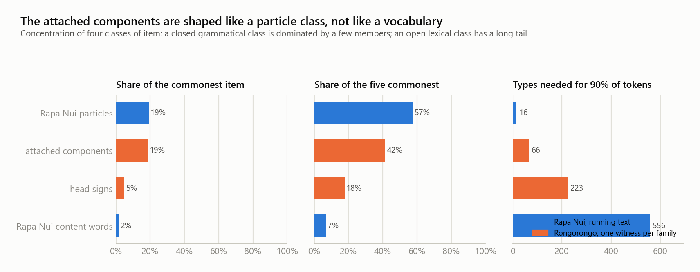

| Class | Tokens | Types | Commonest item | Five commonest | Types for 90% |
|---|---|---|---|---|---|
| Rapa Nui particles | 1,079 | 31 | *te*, 19% | 57% | 16 |
| Attached components | 3,088 | 224 | sign 76, 19% | 41% | 66 |
| Head signs | 8,688 | 649 | stroke 1, 5% | 18% | 223 |
| Rapa Nui content words | 1,868 | 742 | 2% | 7% | 556 |

| Density | |
|---|---|
| Particles per word token, Rapa Nui | 0.37 |
| Particles per content word, Rapa Nui | 0.58 |
| Attachments per unit, rongorongo | 0.36 |
| Free simple signs per unit, rongorongo | 0.37 |

- **The attachment class has the shape of a particle class.** Its commonest member carries 19 percent of it, exactly the share *te* carries among the particles, and its five commonest carry 41 percent against 57. On the three concentration measures the attachments sit at distance 0.30 from the particles and 2.48 from the content words. The head signs, by contrast, profile like the content words. The script's two layers split the way the language's two classes split.
- **The density matches too.** There are 0.36 attachments per unit and 0.37 particles per Rapa Nui word token. If a unit is a word, the script attaches a mark as often as the language uses a particle. The match is not exact in the other direction: per content word Rapa Nui has 0.58 particles, so if units were content words only, a third of the particles would still be unwritten.
- **Free strokes are the other candidate, and they match on density alone.** Free simple signs also run at 0.37 per unit, but section 6 showed they do not behave like a grammatical class: they attach to anything and follow anything. The attachments are the layer that is both concentrated like particles and, from section 6, host-selective like affixes.
- **What this does not show.** A matching profile and a matching rate are consistent with the attachments being particles; they do not prove it, since any small closed class of modifiers would give the same shape. What it rules out is the view that the attachments are ordinary signs that happen to be fused: nothing about their distribution looks like vocabulary.

> **Caveat.** The particle list is a linguist's closed class applied to OCR'd text; a few Rapa Nui words are both particle and content word depending on use, and were counted as particles throughout. The attachment profile is Barthel's, and section 7 showed copies vary in exactly this layer, so its tail is inflated by variant spellings of the same mark.

## 25. The glyphs as carved

*In plain words: everything so far used Barthel's numbers for the signs. Here the drawings themselves are cut into individual glyphs, ten thousand of them, each labelled with its transliteration, so that questions about the signs as physical marks can be asked: how much one sign varies from tablet to tablet, whether different tablets were carved by different hands, and whether carvers ran out of room toward the ends of lines.*

Barthel's tracings of 31 sides were fetched from Wikimedia Commons, cut into lines by their ink bands, and each line cut into glyphs by connected components, with stacked or fused parts merged. The glyphs of a line were then aligned to its transliterated units by count, merging the narrowest gaps or splitting the widest blobs where the counts disagreed; a line needing more than a quarter of its units adjusted is marked unreliable. Keiti's verso aligned on every line and the result was checked by eye against section 3. The instances are not in the repository, since the drawings are Barthel's; the table of their positions and labels is.

| | |
|---|---|
| Tracings on Commons | 31 sides; the small objects F verso, M, O, U to Z have none |
| Instances cut | 10,145 on 29 sides |
| On lines aligned within tolerance | 9,365 on 29 sides, after the sliver fix described under the prints; 8,039 before it |
| Sides aligning on most lines | Keiti both sides, Tahua, the Staff, H, P, Q, Aruku Kurenga, Small Washington |
| Sides too small to segment well | Mamari verso, Small Santiago recto, Honolulu, the Vienna and London tablets |

**Hands cannot be tested on tracings, and the result says so.** For every pair of sides sharing enough signs, the similarity of the same sign across the two sides was compared with its similarity within each. If different carvers drew a sign differently, the cross-side penalty would be large for some pairs and near zero for sides by one hand. It is near zero for all 160 pairs, between -0.005 and +0.056, and the copy families are no closer than unrelated sides. That is the expected result for drawings all made by one person: the hand these tracings record is Barthel's. Scribal hands need photographs.

**Variation per sign is real but the descriptor can barely see it.** At this resolution a glyph is 25 to 40 pixels tall, and the shape descriptor that separated Barthel's type drawings in section 9 gives instances of one sign a similarity of 0.19 to 0.31 against 0.21 for instances of different signs. The most consistent signs as drawn, 56, 760, 608, 680 and 92, and the least, 77, 15 and 3, are listed in `out/tracings_variation.csv`, but the ranking is weak evidence. A stroke-based descriptor was tried and did not improve on this one (section 9, last subsection); larger images of the glyphs, from photographs, are what the variation question needs.

**Glyph width along the line: a result that shrank when the segmentation improved.** Within each aligned line, glyph width relative to the line's median was regressed on position along the line; height was regressed the same way. A first version of this table, from the original segmentation, showed narrowing of a fifth to a third on the H, P and Q rectos, Aruku Kurenga and the Staff, and widening on Keiti's verso and Small Santiago's verso. Hand-drawn boxes on the prints then exposed a fault in the segmentation: Barthel draws a plain stroke as two parallel lines, and where their ends are open the segmentation cut each into a box two pixels wide. Those slivers were not evenly placed. On Aruku Kurenga's recto 58 percent of them fell in the outer fifths of their lines, on Small Santiago's verso 65 percent, against 40 percent expected, and a sliver counted as a glyph of relative width near zero pulls the end of a line down. With the slivers joined to their strokes (section 25, the prints), the table is this.

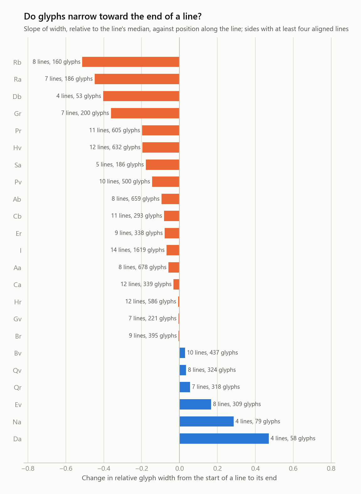

| Side | Lines | Width slope | Same with line ends dropped | Odd lines | Even lines | Height slope |
|---|---|---|---|---|---|---|
| Rb | 8 | -0.51 | -0.17 | -0.85 | -0.21 | -0.08 |
| Ra | 7 | -0.45 | -0.58 | -0.53 | -0.34 | -0.07 |
| Db | 4 | -0.40 | +0.18 | n/a | -0.51 | -0.05 |
| Gr | 7 | -0.36 | -0.45 | -0.42 | -0.27 | -0.09 |
| Pr | 11 | -0.20 | -0.14 | -0.37 | -0.01 | -0.00 |
| Hv | 12 | -0.20 | -0.25 | -0.36 | -0.04 | +0.01 |
| Sa | 5 | -0.18 | -0.20 | -0.41 | +0.21 | -0.02 |
| Pv | 10 | -0.14 | -0.23 | -0.08 | -0.20 | +0.02 |
| Ab | 8 | -0.10 | -0.12 | -0.05 | -0.14 | +0.04 |
| Cb | 11 | -0.08 | -0.04 | -0.04 | -0.13 | -0.00 |
| Er | 9 | -0.08 | -0.01 | +0.02 | -0.20 | -0.01 |
| I, the Staff | 14 | -0.07 | -0.07 | +0.04 | -0.18 | -0.03 |
| Aa | 8 | -0.06 | -0.10 | -0.04 | -0.07 | +0.01 |
| Ca | 12 | -0.03 | -0.18 | +0.06 | -0.13 | +0.01 |
| Hr | 12 | -0.01 | -0.03 | -0.80 | +0.77 | -0.01 |
| Gv | 7 | -0.01 | +0.03 | -0.06 | +0.03 | -0.07 |
| Br | 9 | -0.01 | -0.12 | -0.27 | +0.22 | -0.04 |
| Bv | 10 | +0.03 | +0.01 | +0.04 | +0.02 | -0.04 |
| Qv | 8 | +0.04 | +0.00 | -0.07 | +0.15 | -0.01 |
| Qr | 7 | +0.06 | -0.07 | -0.10 | +0.18 | -0.03 |
| Ev | 8 | +0.17 | +0.28 | +0.06 | +0.28 | +0.01 |
| Na | 4 | +0.29 | +0.12 | +0.37 | +0.21 | -0.03 |
| Da | 4 | +0.47 | +0.98 | +0.44 | +0.50 | +0.11 |

- **Most of the narrowing was the segmentation's.** The Great Santiago recto went from -0.25 to -0.01, Aruku Kurenga's recto from -0.21 to -0.01, the Small St Petersburg recto from -0.22 to +0.06, the Staff from -0.17 to -0.07, and Small Santiago's widening from +0.23 to -0.01. What remains is a narrowing of a seventh to a fifth on the Great St Petersburg tablet, both faces, the Great Santiago verso and Great Washington, stronger on the small Atua Mata Riri and Small Santiago recto, and a widening on Keiti's verso, Échancrée and Small Vienna. Height slopes stay near zero everywhere. Squeezing to fit a fixed text is still the natural reading of the sides that narrow, and the St Petersburg faces are copied texts; but the claim is now about a handful of sides, not a general habit of the carvers.
- **The odd-line pattern survives on one side, and it is a physical one.** Barthel drew every line in reading orientation, so a squeeze toward one physical end of the tablet would show as narrowing on alternate lines and widening on the others. The permutation test of `scripts/parity_check.py` regroups each side's lines at random. On the re-cut instances the Great Santiago recto's odd lines slope -0.94 and its even lines +0.97, equal and opposite, and no random regrouping of its twelve lines matches that; the Staff shows a weaker version at one regrouping in a hundred; every other side is within chance. So on that one face, in the frame of the wood, glyph widths shrink toward one end on every line, which is why its pooled slope is zero. The Great St Petersburg recto carries a copy of the same text and shows no such pattern, so this belongs to the object or to Barthel's image of it, not to the text: either the carver crowded toward one end of the wood, or the photograph Barthel traced was foreshortened along the tablet. The print of that face is too small to decide, fourteen pixels to a glyph. The odd and even columns stay in the table for this case.
- **Keiti's verso widens, and that survives everything.** Its slope was +0.17 before the fix and is +0.17 after, +0.28 with line ends dropped, and section 25's print comparison finds the same on boxes drawn by hand on the photograph. It is the list text of section 4, not a copy of anything.

> **Caveat.** Everything here is measured on Barthel's tracings, which are drawings after photographs and rubbings; proportions are presumably faithful but a tracer's hand is between us and the wood. Segmentation by count alignment is wrong wherever glyphs touch, and the quality flag is coarse. The positional analysis pools lines of different lengths, and the parity split has few lines per side; both slopes and their split should be re-derived from photographs before anyone builds on them.

### The prints: registered to the tracings

*In plain words: the tracings are drawings; the prints are photographs of the wood, retouched so the glyphs show white. A first try at cutting the prints on their own failed. The second try uses what the tracings already know, where every glyph sits in its line, and finds each line on the photograph. That worked, and for the first time the glyphs measured here are the carved ones.*

Commons holds, for every object that has a tracing, a print in which the glyphs were filled white for legibility, mostly from Chauvet's 1935 volume, plus a few rubbings and one unretouched photograph; the Keiti photograph at the head of this report is one of them. A first attempt to segment the prints by their own row profiles did not work: the prints vary in polarity, contrast and resolution, and only two sides produced line cuts that aligned by count, wrongly even then. That attempt is kept in the history of the repository and nothing from it is used.

The second attempt registers each print to its tracing. This cannot be one transform, because the tracing is not a picture of the tablet: Barthel drew every line upright and left to right, while on the wood alternate lines are upside down, the object is curved, and Barthel's spacing is not the carver's. Even one line cannot be matched as a rigid strip. So the registration is built from short pieces upward. The print is reduced to an ink map by local contrast. Every run of six glyphs in a reliable tracing line, filled in (Barthel drew outlines, the prints are solid) and blurred, is correlated over the whole print in both orientations, and its best twelve peaks are kept; a run alone is ambiguous, because the glyph field is full of similar shapes. Then all runs of all lines vote for one layout of the side, a first-line position, a line pitch, a direction and a parity, with reverse boustrophedon built into the vote, since the orientation must alternate line by line. The surviving runs give each line a stretch map along it and a curve across it, each glyph is matched once more in a small window around its predicted place, and the box is cut from the print at full resolution and turned upright. The print instances are not in the repository, since the prints are Chauvet's; the table of boxes and scores is.

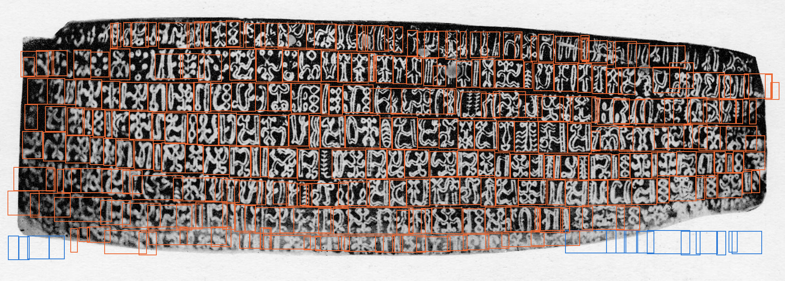

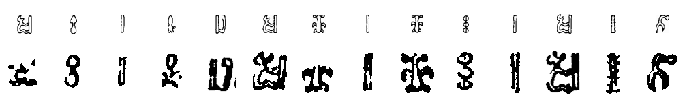

| | |
|---|---|
| Prints registered | 22 sides; Tahua's three-part prints and the rubbings skipped |
| Reliable tracing lines placed | 156 of 168, after the sliver fix; 125 of 131 before it |
| Glyphs cut from the prints | 5,358, of which 4,594 with a local match above the threshold |
| Vote strength | 0.75 to 1.0 of the candidate mass on every side |
| Width of the print glyph against the tracing glyph, relative to line medians | 0.91 over 4,442 glyphs with automatic boxes, which inherit the tracing's widths; 0.65 on the hand-corrected lines of Keiti's verso |

**The width test was circular, and the hand-corrected boxes show it.** The width of each print glyph, measured from its own ink inside a padded box, follows the width of the tracing glyph with a correlation of 0.91. The report first read that as Barthel's proportions being faithful. It is not that: the box comes from the tracing, and the padding does not free it. On the seven lines of Keiti's verso corrected by hand, where the boxes are drawn on the wood with no reference to the tracing and sit tight to the ink, the correlation with the tracing widths is 0.65, and on the one untouched line it stays at 0.96. Part of the disagreement is on the tracing side: the count alignment cuts Barthel's drawing into slivers where it splits a stroke, and twelve percent of the reliable tracing instances are under eight pixels wide. With those set aside the corrected lines give 0.62. How faithful Barthel's proportions are is therefore an open question that needs hand-drawn boxes on the tracing as well as on the print; the automatic number is not evidence either way.

**The narrowing along lines is the carver's, not the tracer's.** The section 25 slopes were recomputed on the print glyphs. On Keiti's verso, where seven lines now carry hand-drawn boxes that owe nothing to the tracing, the widening slope is +0.18 against +0.17 on the tracing, the one comparison here that is free of the circularity described above. Over the fourteen sides whose glyphs stand at least 30 pixels tall on the print, print and tracing slopes correlate at 0.82 and agree in sign on ten, but after the sliver fix most of that agreement is on slopes near zero: Aruku Kurenga, Mamari, Small Santiago's verso and the Small St Petersburg verso are flat in both sources. What the print confirms is the widening on Keiti's verso, +0.23 against +0.17, and on Échancrée, and the narrowing on the Small Santiago recto and Atua Mata Riri's recto. What it does not confirm is the narrowing on the Great St Petersburg tablet, -0.20 and -0.14 on the tracing, +0.03 and +0.08 on the print, nor on Atua Mata Riri's verso. The Great Santiago faces and Great Washington are below the resolution where a width can be measured.

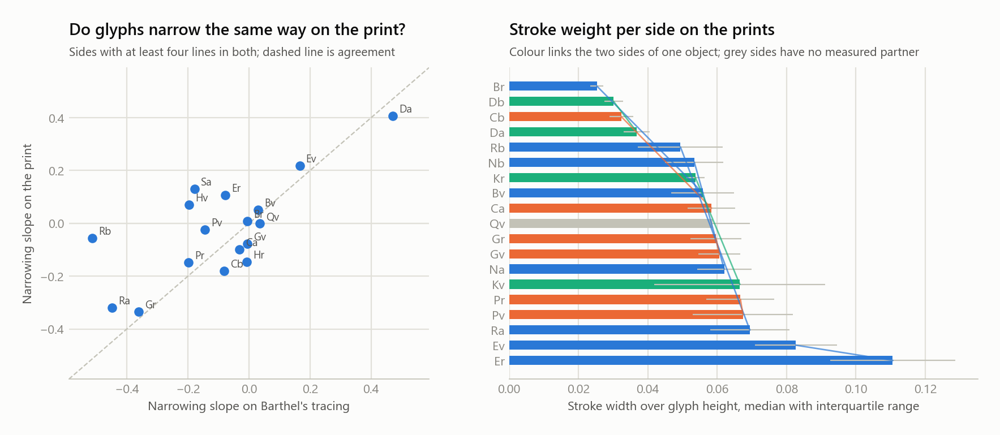

**The hands test is blind, and now we know by how much.** The cross-side penalty of section 25 was recomputed on the print glyphs and is again near zero for every pair of sides, between -0.004 and +0.043. Before reading that as one hand, the test was given a positive control: side B's glyphs re-read with every stroke thickened by one pixel. The control penalties are indistinguishable from the real ones, median 0.018 against 0.016 on the prints and 0.017 against 0.013 on the tracings. The descriptor, a blurred silhouette with gradient histograms at 32 pixels, does not see stroke weight, which is the first thing a different tool or hand would change. The near-zero penalties in section 25 and here are therefore not evidence of one hand; they are evidence that this descriptor cannot tell hands apart. That is a correction to the way section 25 put it.

**Stroke weight can be measured on the prints, and it measures the print.** Stroke width relative to glyph height, from the skeleton and distance transform of each print glyph, was taken per side. The two sides of one object are a little closer in it than sides of different objects, mean difference 0.016 against 0.021 over nine pairs, with a permutation test at 0.07. And the clearest pair shows what the number carries: Aruku Kurenga's two faces, carved by one hand on one piece of wood, differ by more than almost any other pair, 0.025 against 0.057, because the two prints were retouched differently. What survives in a white-filled print is the retoucher's brush over the carver's groove, and stroke weight cannot separate them. Whose hand carved which tablet needs photographs that were never retouched, or the objects themselves.

**Hand correction.** Automatic boxes go wrong in predictable places: thin strokes, where a narrow template has little to lock on; line ends, where the chained shift has drifted furthest; and wherever the print's lines are packed tighter than the tracing's, so that a tall box reaches into the neighbouring line and picks up the top of a glyph there. Two of the fourteen pairs shown above are of that last kind, a plain stroke with the top of a glyph from the next line beneath it; clipping every box to the print's own line band, which the registration now does, did not cure those two, and no automatic rule will catch every case. So the boxes can be corrected by hand. `scripts/box_editor.py Ev` opens the print with its boxes; a box is moved by dragging it, resized by dragging an edge or a corner, deleted, or drawn new; Tab steps through the boxes in reading order, first a box's left and top edges, then its right and bottom, and the arrow keys move the active edges a pixel at a time, with Shift for the whole box and Ctrl for five pixels; and the reading position and unit label of every box follow from its order along the line, so that the status bar can say whether a line's box count matches its transliteration. Saving writes `data/boxes/Ev.json`, which is committed, and from then on the registration uses those boxes for every line of that side whose box count matches its unit count, marking them `manual` in `out/photo_instances.csv`, so the corrections are part of the reproducible run rather than a one-off; a line whose counts differ is unfinished and keeps its automatic boxes. Seven of Keiti's eight lines have been corrected so far, and the first thing they did was expose the width test above.

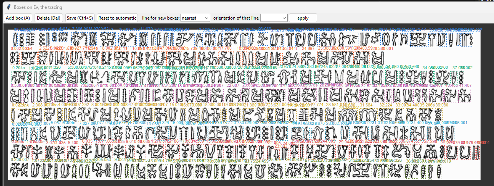

In print mode the key O lays Barthel's tracing over the photograph in translucent red, every line turned to match its orientation on the print and scaled to its extent, so that a doubtful box can be judged against the drawing without leaving the print; Ctrl with the arrows moves the overlay of the selected line, or of all lines when nothing is selected, the bracket keys rescale it, and the alignment is saved with the boxes.

The same editor works on the tracing: `scripts/box_editor.py Ev --source tracing` opens Barthel's drawing with the count-aligned boxes, and `--seed-from-print` places its first boxes from the finished print boxes instead, mapping each print line onto the tracing line and shrinking every box to the ink under it, so that they need a nudge rather than a redraw. The corrections go to `data/boxes/tracing/Ev.json` and `tracings.py` uses them for any line whose count matches, marking those instances `manual`. With boxes drawn by hand on both images the width comparison becomes what it should have been from the start.

The sliver problem was also fixed at its source. Barthel draws a plain stroke as two parallel lines, and where their ends are open the segmentation saw two components a pixel apart and gave each a box two pixels wide; the count alignment then had one blob too many and split or merged elsewhere to compensate. Components narrower than a stroke now join their neighbour across a gap of up to three pixels, and a split may no longer leave a piece narrower than five. Instances under five pixels wide fell from 307 to 28, and because the count alignment no longer had to absorb the fragments, the instances on lines aligned within tolerance rose from 8,039 to 9,365.

> **Caveat.** The registration has been checked by eye on Keiti's verso, the check images above, and on no other side; the vote strength and the local match scores in `out/register_sides.csv` and `out/photo_instances.csv` are the only quality measures elsewhere, until a side has been corrected by hand. Glyphs at line ends and thin strokes match worst. Three prints are below usable resolution, and the automatic boxes still come from the tracing, so a glyph Barthel misdrew is cut wrong here too.

## 26. The untyped sides

*In plain words: twelve tablet sides, Tahua's two among them, matched nothing else in the corpus and got no label in the catalogue of section 19. Are they a kind of text we have not seen, or ordinary texts that simply were never copied? We ran every side through a new battery of tests that the earlier passes could have missed, and read the twelve against the nineteen typed sides.*

Four tests, on all 31 sides with at least 40 units. Periodicity: how often the sign at one position equals the sign a fixed distance later, for distances up to 60, against 200 shuffles; a peak at a distance means repeats at a fixed interval, the signature of verse. Lines: whether the transliterated lines are units of the text, measured as how far the line-initial signs depart from the side's background against random cuts. Internal repeats: the share of a side covered by runs of three signs that recur within it with one substitution allowed, against the same on the shuffled side. Affinity: mean vocabulary similarity to each typed group, from section 10's matrix. Then the profile of strokes, attachments, sign 76 and doubling, and the signs each side over-uses.

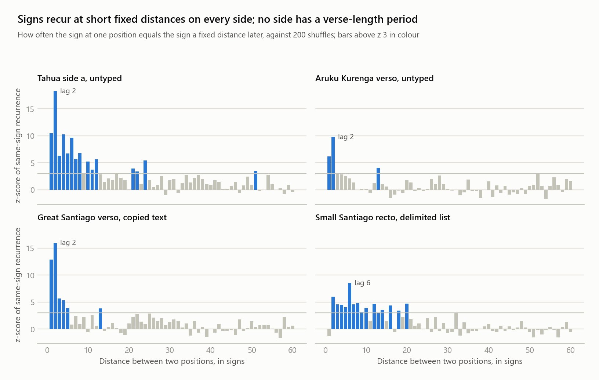

| Side | Units | Strongest period | z | Internal repeats, side / shuffled | Nearest group | Over-used signs |
|---|---|---|---|---|---|---|
| Aa, Tahua | 678 | 2 | +18 | 55% / 36% | copied H/P/Q | 4, 22, 65, 11 at 13 times their corpus rate |
| Ab, Tahua | 659 | 2 | +11 | 76% / 66% | copied H/P/Q | 742, 741 |
| Bv, Aruku Kurenga | 510 | 2 | +10 | 52% / 39% | copied H/P/Q | 54, 405, 320 |
| Gv, Small Santiago | 243 | 2 | +11 | 44% / 32% | copied H/P/Q | 33 at 23 times, and sign 76 on 17% of units |
| Ra, Small Washington | 194 | 1 | +4 | 56% / 53% | copied H/P/Q | 20, 40 |
| Rb, Small Washington | 161 | 2 | +5 | 41% / 44% | copied H/P/Q | 680 at 22 times |
| Da, Db, La, Ma, Nb, Oa | 44 to 106 | 1 to 3 | +4 to +7 | mixed | copied H/P/Q, Ma nearer refrains | La: 51 at 126 times; Ma and Oa: the hand 6 |
| Typed sides, for comparison | | 1 to 6, Ta 41 | +3 to +16 | excess of 0 to 23 points | | |

- **No side, typed or untyped, has a verse-length period.** Every side peaks at a distance of 1 or 2, which is doubling and the alternation device of section 5, and nothing recurs at fixed distances of 5 to 60 beyond chance. The one exception is Small Santiago's recto at distance 6, which is the rhythm of its delimited list. Whatever these texts are, they are not stanzas of fixed length.
- **Tahua is the most alternation-heavy text in the corpus.** Its side a repeats a sign at distance 2 with a z-score of 18, above every copied text, with harmonics at 4, 6 and 8, and the signs it over-uses, 4, 22, 65 and 11, are the heads and fillers of the alternating series found on its first line in section 5. The largest tablet is built on the A-x-A-y device more thoroughly than any other object. It also showed what looked like the corpus's one hint of a longer period, a weak secondary peak at distances of 22 to 24 signs with z near 5. A closer look, in `scripts/tahua_period.py`, resolves it: the excess is not a rhythm of the side but a single passage on line 7, where a run of about ten signs beginning 2, 80, 4, 280, 182, 48, 22, 25 recurs 22 positions later, together with a shorter repeat at 19. The signs that carry the peak recur at irregular gaps everywhere else on the side, three of thirty for the commonest, and side b shows no excess at those distances. Tahua has an internal refrain of the Keiti-recto kind on one line, not stanzas.
- **Lines are not units of text anywhere.** No side's line-initial signs differ from its background beyond what random cuts produce; the closest are a few typed sides at p 0.05 to 0.09. The carver's line was a physical unit, not a textual one, on every object.
- **The untyped sides are as internally repetitive as the typed ones.** Their loose internal repeats exceed the shuffled baseline by the same margins as the copied and list texts do. They are structured; the structure is simply not shared with any other object.
- **Their vocabulary is the common one.** Eleven of twelve sit nearest the H, P, Q group by sign frequencies, which is where the bulk of the corpus sits, not near the lists, the triads or the refrains. They are not a separate genre by vocabulary; they are texts in the general idiom, each marked by its own repeated sign.

**So the residue is not a hidden genre.** The twelve sides are ordinary compositions in the common vocabulary, using the common devices, each built around a sign or two of its own, and never copied. Their isolation is a fact about transmission, not about kind. Small Santiago's verso is the one with a claim to something more: a sixth of its units carry sign 76, which puts it between the general texts and the Staff, as section 14 also found.

> **Caveat.** The periodicity test uses head signs and exact identity, so a refrain written with varying attachments or substituted signs would register weakly; the loose-repeat test partly covers that. The line test has few lines per side and low power. Vocabulary affinity to the H, P, Q group is expected for any text in the general idiom, since that group is the largest and most typical, and says little on its own.

## 27. Charts

All charts are produced by `scripts/charts.py` from the tables in `out/`.


## 28. What it means and what it does not

Nothing here reads a sign. Fish 700 appears five times on Keiti's verso, always inside a formula or a list slot; the verso's commonest signs are strokes, the delimiter, and sign 22, none of them pictures of anything. A rendering into English sentences would be invention.

What the evidence supports is a genre-level and layer-level description. The texts are recited formulaic material: copied sets on H, P, and Q, a condensed copy on K, delimited lists whose items are mostly unique, refrains and alternating series. Within a text, three layers behave differently. The head sign is the open, content-bearing class. The attached component is a small closed class that copyists treated as optional and that carries whatever host selectivity exists. The compound unit is the word-sized thing. This picture is consistent with the mixed logo-syllabic reading most specialists favour, and it argues against both the picture-reading and the pure-cipher framings.

What is probably known already: the families, the 380.1 lists, the Mamari calendar, and the size of Barthel's inventory. What is worth checking against the literature: the negative affix result for free strokes and the fixed stacking order; the finding that copies vary in attachments rather than head signs, and that the attachment class has the profile and density of the Rapa Nui particle class; the word-like statistics of whole units; the results that neither shape merging, template decomposition nor stroke-based matching can bring the inventory near a syllabary; the shuffled-null test showing the Staff's sign-76 triads are a real structure, respected by the carver's dividers, with the shape of the 1886 creation chant, while they neither chain nor repeat parents nor keep separate slot vocabularies; the measurement that Metoro's chant names signs consistently against a shuffled null while Ure Vaeiko's recitation for the same tablet bears no relation to it; the bound on statistical decipherment from a positive control; the narrowing of glyphs along lines; and the finding that the isolated sides are texts in the common idiom rather than a separate genre.

### Open questions and next tests

- **Are units words?** Section 13 compares them with the 1886 recitations: units are shorter than words and the particle layer is thinner, which points to logographic signs with particles either unwritten or carried by attachments. A cleaner and larger Rapa Nui sample would sharpen this.
- **What is the stacking order?** Chains of the small signs in the order 4, 2, 1, 9 could be a numeral system or an affix sequence. Counting how often each chain length occurs, and where in a list entry it falls, would separate the two.
- **What does 380.1 do?** It never repeats and it separates word-length items. Whether its own attachments, 3 on G and K, 52 on N, correlate with the entries around it is testable.
- **Are Keiti's refrains strophic?** The recto refrain on Er1, Er2, Er3, and Er6 and the Ev7 series both look like chant structure. Measuring the distance between refrains against the line lengths of documented Rapa Nui chants is a test that needs no reading.
- **Do compounds decompose?** Section 12 finds no shape evidence that the rare signs are built from the frequent ones, at the resolution a pixel matcher allows, and section 9 shows stroke-based matching does no better on these drawings. Pressing the question needs larger images of the signs than Barthel's catalogue provides.

## 29. Method, data, reproducibility

The data is the CEIPP numerical transliteration of the whole corpus, Thomas Barthel's numbering as extended by the Cercle d'Études sur l'Île de Pâques et la Polynésie, served at kohaumotu.org, and Barthel's sign catalogue drawings from the same site. Each unit is one compound as Barthel drew it; components are joined by dots, variant letters mark drawn variants, a question mark marks doubt, and 000 marks an illegible sign. Matching throughout strips variant letters and doubt marks, and most comparisons use only the first component so ligature differences do not break a match. Where copies would count the same evidence several times, the H, P, Q group and the G, K pair are down-weighted or reduced to one witness.

### Layout

```
data/html/          raw transliteration pages, one per object (A to Z)
data/corpus.json    parsed corpus: line id -> list of Barthel units
data/signs/         catalogue pages, row GIFs, rows.json (row -> five sign numbers)
docs/img/           line crops from Barthel's tracings used in this README
scripts/            one script per analysis, see below
out/                generated CSV and Markdown reports
```

### Run

Everything, in order, with data fetched on first use:

```bash
pip install -r requirements.txt
python run_all.py            # add --fast to skip the five-minute decomposition test
```

Or step by step:

```bash
python scripts/fetch_corpus.py                 # only to refresh data/html
python scripts/parse_corpus.py
python scripts/alternations.py
python scripts/lists_380.py
python scripts/affix_test.py
python scripts/parallels.py
python scripts/parallels.py --min-run 4 --mismatch 1 --suffix _fuzzy
python scripts/allographs.py
python scripts/parallels.py --merge out/allograph_merge.csv --suffix _merged
python scripts/inventory.py
python scripts/fetch_signs.py
python scripts/sign_shapes.py
python scripts/stroke_shapes.py        # needs scikit-image
python scripts/genre_entropy.py
python scripts/collocations.py
python scripts/decompose.py --tol 1    # about a minute per pass on 16 cores, 5 passes
python scripts/fetch_rapanui.py        # Thomson 1891 OCR text, public domain
python scripts/metraux_text.py         # only if page scans of Metraux 1940 are in data/metraux; needs Tesseract
python scripts/rapanui.py
python scripts/fetch_lexicon.py        # Churchill 1912 with Roussel's vocabulary; Routledge 1919
python scripts/lexicon.py
python scripts/chant.py
python scripts/staff_chain.py
python scripts/staff_dividers.py
python scripts/fetch_metoro.py         # Metoro's readings, Jaussen 1893, public domain
python scripts/metoro.py
python scripts/metoro_merge.py
python scripts/synthesis.py
python scripts/robustness.py
python scripts/mamari_calendar.py
python scripts/calendar_names.py       # needs data/rapanui/nights.txt, the thirty night names
python scripts/two_islanders.py
python scripts/decipher.py             # about 3 minutes
python scripts/fetch_polynesian.py     # Maori and Tahitian texts from archive.org, reduced to Rapa Nui-shaped tokens
python scripts/decipher.py --lm maori  # the same search and controls under a related-language model; also tahitian, polynesian
python scripts/decipher_length.py      # how much text the search needs, on a known Maori text
python scripts/matched_stats.py        # glyph statistics against Maori and Tahitian words and syllables at the corpus's size
python scripts/attachments.py
python scripts/fetch_tracings.py       # Barthel's tracings from Commons, at a polite pace
python scripts/tracings.py
python scripts/tracings_analysis.py
python scripts/parity_check.py
python scripts/fetch_photos.py         # the white-filled prints from Commons
python scripts/register.py             # the tracings registered to the prints, line by line; about 40 minutes
python scripts/box_editor.py Ev        # optional: correct the boxes of one side by hand; saved corrections are used by the next register.py run
python scripts/tracings_analysis.py --source photos
python scripts/hands_prints.py
python scripts/allograph_candidates.py  # rare signs against their series-mates by context, with print shapes where they exist
python scripts/untyped.py
python scripts/tahua_period.py
python scripts/charts.py
python scripts/glyphs.py
```

Requires Python 3.10 or later with numpy, scipy, Pillow, matplotlib and scikit-image, as listed in requirements.txt, and Tesseract for the Métraux page scans. The kohaumotu site serves plain http only and its TLS certificate has expired.

| Script | Produces |
|---|---|
| fetch_corpus.py, parse_corpus.py | data/html, data/corpus.json |
| alternations.py | Every alternating series, filler inventories, affix-like against list-like |
| lists_380.py | The 93 list entries, exact and ligature-tolerant clusters, families, entry shape |
| affix_test.py | Host selectivity, enrichment, fused hosts, stacking order |
| parallels.py | Shared runs, blocks, side matrix, families; options for run length, substitutions, merges |
| allographs.py | Substitution pairs, component swaps, merge tables |
| matched_stats.py | Glyph streams against Māori and Tahitian words and syllables in contiguous windows of the corpus's size: types, hapax share, top-ten share, Zipf slope, type-token curves |
| inventory.py | Three inventories with coverage thresholds and Zipf slopes |
| fetch_signs.py, sign_shapes.py | Catalogue drawings, similarity, look-alike classes, contact sheet |
| stroke_shapes.py | Skeleton-based descriptors (stroke counts, skeleton image, shape contexts) calibrated against the pixel descriptor on Barthel's variant pairs |
| genre_entropy.py | Vocabulary similarity of sides, clusters, 2-D map coordinates; unigram and conditional entropy per layer |
| collocations.py | Sign pairs and triples scored by log-likelihood ratio and PMI, spread across sides, stroke chains and their hosts |
| decompose.py | Tolerant template decomposition of rare signs into frequent ones, parallel, with random and positive controls; options --tol, --limit, --controls, --basic, --workers |
| fetch_rapanui.py, rapanui.py | Thomson 1891 OCR text; word length, reduplication and frequent-item comparison against rongorongo units |
| fetch_lexicon.py, lexicon.py | Churchill 1912 and Routledge 1919 OCR; a Rapa Nui lexicon of headwords from Roussel's vocabulary, with syllable inventory, length and reduplication over types |
| metraux_text.py | OCR of hand-saved page scans of Métraux 1940 and extraction of the Rapa Nui-language lines into the working corpus; statistics only are published |
| chant.py | Entry shape of the 1886 creation chant against the 380.1 lists and the sign-76 segmentation of the Staff, Gv and Ta, with a shuffled null |
| staff_chain.py | Chaining and parent-repetition of sign-76 segments on the Staff, Gv, Ta and in the chant, against shuffled order; slot vocabularies |
| staff_dividers.py | Stretches between the Staff's carved dividers: length, alignment with the 76 triads, openers and closers, cohesion, repeats, against random dividers |
| fetch_metoro.py, metoro.py | Metoro's 1873 readings line by line; word alignment to Barthel's signs, consistency against shuffled line pairing, words per series |
| metoro_merge.py | Sign pairs proposed by Metoro's words, checked against shape and copy substitutions, and tested by rerunning the parallel map against random frequency-matched merges |
| synthesis.py | The typology of texts (one row per side) and the sign dossier (one row per sign), gathered from every other table |
| robustness.py | The headline measures recomputed under six candidate inventories, with a stability verdict for each |
| mamari_calendar.py | The Mamari calendar lines classified into crescents, marker groups and other signs; runs and counts against a lunar month |
| calendar_names.py | The calendar's runs and marker groups against the thirty named nights of the month, with permutation tests |
| two_islanders.py | Vocabulary similarity between Ure Vaeiko's 1886 recitations and Metoro's 1873 chants, same-tablet pairs against the rest |
| decipher.py | One-to-one assignment of the frequent signs to Rapa Nui syllables by annealing, with shuffled, reversed, wrong-language and positive controls; `--lm maori`, `tahitian` or `polynesian` trains the model on a related language as well |
| fetch_polynesian.py | Public-domain Maori and Tahitian scripture and traditions from archive.org, mapped to Rapa Nui phonotactics as token streams |
| decipher_length.py | The same search on a held-out Māori text at increasing lengths, to find how much text recovery needs |
| attachments.py | Concentration and density of the attached components against the Rapa Nui particle class and content words |
| fetch_tracings.py, tracings.py | Barthel's tracings of 31 sides from Commons; lines and glyph instances cut and aligned to the transliteration, with a quality flag per line |
| tracings_analysis.py | Per-sign variation, cross-side hand penalties with a thickened-stroke positive control, and glyph width along the line with end-dropping and line-parity checks; `--source photos` runs it on the print glyphs |
| fetch_photos.py, register.py | The white-filled prints from Commons; each tracing registered to its print by chunk correlation and a layout vote, glyphs cut from the print, fidelity of width and shape to the tracing |
| hands_prints.py | Stroke weight per side on the prints and a same-object permutation test |
| allograph_candidates.py | Every rare sign against the common sign of its Barthel series: how well the common sign's neighbours predict the rare sign's, ranked among all common signs, with a shuffled-label null and the copy pairs as positive control; catalogue and print shape alongside |
| box_editor.py | A tkinter editor for the boxes on a print or, with `--source tracing`, on Barthel's drawing, seeded from the print boxes if wanted: drag, resize, add, delete, Tab through edges and boxes, save to `data/boxes/<side>.json` or `data/boxes/tracing/<side>.json`, which register.py and tracings.py then use |
| check_reproduction.py | Diff of a regenerated out/ against the committed one, file by file |
| parity_check.py | Odd against even lines per side, with a permutation test of the slope difference |
| untyped.py | Periodicity, line structure, loose internal repeats, vocabulary affinity and sign profile for every side, read for the twelve untyped ones |
| tahua_period.py | What carries Tahua's recurrence at 22 to 24 signs: driving signs, returning groups, gap stability, line positions, and side b |
| charts.py | The twenty-two charts in docs/img |
| glyphs.py | The labelled glyph strips in docs/img/glyphs, cut from the catalogue drawings |

### How to cite

The repository carries a citation file, so GitHub's "Cite this repository" button gives the reference in APA and BibTeX. Cite the tagged version you used, since the analyses change between versions:

> Rochala, P. (2026). *Structure Without Reading: a reproducible structural analysis of the rongorongo corpus* (Version 1.0.0) [Software and working report]. https://github.com/rochal/rongorongo

```bibtex
@software{rochala2026rongorongo,
  author  = {Rochala, Piotr},
  title   = {Structure Without Reading: a reproducible structural analysis of the rongorongo corpus},
  year    = {2026},
  version = {1.0.0},
  url     = {https://github.com/rochal/rongorongo},
  note    = {Software and working report}
}
```

To cite one result, name the section, for example "section 15, chaining test", and the version. The data behind every figure is in `out/`, and the script that produced it is named in the table above, so a claim can be checked against the exact numbers rather than the prose.

### Licence

The scripts, this README and the generated outputs are under the MIT licence in LICENSE. The downloaded transliteration and sign catalogue are not redistributed here and remain with the CEIPP; the line crops in docs/img are from Barthel's tracings as hosted on Wikimedia Commons, and the small glyph strips in docs/img/glyphs are cut from Barthel's catalogue drawings as reproduced on kohaumotu.org, included as quotations for the purpose of commentary.

### Reproduction

The sequence was run end to end from a fresh clone on 6 September 2026: `pip install -r requirements.txt` and `python run_all.py`, 40 steps in 23 minutes on a 32-core machine, every data source fetched again. `scripts/check_reproduction.py` then compared the regenerated `out/` with the committed one: 113 of 122 tables identical byte for byte, none nondeterministic. The nine that differ all follow from the Métraux page scans, which cannot be redistributed and so are absent from a clone: without them the Rapa Nui corpus is Thomson's recitations alone, and the word comparison, the attachment profile and the decipherment run take the values a Thomson-only corpus gives. Anyone who adds the scans to `data/metraux/` reproduces the committed numbers.

```bash
python scripts/check_reproduction.py <path to a regenerated out folder>
```

### Conventions

Line ids are Barthel's: object letter, side, line (Ev04 = Keiti verso line 4). A unit like `380.001.003` is one compound glyph; `522fy` carries Barthel variant letters; `?` marks an uncertain reading and `000!` an illegible sign. In prose the leading zeros are dropped, so 380.001 is written 380.1.

### Sources

- Barthel, T. S. 1958. *Grundlagen zur Entzifferung der Osterinselschrift.* Hamburg.
- Pozdniakov, K. 1996. Les bases du déchiffrement de l'écriture de l'île de Pâques. *Journal de la Société des Océanistes* 103.
- Horley, P. 2005. Allographic variations and statistical analysis of the rongorongo corpus. *Rapa Nui Journal* 19.
- Fischer, S. R. 1997. *Rongorongo: The Easter Island Script.* Oxford.
- CEIPP transliteration and Barthel sign catalogue: http://kohaumotu.org/rongorongo_org/
- Jaussen, T. 1893. L'île de Pâques: historique, écriture, et répertoire des signes des tablettes ou bois d'hibiscus intelligents. *Bulletin de Géographie Historique et Descriptive.* Public domain; Metoro's readings as transcribed line by line on kohaumotu.org.
- Métraux, A. 1940. *Ethnology of Easter Island.* Bernice P. Bishop Museum Bulletin 160. Public domain in the United States (HathiTrust full view), in copyright elsewhere; page scans were saved by hand and OCR'd with Tesseract, and neither the scans nor the extracted text are in the repository, only their statistics.
- Churchill, W. 1912. *Easter Island: the Rapanui speech and the peopling of southeast Polynesia.* Carnegie Institution. Public domain; carries Roussel, H. 1908, Vocabulaire de la langue de l'Île-de-Pâques ou Rapanui, *Le Muséon* 9, in English. OCR text from the Internet Archive, item easterislandrapa00churrich.
- Thomson, W. J. 1891. Te Pito te Henua, or Easter Island. Report of the U.S. National Museum for 1889. Public domain; OCR text from the Internet Archive, item cu31924105726222.
- Barthel tracings: Wikimedia Commons files Barthel_<side>.png for 31 sides (Barthel_Ra.jpg, Barthel_I.png for the Staff), fetched through the Commons API at rendered size.
- Provenance and line counts of each object: the Wikipedia articles on the individual rongorongo texts.
