# Structure Without Reading

What the Barthel transliteration of the rongorongo corpus shows about its texts when you look for structure and refuse to guess at meaning. Started from the verso of the Keiti tablet.

| | |
|---|---|
| Corpus | 26 objects, 301 lines, 11,216 units |
| Source | CEIPP numerical transliteration, kohaumotu.org |
| Tracings | Thomas Barthel, 1958, via Wikimedia Commons |
| Status | Working report, September 2026 |

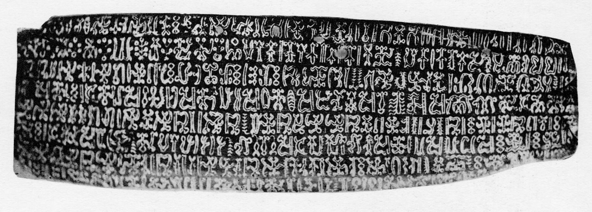

*The verso of the Keiti tablet, eight lines, Ev1 at the top. Photographed in Papeete in the early 1880s, some thirty years before the tablet was destroyed at Louvain in 1914; this print has the glyphs filled white for legibility. Public domain, via Wikimedia Commons.*

## What rongorongo is

Rongorongo is the script of Easter Island, or Rapa Nui, the Chilean island in the south-east Pacific some 3,500 kilometres from the South American coast and about as far from the nearest inhabited land in Polynesia. It survives on about two dozen wooden objects, mostly tablets, plus a staff, two breast ornaments, and a figurine, holding around 14,000 glyphs in all. The glyphs are carved in lines that alternate direction and orientation: a reader finishes one line, turns the tablet through a half turn, and reads the next. Barthel's catalogue of 1958 numbers the signs, and depending on how variants and compounds are counted the inventory runs from about fifty basic elements to several hundred. Eight of the commonest signs, in Barthel's numbering, as he drew them:

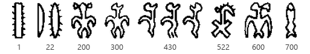

Europeans first recorded the script in 1864, and within a decade the islanders who might have been able to read it were gone, lost to slave raids by Peruvian ships in 1862 and the epidemics that followed. Islanders who chanted "readings" for missionaries in the 1870s and 1880s were reciting, not reading, and their chants match no tablet sign for sign. Whether rongorongo is true writing, a mnemonic aid for recitations, or something in between remains open, and no decipherment has won acceptance. The Keiti tablet in the photograph above, collected in 1870 and sent to Belgium, burned with the library of Louvain in 1914 and is known only from photographs, rubbings, and a tracing.

## About this project

I am Piotr Rochala, a software engineer from Poland with a long-standing fascination for ancient cultures and the scripts they left behind. I am not a linguist, an archaeologist, or a Pacific specialist, and this repository makes no claim to a decipherment. What it offers is the thing a software engineer can bring to a hundred-year-old problem: a reproducible pipeline over the published data, with every measurement scripted, every result paired with a control or a null, and every caveat stated where the number is. The corpus and the sign catalogue are Barthel's and the CEIPP's; the tracings are Barthel's; the Rapa Nui text is Thomson's. My contribution is the questions, the code, and the discipline of not guessing at meaning.

The work started with a single photograph of the Keiti tablet and the question of what could be said about it without reading it. It grew into the analyses below. Where a result is likely already known to specialists I say so; where I think it may be new I say that too, and I would be glad to be corrected on either. Issues and pull requests are welcome, and so is a message from anyone who works on this material.

Rongorongo is undeciphered and this report does not change that. It records nine structural results obtained by scripting over the published numerical transliteration and Barthel's sign catalogue, each with its evidence and its caveat, so that they can be checked against the literature and built on. Every result is reproducible from the scripts in this repository.

**In one paragraph.** The corpus divides into three families of copied texts and a majority of isolated ones; Keiti's verso is isolated but borrows two list entries from the Small Santiago tablet and one eight-sign formula shared by three tablets. The 380.1-delimited lists are a corpus-wide format whose entries are mostly unique and word-length. Alternating series are two devices, not one. The free-standing stroke signs fail a test for suffix behaviour but chain in a fixed order, and the affix-like behaviour lives in fused components instead. Copies of a text vary in those attached components far more than in head signs. Counted by head sign the inventory is far too large for a syllabary; counted by whole compound unit it has the statistics of words. Merging signs by drawn shape shrinks the head inventory by a quarter, not by the order of magnitude a syllabary would need.

## How to read this report

Each section opens with a paragraph in italics that says in plain words what was asked and how. The rest of the section gives the evidence. A few terms recur throughout:

- **Signs and their numbers.** Thomas Barthel numbered every glyph in 1958, and specialists refer to signs by those numbers. Sign 600 is a frigatebird, 700 a fish, 200 a seated figure, 1 a plain stroke. The numbers are labels, not meanings.
- **Units, heads, and attachments.** Scribes often fused two or more signs into one glyph. Barthel writes such a compound with dots, 380.1 for sign 380 with stroke 1 attached. In this report the whole compound is a *unit*, its first sign is the *head*, and the rest are *attachments*. Most comparisons use heads only, so that a sign written with or without a small extra mark still counts as the same sign.
- **Line names.** Each object has a letter and each line a number: Ev4 is the fourth line on the verso of tablet E, Keiti; Gr5 is line 5 on the recto of G, Small Santiago.
- **One witness per family.** Three tablets copy each other and a fourth copies a fifth. Where counting would otherwise count the same text several times, the copies are dropped.
- **Nulls and p values.** Many results are compared with a *null*: the same measurement on the data with its order shuffled, or with a sign placed at random, repeated hundreds of times. If the real text scores no better than the shuffled versions, the pattern is chance. The p value is the share of shuffles that scored at least as high as the real text; a p of 0.02 means two shuffles in a hundred did.

## Contents

1. [Keiti's verso against Barthel](#1-keitis-verso-against-barthel)
2. [Parallel passages and families](#2-parallel-passages-and-families)
3. [Two plates: what Keiti shares](#3-two-plates-what-keiti-shares)
4. [The 380.1 lists](#4-the-3801-lists)
5. [Alternating series](#5-alternating-series)
6. [The affix test](#6-the-affix-test)
7. [Allographs and how copies differ](#7-allographs-and-how-copies-differ)
8. [The inventory](#8-the-inventory)
9. [Shape similarity of the signs](#9-shape-similarity-of-the-signs)
10. [Genre by vocabulary, and entropy](#10-genre-by-vocabulary-and-entropy)
11. [A collocation lexicon](#11-a-collocation-lexicon)
12. [Compound decomposition](#12-compound-decomposition)
13. [Units against Rapa Nui words](#13-units-against-rapa-nui-words)
14. [The list format against the creation chant](#14-the-list-format-against-the-creation-chant)
15. [Do the triads chain?](#15-do-the-triads-chain)
16. [The carved dividers](#16-the-carved-dividers)
17. [Metoro's readings](#17-metoros-readings)
18. [Charts](#18-charts)
19. [What it means and what it does not](#19-what-it-means-and-what-it-does-not)
20. [Method, data, reproducibility](#20-method-data-reproducibility)

## 1. Keiti's verso against Barthel

*In plain words: before analysing anything, we checked that the photograph, the standard drawing, and the sign-by-sign transcription all agree on which line is which and where the damage is. Everything after this rests on the transcription, not on our reading of the photograph.*

Tablet E, Keiti, was destroyed in the burning of Louvain in 1914 and survives as photographs, rubbings, and Barthel's 1958 tracing. The photograph that started this work shows the verso, eight lines, Ev1 at the top. Alignment with Barthel's tracing and with the CEIPP transliteration confirmed the orientation from the opening signs of Ev1, and confirmed that the three signs Barthel marked illegible on the verso all fall on Ev1, where the photograph shows holes.

A first reading from the photograph alone got the glyph classes right and the specifics mostly wrong, which is the expected result at roughly 30 pixels per glyph. Everything below rests on the transliteration, not on the photograph.

Three features of the verso set the agenda for the rest of the report: the compound 380.1 occurs 22 times across Ev2 to Ev5 and never twice in a row; Ev7 holds two alternating series, sign 35 five times and sign 92 eight times; and the recto's last line joins the verso's first through a sequence shared with other tablets, which Pozdniakov used to confirm Barthel's line order.

## 2. Parallel passages and families

*In plain words: we looked for stretches of text that appear on more than one tablet, the way you would spot a paragraph copied between two documents. A stretch counts when at least five signs in a row match, or four with one allowed to differ. Tablets that share many such stretches are copies of one another; we call those groups families.*

The whole corpus was searched for runs of signs that occur in two places, whether on two different objects or twice on one. A run is extended as far as the two places keep matching, so each is the longest shared stretch at that spot. Only the head sign of each unit is compared, so a sign written with an extra attached mark in one copy still matches. Two settings were run: strict, five or more signs with no difference allowed, and fuzzy, four or more signs with one substitution allowed inside the run.

| Setting | Shared runs | Families | Hr and Qr, covered signs | Share of Qr with a parallel | Share of Keiti verso |
|---|---|---|---|---|---|
| Strict, 5+ exact | 134 | 3 | 162 | 47% | 4% |
| Fuzzy, 4+ with one substitution | 248 | 3 | 210 | 61% | 7% |

The same three families come out under both settings: the rectos of the Great Santiago, Great St Petersburg, and Small St Petersburg tablets; the versos of the same three; and the Small Santiago recto with the Small London tablet, which the fuzzy setting extends to London's verso. Recto and verso families never cross, so H, P, and Q each carry two texts copied as a set. The longest single shared run is 15 signs between Hr3 and Qr3.

Everything else is nearly isolated. Tahua, Aruku Kurenga, Mamari, the Santiago Staff, and Keiti's recto share no run of five with any other object, and under the fuzzy setting their coverage stays below five percent. Keiti's recto instead has a strong internal refrain, the run 40, 40, 300.28, 4.430, 22, 203, which recurs on Er1, Er2, Er3, and Er6. Mamari's internal repeats on Ca7 and Ca8 are its calendar section.

> **Caveat.** These families are known to specialists; Pozdniakov and Horley catalogued the H, P, Q group and the G, K relation by hand alignment. Rediscovering them from scratch is a check on the data and method, not a new result. The isolation of the other texts holds only at the granularity tested; looser alignments may connect them.

## 3. Two plates: what Keiti shares

*In plain words: these are the two passages the Keiti tablet shares with other tablets, shown in the drawings so the match can be seen with the eye and not just counted.*

Keiti's verso has two external parallels of substance, both verified against Barthel's drawings glyph for glyph.

### Ev4 and Gr5: two consecutive list entries

Ev4 opens with two entries separated by the 380.1 delimiter: an oval, a stroke, a forked sign, a stroke; then the turtle sign 280 twice, each followed by a stroke. Gr5, on the Small Santiago tablet, carries the same two entries in the same order as its fourth and fifth of six, with the delimiter written 380.1.3. The Small Santiago version adds sign 521 after each turtle's stroke and a third turtle; Keiti stacks sign 61 onto the last stroke of the first entry.

The signs involved, from Barthel's catalogue:

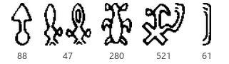

Gr5 from unit 16, Barthel's tracing:

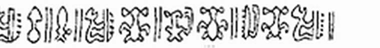

`380.1.3 · 88 · 1 · 47 · 1 · 380.1.3 · 280 · 1 · 521 · 280 · 1 · 521 · 1 · 22.61 · 280 · 380.1.3 · 1`

Ev4 from unit 1, Barthel's tracing:

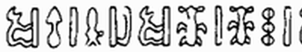

`380.1 · 88 · 1 · 47 · 1.61 · 380.1 · 280 · 1 · 280 · 2 · 1 · 380.1 …`

The two full lines, for context. Gr5:

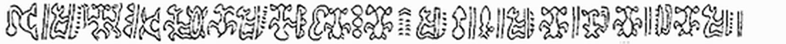

Ev4:

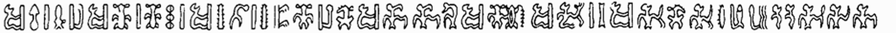

Entry by entry, with `|` marking the delimiter:

```
Gr5  62x.7 1 | 216s 20 7 320.70 600 | 290.20 79 280 2 280 30a | 88 1 47 1    | 280 1 521 280 1 521 1 22.61 280 | 1
Ev4                                                            | 88 1 47 1.61 | 280 1 280 2 1                   | 1f 57 1 1f 163 200 1.62 522fy | 607 607 650y | 200.70.3 | 376s 1 1V | 405s 522f 405s 22f 10.700 10.53 430 430 407 405 407
```

### Ev6, Hv12, Ra5: an eight-sign formula on three tablets

The run 27, 77, 34, 4, 522, 700, 600, 59 appears on Keiti, on the last line of the Great Santiago verso, and on the fifth line of the Small Washington tablet, three objects in three countries. Fish 700 is followed by frigatebird 600 every time, so the pair is a slot in a formula, not a description of animals. Keiti writes the first four signs as two ligatures, 27.6 and 77.34, where the others write them separately. What precedes the run differs on each tablet, so it is a reusable unit placed in different surroundings.

The eight signs of the run, from Barthel's catalogue:

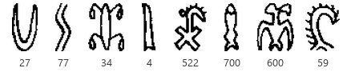

Ev6:

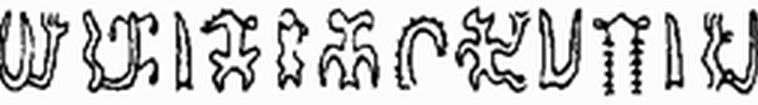

`244s · 27.6 · 77.34 · 4 · 522fy · 700 · 600 · 59f · 324 · 4.4`

Hv12:

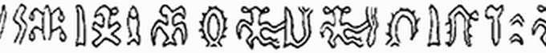

`254.71 · 27 · 77 · 34 · 4 · 522y · 700 · 600 · 59f · 220.4.64 · 220.132`

Ra5. The Commons tracing of tablet R is small and the enlargement blurred:

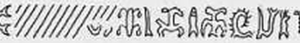

`illegible · 27? · 77? · 34 · 4 · 522 · 700 · 600 · 59f · 4.64 · 6:700`

```
Ev6   244s      | 27.6  77.34   4  522fy  700  600  59f | 324        4.4
Hv12  254.71    | 27    77  34  4  522y   700  600  59f | 220.4.64   220.132
Ra5   illegible | 27?   77? 34  4  522    700  600  59f | 4.64       6:700
```

## 4. The 380.1 lists

*In plain words: on several tablets one particular sign turns up again and again, always separating short groups of one to five signs, the way commas separate items in a list. We cut the text at that sign and looked at what lies between the cuts, and whether the same items appear on more than one tablet.*

The compound 380.1, a seated figure with an attached stroke, is a list delimiter on six tablets: Small Santiago 30 occurrences, Keiti 22, Small London 22, Mamari 20, Small Vienna 7, Great Washington 4. Cutting every stretch between two consecutive delimiters gives 93 entries.

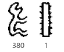

*Sign 380 and stroke 1 as Barthel drew them separately. On the tablets the stroke is fused to the figure, written 380.1; Small Santiago and Small London add sign 3, Small Vienna adds 52:*

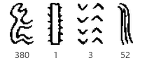

| Measure | Value | Reading |
|---|---|---|
| Entries of 1 to 5 units | 82 of 93 | Word or name length |
| Entries repeated exactly on another tablet | 6 clusters, all G and K | London copies Santiago in order, differing only in ligatures |
| Entries in a family sharing a sign pair | 31, in 12 families | Keiti's only cross-tablet matches are with Small Santiago |
| Unique entries | 62 | Two thirds of content is not shared anywhere |
| Entries ending in stroke 1 | 16 | Commonest final sign; strokes fall last more often than first |
| Mamari Ca3 entries opening with sign 22 | all | A list built as "22 plus item", a different shape from Keiti's |

The format is formulaic and the content mostly is not. That is what lists of distinct names or items look like, a genealogy for example, rather than a liturgy repeated across tablets. Keiti's borrowed entries from Small Santiago are a fragment inside an otherwise unique list, which strengthens the reading of those entries as fixed items.

## 5. Alternating series

*In plain words: sometimes one sign repeats with a single different sign between each repeat, in the pattern A x A y A z. We found every such run in the corpus and asked what the in-between signs are. It turns out there are two kinds: runs where the in-between signs are simple strokes, and runs where they are complex signs that look like list items.*

A series is a run X a X b X c with the same head sign at every second position and one unit between. With at least three heads, and bare strokes excluded as heads, the corpus holds 61 such series on 14 objects. Classifying by what fills the gaps splits them into two devices.

| Kind | Series | Fillers | Examples |
|---|---|---|---|
| Affix-like | 35 | Simple signs below 100, mostly strokes | Fish 700 on H with 20, 1, 90. Fish 710 on Q with 20, 1, 90. Sign 92 on Keiti with 1, 9, 5, 22, 90. Sign 62.6 on H and P with a stroke six times. |
| List-like | 26 | Complex signs, each rare in the corpus | The 380.1 lists. The hand 73.6 on G and K with 206, 200, 222, 451, identical on both tablets. Sign 22 on Tahua with five 500-series figures. |

The affix-like fillers form a small shared set. Stroke 1 follows ten different head signs on eight objects; signs 20 and 90 each follow four heads and are five and three times more frequent in these slots than in the corpus overall. The H and Q fish series share their fillers because H and Q copy each other, so Keiti's Ev7 is the only independent witness to the set.

Head signs of the series named above, then the fish 710 with two of its fillers:

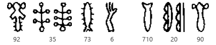

## 6. The affix test

*In plain words: the simplest signs, single strokes, are so common that they might be grammatical endings, like the -s and -ed of English. An ending is fussy about what it attaches to and indifferent to what comes after. We measured that fussiness for each stroke, with ordinary picture signs as a comparison, and also checked whether strokes standing next to each other keep a fixed order.*

If the small signs are suffixes they should select their host on one side and be indifferent on the other. For each candidate the distribution of the sign before it and after it was compared with the corpus background by Kullback-Leibler divergence in bits, with contexts on the copying tablets down-weighted so a passage counts once. Content signs served as controls.

The candidates, the simple signs below 100:

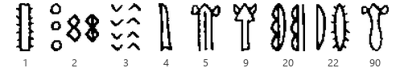

The controls:

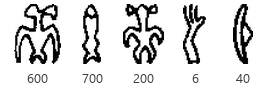

| Sign | Left choosiness | Right choosiness | Difference | Distinct left neighbours |
|---|---|---|---|---|
| 1 | 0.98 | 1.18 | -0.19 | 127 |
| 2 | 0.90 | 0.98 | -0.08 | 119 |
| 4 | 1.91 | 1.68 | +0.22 | 86 |
| 20 | 2.61 | 2.57 | +0.04 | 38 |
| 90 | 2.23 | 2.55 | -0.32 | 43 |
| fish 700, control | 1.27 | 1.36 | -0.09 | 81 |
| frigatebird 600, control | 1.19 | 1.16 | +0.03 | 99 |

**The free-standing strokes fail.** No candidate shows the one-sided pattern. Strokes 1 and 2 are the least choosy signs in the corpus on both sides, which is how a very common syllable or a general particle behaves, not a host-selective affix. Signs 20 and 90 are choosy toward specific partners, the fish signs and sign 80, which is the alternating passages again rather than a general rule.

**Two things survive.** When strokes stand side by side their order is fixed: 2 before 1 in 18 cases against 8, 4 before 2 in 17 against 7, 1 before 9 in 10 against none, 2 before 3 in 5 against none. That gives a chain 4, 2, 1, 9, which is what affix chains and numeral systems both produce. And the fused components are host-selective in exactly the way free strokes are not: sign 3 is bound in 404 of 433 occurrences, sign 9 in 142 of 194, and bound stroke 1 attaches to sign 380 in 107 of 430 cases. If anything here is an affix, it is the small sign fused into a larger one.

## 7. Allographs and how copies differ

*In plain words: when the same passage exists on two tablets, the places where the two copies differ show which signs the scribes treated as interchangeable, like two spellings of one word. We collected those differences and asked whether merging such signs changes any earlier result.*

The fuzzy parallel runs align copies with one sign swapped. Each swap is a pair of signs in the same slot of the same passage, and recurring pairs are candidate allographs, variant spellings of one sign. This is the mechanism by which Pozdniakov reduced Barthel's inventory.

The layer is thin. The runs contain 48 substitutions in 42 distinct pairs; only three recur in separate passages, 8 with 551, 316 with 356, and 400 with 430, and 17 one-off pairs sit in the same Barthel series and are plausible look-alikes. Merging was tested by rerunning the strict parallel map: the three recurring pairs raise shared runs from 134 to 145; adding the 17 look-alikes raises them to 165 and lifts Great Santiago's covered share from 42 to 46 percent. The families do not change and no isolated text connects to anything.

**Copies vary in attachments, not in head signs.** Scribes kept the main sign and changed what was fused to it. Sign 22 stands bare on one tablet and carries 380 on another eight times; sign 200 carries 50 in one copy and 132 in the other six times. Components 10, 50, 132, 380, 1, and 430 come and go most. Barthel's compound notation is recording a layer that copyists treated as optional.

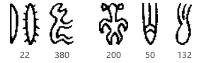

*Sign 22, which one copy writes bare and another with 380 attached; sign 200, which carries 50 in one copy and 132 in the other.*

> **Caveat.** Copied passages are too few and too faithful for empirical allograph reduction to reach anywhere near 52 signs. Pozdniakov's reduction rests mainly on visual similarity, which section 9 tests directly.

## 8. The inventory

*In plain words: how many different signs are there, and how is the text spread across them? A system that spells sounds, like an alphabet or a syllabary, needs few signs, all used often. A system that draws words needs many signs, most of them rare. We counted three ways: main signs alone, attached marks alone, and whole compounds.*

Three inventories were counted with one witness per family, so copies do not inflate the numbers: head signs, the first component of every unit; attached components, everything fused onto a head; and whole units as written.

| Inventory | Tokens | Distinct | Once only | Signs for 50% | 90% | 99% | Zipf slope |
|---|---|---|---|---|---|---|---|
| Head signs | 8,688 | 649 | 30% | 34 | 223 | 563 | 1.36 |
| Attached components | 3,088 | 224 | 35% | 9 | 66 | 194 | 1.42 |
| Whole units | 8,688 | 2,067 | 63% | 80 | 1,199 | 1,981 | 0.93 |

**Head signs, as Barthel numbered them, are not a syllabary.** Rapa Nui has about 55 syllables. The 55 most frequent head signs cover about 62 percent of the text and the next 600 carry the remaining third. For a reduction to roughly 52 basic signs to hold, some 600 of Barthel's numbers must be compounds or variants of those 52, and they account for over a third of all tokens.

**Attached components are a compact set.** Nine cover half of all attachments; one sign, 76, is nearly a fifth of them, followed by 3, 1, 10, and 6. A small closed set attached to a large open one is the shape of a grammatical layer on a lexical one, and it is the same set the affix test singled out.

The eight components most often attached to a head sign:

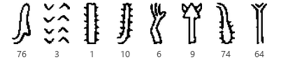

**Whole units have the statistics of words.** A natural-language text of about 9,000 tokens typically has around 2,000 distinct words, more than half occurring once, with a Zipf slope near one. Units come out at 2,067 distinct, 63 percent once only, slope 0.93. Neither head signs nor components separately fit that profile; the units do.

Barthel's series confirm the split: the geometric signs below 100 are 139 distinct signs and 54 percent of the text, while each pictorial series, human figures, birds, fish, holds between 4 and 10 percent. The script is mostly abstract marks with pictorial signs through it, not a picture script with a few marks.

> **Caveat.** Barthel's catalogue splits what may be one sign into several numbers, so 649 is an upper bound and the tail is shorter than it looks. The word-like statistics of units are suggestive, not probative, because an over-split catalogue also inflates the unit count.

## 9. Shape similarity of the signs

*In plain words: Barthel gave separate numbers to signs that may be the same sign drawn a little differently. We compared the drawings of all six hundred signs by shape to see how many of his numbers collapse into look-alike groups, and whether that brings the count anywhere near the fifty-odd signs a syllabary would need.*

Barthel's catalogue drawings, 601 signs and 713 drawings including the variants he drew for 112 of them, were fetched from kohaumotu and compared by shape. Each drawing is normalised to a 40 pixel square and described by a lightly blurred silhouette and by gradient-orientation histograms over a five by five grid; similarity is the cosine of the descriptors, best of direct and mirrored, penalised for aspect-ratio mismatch.

Barthel's own variant pairs are the ground truth. The threshold was set where only one unrelated pair in 200 passes, and at that setting it recovers 22 percent of the genuine variant pairs. Classes are cliques: a sign joins only if it passes against every current member. A first attempt with single linkage chained the whole catalogue into one class, which is a warning about how continuous the shape space is.

The closest pairs, from the contact sheet the script writes:

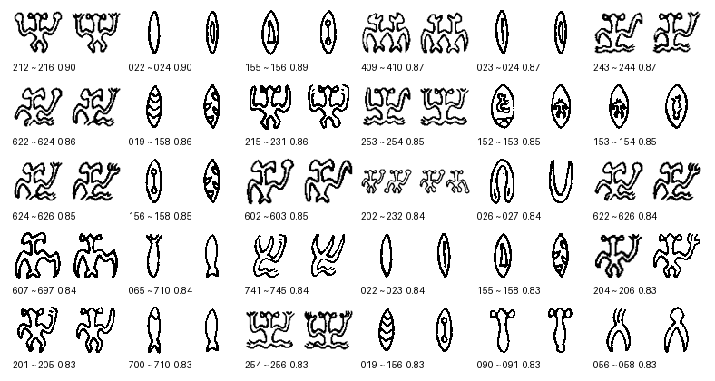

| Inventory, one witness per family | Distinct | Signs for 50% | 90% | 99% |
|---|---|---|---|---|
| Barthel head signs | 649 | 34 | 223 | 563 |
| After shape merging, strict | 485 | 25 | 151 | 399 |

- **113 look-alike classes absorb 171 signs.** The closest pairs are real: the figures 212 and 216, the ovals 22 and 24, the birds 622 and 624, the fish 700 and 710, the fork signs 90 and 91.
- **Shape merging does not get near 52.** Even the over-merged single-linkage pass only reached 380 classes. Pozdniakov's reduction cannot be a look-alike merge; it has to treat most of Barthel's numbers as compounds of a few dozen elements, which is a different claim and one this method does not test.
- **The copy-derived allograph pairs split by shape.** Same-series pairs from the copied passages score high, 254 with 256 at 0.83, 316 with 356 at 0.69, 630 with 631 at 0.68, against a median of 0.34 for random pairs. But 400 with 430, seen in two passages, scores 0.30, and 8 with 551 scores 0.55. Those are genuine substitutions in copying, not spelling variants.

> **Caveat.** The descriptor is crude and the recall figure says so: most of Barthel's own variant pairs fall below the strict threshold, so the merge is conservative. A few classes remain doubtful, such as the ovals 22 to 24 grouped with the fish 700, whose drawing is an elongated oval. This measures similarity of Barthel's type drawings, not of the signs as carved, which vary more.

## 10. Genre by vocabulary, and entropy

*In plain words: two questions. First, which tablets use the same vocabulary of signs, even when they do not copy each other, the way two cookbooks share words that a cookbook and a legal contract do not? Second, how much does one sign let you guess the next? In real text the previous word narrows what can follow; in a random list it does not.*

Copying groups texts that share passages. A second grouping asks which texts share a vocabulary, whether or not they share passages. Each side with at least 40 units is profiled by the head signs it favours relative to the corpus, tf-idf weighted, and sides are compared by cosine similarity. Thirty-one sides qualify.

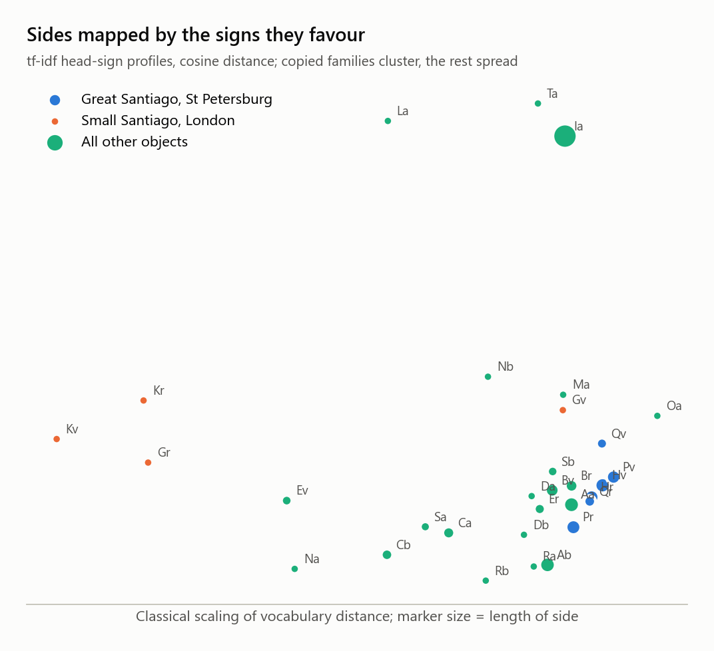

- **The copied families are also vocabulary families**, which is a sanity check: Hr with Qr at 0.84, Hv with Pv at 0.75, Gr with Kv at 0.67.
- **Keiti's verso keeps company with the other list tablets.** Its nearest neighbours by vocabulary are Small Vienna side a and Great Washington side a, with Small London verso close behind, none of which copy it. The 380.1 lists share a vocabulary as well as a format.
- **Keiti's recto belongs elsewhere.** Its nearest neighbour is the recto of Aruku Kurenga, and its own verso ranks only fourth. Small Santiago and Small Vienna have sides even less alike, at ranks 19 and 25 of 30, so several objects carry two texts of different kinds. Tahua, Mamari, and Great Santiago have sides that resemble each other.
- **The Santiago Staff and the Honolulu tablet stand apart together.** Their vocabularies resemble each other at 0.53 and nothing else above 0.38. That matches Fischer's grouping of the two, made on other grounds.

Entropy asks how much a sign is predicted by the sign before it. For each layer the unigram entropy and the conditional entropy given the previous token are computed one witness per family, and the same for the tokens shuffled, which keeps the frequencies and destroys the order. The difference is the information carried by adjacency.

| Layer | Tokens | H1 | H2 as written | H2 shuffled | Adjacency gain, bits |
|---|---|---|---|---|---|
| Head signs | 8,569 | 7.49 | 4.60 | 4.89 | 0.29 |
| Whole units | 8,569 | 9.10 | 3.49 | 3.74 | 0.25 |
| Components | 11,666 | 7.29 | 4.75 | 5.20 | 0.45 |

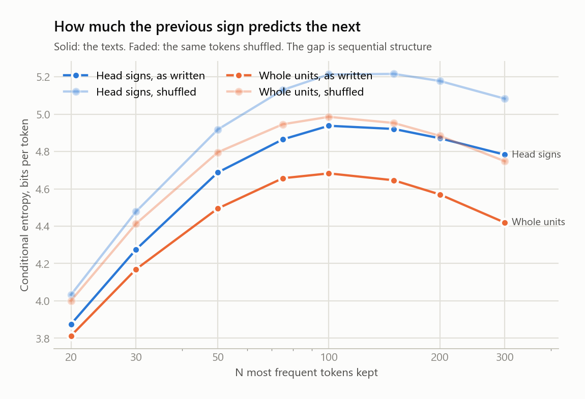

Adjacency carries a consistent quarter to half a bit per token at every vocabulary size tested, so the order of signs is not random. The gain is modest, which fits texts dominated by lists of distinct items, where the previous item says little about the next. Components show the largest gain because a compound's parts follow each other in a fixed way, which is the ligature layer again.

> **Caveat.** Conditional entropy on a finite sample sits below the unigram entropy even for random order, because rare pairs are never observed. The shuffled column is the fair baseline, not H1. Published entropy comparisons across scripts use varied conventions, so these values should be compared with others only after matching the method.

## 11. A collocation lexicon

*In plain words: which pairs of signs sit next to each other far more often than chance would put them there, the way "New" and "York" do in English? Pairs found on many tablets are habits of the script; pairs found on one tablet only are that tablet's refrain.*

The entropy result says adjacency carries a modest amount of information. Collocations are where it sits. Every adjacent head-sign pair seen at least four times, one witness per family, was scored with the log-likelihood ratio, and a pair counts as a collocation at p below 0.001. Of 301 candidate pairs, 73 pass. The number of sides a pair occurs on separates two kinds: a pair confined to one or two sides is a refrain inside a text, a pair spread over three or more is a habit of the script. There are 37 of the first kind and 36 of the second.

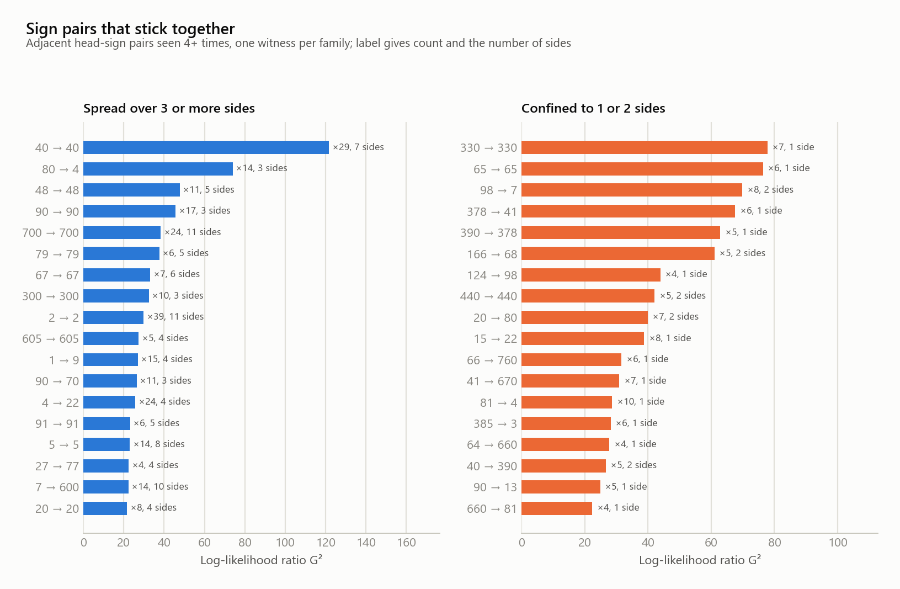

- **Doubling is the commonest collocation in the script.** Of the 37 spread collocations, 18 are a sign followed by itself: crescent 40 on 7 sides, fish 700 on 11, and 48, 79, 67, 300, 605, 91, 607, 95, 200, 381, 63, plus the stroke chains 2, 5, 20, 22, and 90 doubled. Rapa Nui, like all Polynesian languages, uses reduplication as a productive grammatical device, so a script that doubles signs this often is at least consistent with writing that language. It is also consistent with tallying, so this is a lead, not a result.
- **A few non-doubled pairs are genuine script-wide habits.** Sign 7 before the frigatebird 600 on 10 sides, 80 before stroke 4 on 3 sides and 14 times, 27 before 77 on 4 sides, which is the opening of the Ev6 formula, turtle 280 before stroke 1 on 10 sides, and stroke 1 before the delimiter 380 on 7 sides, the closing-stroke pattern from the lists.
- **The local collocations are the two refrains we already knew.** Mamari's calendar sequence 390, 378, 41, 670, 8 and Keiti's recto refrain 300, 4, 22 account for most of them, along with a few triple repeats confined to single texts.
- **Stroke chains float free.** For each chain of two or more strokes, the sign immediately before it was tallied. Only one chain has a preferred host: 4 then 22 follows sign 300 in 10 of 21 cases, and that is Keiti's refrain. Every other chain follows a scatter of different signs. This agrees with the affix test: the chains have internal order but no host.
- **Whole units collocate more sharply than head signs.** Counting ligatures as distinct, 69 unit pairs pass, and the strongest are refrain fragments with their attachments intact, such as 4.430 before 22.380, which occurs 10 times against an expectation near zero. The attachments travel with the phrase.

Four of the script-wide pairs, the doubled crescent and fish, 7 before the frigatebird, the turtle before a stroke, and the opening of the Ev6 formula:

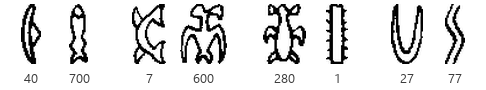

> **Caveat.** With a corpus this small a pair needs only four occurrences to be tested, so the tail of the collocation list is fragile. The 18 doublings and the handful of spread pairs with more than 10 occurrences are the robust part.

## 12. Compound decomposition

*In plain words: are the rare, complicated signs just combinations of the common simple ones, like letters making words? We tried to rebuild each rare drawing out of pieces of the fifty-five commonest drawings, and checked whether that works any better than rebuilding it out of random other drawings. It does not.*

The largest open question from section 8 is whether the 600 rare head signs are compounds of a few dozen basic ones, which is what Pozdniakov's reduction to about 52 signs requires. This section tests it directly on Barthel's drawings, with controls in both directions.

The method: take the 55 most frequent head signs as the basic set, and explain each of the 547 other drawings greedily by up to three basic drawings, each tried mirrored and at five scales, slid over the target by batched FFT correlation. Matching is tolerant: a target pixel counts as explained when it lies within a set distance of part ink, and a part pixel counts as a hit when it lies within that distance of target ink; a placement is scored by the F1 of those two rates and must explain at least a tenth of the target. A rare sign decomposes when 80 percent of its ink is explained with 70 percent precision. Two controls: the same fit with 55 random rare signs as templates, run three times, and a positive control fitting Barthel's own variant drawings of the basic signs with the basic templates, which ought to be explained by their own sign. The test was run at tolerances of two pixels and one pixel on a 48-pixel canvas.

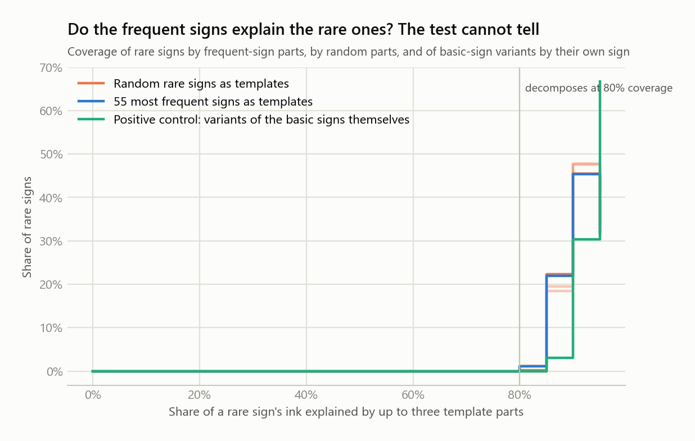

| Tolerance | Template set | Share of rare signs decomposing | Positive control at threshold | Variants matching their own sign first |
|---|---|---|---|---|
| 2 px | 55 most frequent signs | 77% | 100% | 33% |
| 2 px | Random rare signs, three runs | 76% to 79% | | |
| 1 px | 55 most frequent signs | 29% | 64% | 42% |
| 1 px | Random rare signs, three runs | 22% to 27% | | |

**The frequent signs explain the rare ones no better than random rare signs do.** At two pixels of tolerance almost everything decomposes, whichever 55 shapes serve as parts: the matcher is permissive enough to build any thin drawing from three pieces. At one pixel the rate drops to a third and the frequent set leads the random sets by about five points, which is the shared stroke vocabulary the shape-similarity section already showed, not composition from a basic inventory. A genuine compound system would put the frequent set far ahead of random shapes at every tolerance.

**What the positive control says about the method.** At two pixels every variant of a basic sign is explained by the basic set, but only a third by its own sign first; at one pixel two thirds reach the threshold and 42 percent match themselves first. The matcher sees shapes but not identity well: a continuous shape space where many signs resemble many others, which is the same picture as section 9. That limits what any pixel-level method can say here, and a stroke-graph matcher would be the next step if the question is to be pressed further.

**Consequence for the inventory.** Nothing in the drawings supports collapsing Barthel's 649 head signs toward 52 by treating the rare ones as compounds of the frequent ones. Section 8's conclusion stands: as drawn, the head-sign inventory is far too large for a syllabary, and if a small basic inventory exists it is not recoverable from shape by this route.

> **Caveat.** A first version of this test scored placements by rigid pixel overlap and failed its positive control outright, at 42 percent coverage for a sign on its own variants. The tolerant score fixed that and exposed the opposite problem, so both tolerances are reported. The 2-pixel outputs are kept in out/ with a _tol2 suffix.

## 13. Units against Rapa Nui words

*In plain words: if each compound glyph stands for a word of the Rapa Nui language, then glyphs should be about as long as Rapa Nui words, and the commonest glyphs should be the short little words a language uses most, like "the" and "of". We checked against a Rapa Nui text recorded in 1886, the only free one of the right kind.*

Section 8 found that whole units have the statistics of words. That gives a prediction that needs no reading: if units are words in Rapa Nui, their length distribution should resemble Rapa Nui word length, their doubling rate should resemble Rapa Nui reduplication, and the most frequent units should be short the way particles are.

The Rapa Nui sample is the set of recitations Ure Vaeiko gave in 1886, printed in Rapa Nui in Thomson's 1891 Smithsonian report, which is public domain. The OCR text from the Internet Archive was cut to the Rapa Nui passages preceding each English translation and cleaned to tokens made of Rapa Nui letters only: 1,365 word tokens, 491 distinct, from five recitations. Word length is counted in syllables, which in Rapa Nui equals the number of vowels. OCR noise remains and long vowels count as two syllables, so the Rapa Nui lengths are slightly inflated.

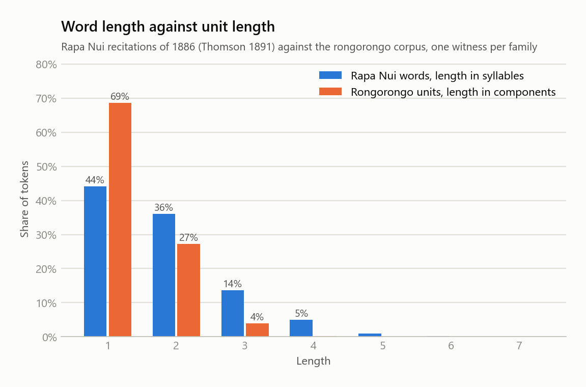

| | Rapa Nui words | Rongorongo units |
|---|---|---|
| Length 1 | 31% | 69% |
| Length 2 | 42% | 27% |
| Length 3 or more | 27% | 4% |
| Mean length | 2.13 syllables | 1.36 components |
| Doubling, inside the item or immediate repeat | 3.8% | 6.8% |
| Share of tokens in the fifteen most frequent items | 34% | 23% |
| Mean length of those fifteen | 1.7 syllables | 1.0 components |

- **Components are not syllables.** If each component wrote one syllable and each unit one word, the two length distributions would match. They do not: two thirds of units are a single sign, while less than a third of Rapa Nui words are monosyllables, and units of three or more components are rare where three-syllable words are common. A single sign must on average carry more than one syllable, which is the logographic side of a mixed script, not a syllabary.
- **Doubling is in the same range.** Reduplication and immediate repeats make up about 4 percent of the Rapa Nui tokens and about 7 percent of the rongorongo units. The script doubles somewhat more than the language reduplicates, which is compatible with reduplication being written and with some doubling being something else, such as tallying.
- **The particle layer is thinner in the script.** In the recitations the fifteen commonest words are the grammatical particles te, e, i, ki, a, no, to and a few nouns, and they carry a third of the text. The fifteen commonest units carry under a quarter. Either the script leaves particles unwritten, which early and mixed scripts commonly do, or the attached components carry them, which is what the affix test and the entropy of components suggested.

> **Caveat.** This is one small sample of one genre, transcribed by ear in 1886 and OCR'd from an 1891 print. The direction of each difference is robust to the noise; the exact percentages are not. A cleaner Rapa Nui text of comparable genre would sharpen all three comparisons.

## 14. The list format against the creation chant

*In plain words: an islander in 1886 recited a creation chant for a tablet, and the chant is a list of forty entries, each naming two beings that produce a third. One scholar has argued that the Santiago Staff writes exactly such three-part entries. We compared the shape of the chant's entries with the shape of the Staff's groups and with the lists of section 4, without reading any of them.*

Among the recitations in Thomson's report is the one Ure Vaeiko gave for the Small Washington tablet, a creation genealogy of forty entries. Each entry names a parent, joins it with a fixed phrase to a second name, and yields a third: a three-slot formula with constant connective words. Fischer built his 1997 reading of the Santiago Staff on the claim that the Staff writes exactly this, as triads in which the first sign carries the attached sign 76 as the connective. The 380.1 lists of section 4 are the other candidate for a written genealogy. Both can be compared with the chant on shape alone.

Sign 76, which marks the Staff's triads, and the three signs that most often open a stretch between its carved dividers, 90, 604 and 606:

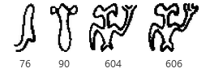

The chant's forty entries were parsed from the OCR with the fixed phrase intact, and lengths counted in content words, the connective phrase and the particles excluded. The 380.1 entries were counted in content units, strokes excluded. The Staff was cut before every unit carrying sign 76, which is Fischer's segmentation, and the same cut was applied to the two texts he grouped with the Staff, Gv and Ta. Since a cut at a frequent sign yields short segments whatever the text, each 76 cut was compared with a null in which the same number of 76-bearing units is shuffled to random positions.

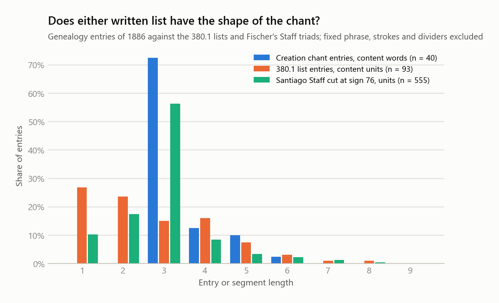

| Series | n | Median length | Exactly 3 | 2 to 4 | Shuffled null, exactly 3 |
|---|---|---|---|---|---|
| Chant entries | 40 | 3 | 72% | 85% | |
| 380.1 entries, content units | 93 | 2 | 15% | 55% | |
| Staff cut at sign 76 | 555 | 3 | 56% | 82% | 15% |
| Gv cut at sign 76 | 40 | 4 | 25% | 57% | 12% |
| Ta cut at sign 76 | 30 | 3 | 23% | 57% | 15% |

- **The Staff has the chant's shape; the 380.1 lists do not.** Cut at sign 76, the Staff falls into segments of exactly three units 56 percent of the time and of two to four units 82 percent of the time, against 72 and 85 percent for the chant. Shuffling the positions of the 76 units drops the three-unit share to 15 percent, so the regularity is in the text, not in the density of the sign. The 380.1 lists, by contrast, have a median entry of two content units and no preference for three.
- **The Staff is triadic beyond doubt; what the triads say is another matter.** This is structural support for the first half of Fischer's claim, that the Staff is built of three-part units marked by sign 76 and that their shape matches a Rapa Nui creation genealogy. It says nothing about his second half, that each triad reads as one being copulating with another to produce a third. Any three-slot formula would give the same shape, and the shape is also that of a tally of three items or a line of a chant with a fixed refrain.
- **Gv and Ta are triadic, but weakly.** Both beat their nulls, at 25 and 23 percent against 12 and 15, but fall well short of the Staff. Fischer grouped them with the Staff on the strength of sign 76; the shape supports a relation without making them the same kind of text.
- **The two written list formats are different genres.** The 380.1 lists have short, mostly unique entries and one delimiter; the Staff has three-unit segments marked by an attached sign and grouped, by its own carved dividers, into stretches of a median nine units, or about three triads. If one of them is a genealogy in the chant's form, it is the Staff.
- **Recurrence points the same way.** In the chant 30 percent of entries share a name with another, mostly the parent repeated over consecutive entries. In the 380.1 lists 13 percent of entries repeat another entry's content exactly.

> **Caveat.** The chant is one recitation, taken down by ear in 1886 from a man who may have been improvising for a visitor; its shape is at least a Rapa Nui recitation's shape, whatever its relation to the tablet it was recited for. The 76 cut was defined by Fischer with the chant in mind, so the match is a test of his segmentation rather than a discovery independent of it; the shuffled null is what makes the match evidential.

## 15. Do the triads chain?

*In plain words: in a family tree, the child in one entry becomes the parent in a later one, and one parent often has several entries in a row. If the Staff's three-part groups are a genealogy, they should behave that way. We checked whether they do, and whether the chant does.*

Section 14 showed that the Staff is made of three-unit segments marked by sign 76, shaped like the entries of the 1886 creation chant. A genealogy is more than a row of triads, though: its entries chain, with the offspring of one returning as the parent of a later one, and a parent is often repeated over consecutive entries. Fischer's reading predicts both for the Staff. Both are countable.

For each segment the first and last head signs were taken, and three shares measured: how often a segment's last unit reappears as the first unit of any later segment, how often it equals the very next segment's first unit, and how often consecutive segments share a first unit. Each was compared with the mean over 500 shuffles of segment order, which keeps every segment intact and destroys only the sequence. The chant was measured the same way from its parsed entries.

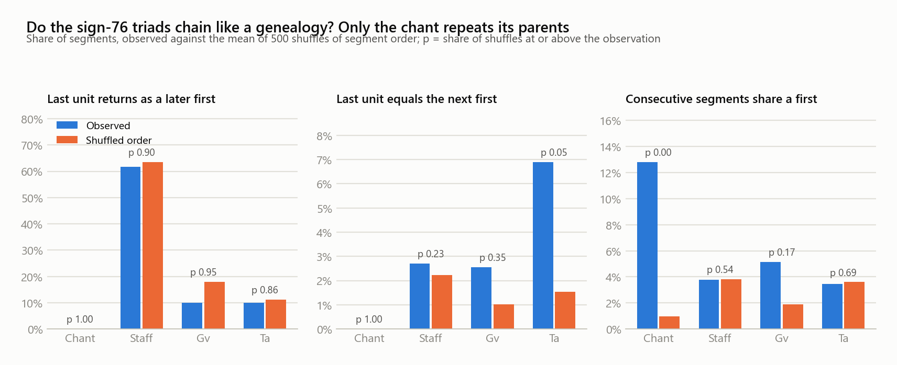

| Text | Segments | Last returns as a later first, observed / shuffled | Consecutive same first, observed / shuffled | p |
|---|---|---|---|---|
| Chant | 40 | 0% / 0% | 12.8% / 1.0% | 0.00 |
| Staff | 555 | 62% / 64% | 3.8% / 3.8% | 0.54 |
| Gv | 40 | 10% / 18% | 5.1% / 1.9% | 0.17 |
| Ta | 30 | 10% / 11% | 3.4% / 3.6% | 0.69 |

- **The Staff's triads do not chain.** A segment's last sign returns as a later first sign 62 percent of the time, but shuffling the order gives 64 percent: with 555 segments drawn from a few hundred signs, that much recurrence is expected by chance. Consecutive segments share a first sign exactly as often as shuffled ones do.
- **The chant does not chain either, but it repeats its parents.** No offspring in the 1886 recitation returns as a parent, so the offspring-to-parent chain is not a feature of this genre as recited. What the chant does have is runs of entries with the same parent, 12.8 percent of consecutive pairs against 1 percent under shuffling. The Staff shows nothing of the kind.
- **The slots do not have separate vocabularies.** In the chant the parent, spouse and offspring slots draw on almost disjoint name sets, with pairwise overlap near zero. On the Staff the first, middle and last slots overlap substantially, Jaccard 0.27 to 0.40, and the same sign serves in every position. Of 313 three-unit segments only one occurs twice.
- **Ta shows one marginal signal**, the next segment's first unit equalling the previous last 6.9 percent of the time against 1.5 percent, at p 0.05 on 30 segments. Too small to build on.

**What this does to the Staff hypothesis.** The triadic shape survives; the genealogical reading of it does not gain the sequential support it predicted. Three-slot segments whose slots share a vocabulary, never repeat, and never refer back are the shape of a long chant with a fixed line structure, or of a tally, at least as much as of a lineage. The result narrows Fischer's claim to its structural half, which the shuffled null in section 14 established, and leaves its semantic half without evidence from sequence.

> **Caveat.** The chain measure compares head signs only, so a lineage written with changing attachments would be caught, but one written with different signs for the same name would not. The chant sample is one recitation of forty entries, which is enough to show parent repetition and too little to rule out chaining in other genealogies.

## 16. The carved dividers

*In plain words: the person who carved the Staff also cut small marks into it at intervals, the only punctuation anywhere in the corpus. We asked whether those marks line up with the three-part groups, how much text they enclose, and whether the enclosed stretches begin or end with particular signs.*

The Santiago Staff is the one object whose carver marked divisions in the text: 96 vertical strokes, coded 999 in the CEIPP file, cutting the 1,620 legible units into 95 complete stretches. Sections 14 and 15 established that the Staff is built of three-unit segments marked by sign 76. The question here is what the carver's own divisions group.

Each measure is compared with a null that keeps the number of dividers and places them at random among the units.

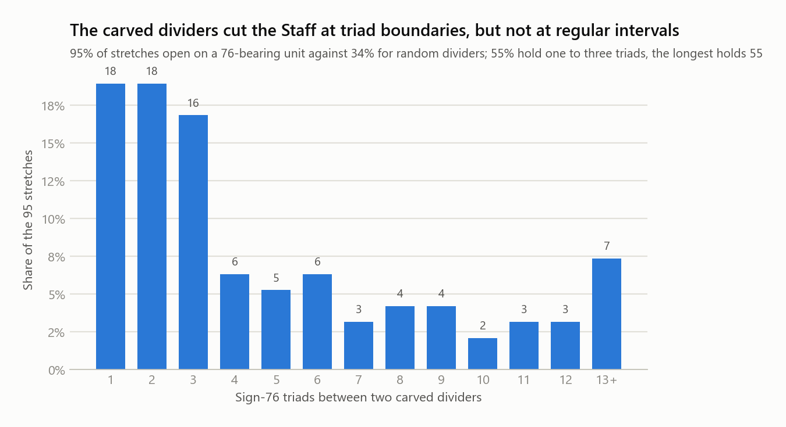

| Measure | Observed | Random dividers |
|---|---|---|
| Stretches opening on a 76-bearing unit | 95% | 34% |
| Stretches holding exactly three triads | 17% | 10%, p 0.02 |
| Stretches holding one to three triads | 55% | |
| Length variation, coefficient of variation | 1.30 | 0.96 |
| Stretch sequences that recur | 0 of 95 | |

- **The dividers respect the triads.** Ninety-five percent of stretches begin with a 76-bearing unit, which is where a triad begins, against 34 percent if the dividers fell at random. The carver was dividing the text at the same joints that sign 76 marks. That makes the triad structure of section 14 a feature the writer was conscious of, not an artefact of the segmentation rule.
- **The stretches are not verses of fixed length.** They run from a single triad to 55, more variable than random placement would give, with a preference for one to three triads that accounts for over half of them. Whatever a stretch is, it is a unit of content, not of metre.
- **A few signs like to open a stretch.** Sign 90 opens 15 of the 95, two and a half times its share of the Staff, and the bird signs 604 and 606 open nine between them at four to five times their share. Nothing similarly marked closes a stretch. A preferred opener is what a formula or a heading looks like.
- **Stretches are not cohesive and never repeat.** Triads inside a stretch share a first sign no more often than triads across a divider, and no stretch's sign sequence occurs twice. The dividers group triads without making the groups internally uniform or formulaic.

Put together with the previous two sections: the Staff is a long text of three-unit segments, marked by an attached sign and punctuated by the carver into groups of variable size that tend to open with a few particular signs, whose segments neither repeat nor chain. That is the profile of a continuous composition with a fixed line structure, punctuated into sections, rather than of a genealogy or a tally. What the lines say remains as unknown as before.

> **Caveat.** Sign 999 is the CEIPP's code for the divider; if any were missed in transliteration the stretch lengths shift, though the alignment result would only strengthen. Partial stretches at the ends of lines are dropped.

## 17. Metoro's readings

*In plain words: in 1873 an islander named Metoro chanted over four tablets for Bishop Jaussen, who wrote down what he said for each sign. Nobody thinks he was reading, but the record can be tested: did he say the same word for the same sign each time? If so, his chant encodes sign identities, whatever else it does or does not encode.*

Jaussen's notebook, published in 1893, gives Metoro's words sign by sign, one word group per sign, for Tahua, Aruku Kurenga, Mamari, and Keiti. Metoro divided the text into signs differently from Barthel, so the groups cannot simply be paired with the units: 83 lines give 3,690 Barthel units against 4,200 word groups. Instead each line was treated as a sentence pair and a word-alignment model of the kind used in early machine translation estimated, for every sign, the distribution of words Metoro said for it. A sign's consistency is the probability of its single most likely word. The null keeps every line's words but pairs them with the wrong lines of the same tablet, so any consistency above it comes from the signs actually in front of him.

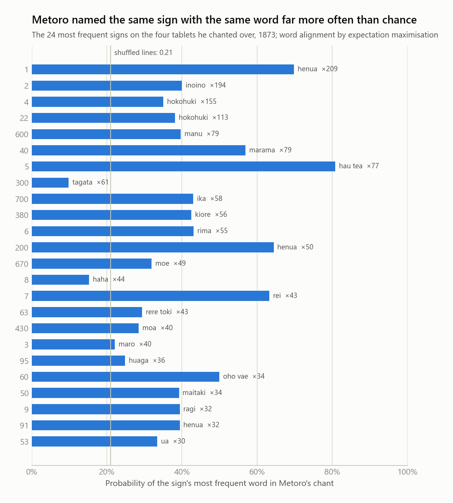

| | Weighted mean probability of a sign's top word |
|---|---|
| Observed | 0.36 |
| Lines paired at random within each tablet, 20 shuffles | 0.21 |

- **Metoro was consistent.** Across signs seen eight or more times, the most likely word accounts for 36 percent of what he said, against 21 percent when his lines are paired with the wrong signs. For the commonest signs the figures are far higher: stroke 1 is *henua*, land, 70 percent of the time; sign 5 is *hau tea* 81 percent; the crescent 40 is *marama*, moon, 57 percent; sign 7 is *rei* 63 percent; sign 522 is *ariki*, chief, 62 percent.
- **He named what the signs look like.** The frigatebird 600 is *manu*, bird; the fish 700 is *ika*, fish; the hand 6 is *rima*, hand; the crescent is the moon; the seated figure 380 is *kiore*, rat, and the 300-series figures are *tagata*, man. This is Métraux's reading of Metoro, that he was describing the pictures, and here it is with numbers: his vocabulary tracks Barthel's pictorial series.
- **His consistency was highest on the simplest signs.** The strokes and the crescent, which carry no obvious picture, got the most fixed words of all. Whatever *henua* and *hau tea* meant to him for a stroke, he held to them across four tablets and thousands of signs.
- **What this does and does not license.** A consistent labelling of sign shapes is not a reading, and Metoro's words for a sign say nothing about what a scribe meant by it. But the consistency makes his chant usable for one thing: as an independent, nineteenth-century judgment of which glyphs are the same sign. Where Metoro said the same word for two of Barthel's numbers, that is evidence for merging them, from a witness who had never seen Barthel's catalogue.

The eight signs named above, in Barthel's drawings, in the order stroke 1, 5, crescent 40, frigatebird 600, fish 700, hand 6, seated figure 380, and 522:

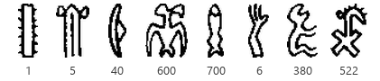

> **Caveat.** The alignment model assumes Metoro's word for a sign does not depend on its neighbours, which is false for a chant with grammar. Particles were stripped from his word groups so that *te henua* and *henua* count as one word. Guy showed that Metoro read the second sides of Mamari and Keiti in a disordered way; those lines are included, which can only lower the measured consistency.

## 18. Charts

All charts are produced by `scripts/charts.py` from the tables in `out/`.

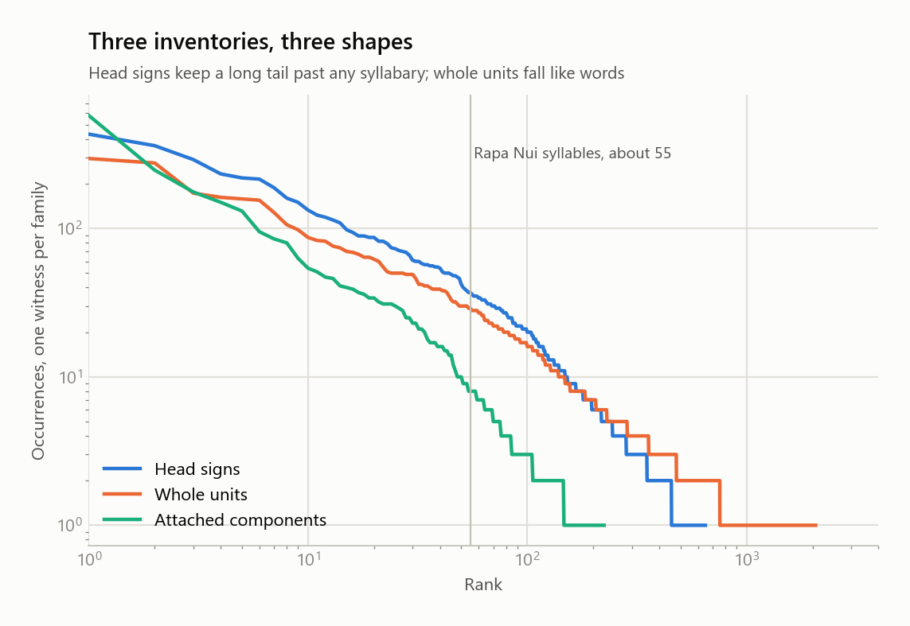

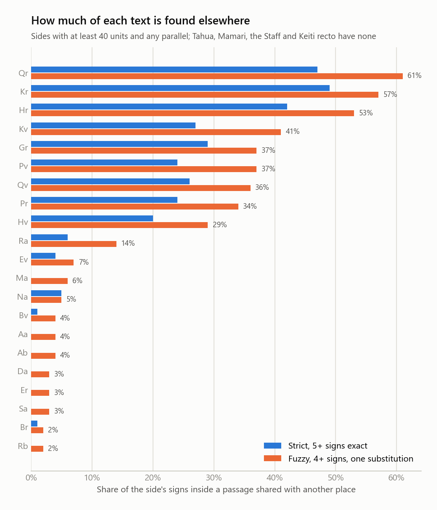

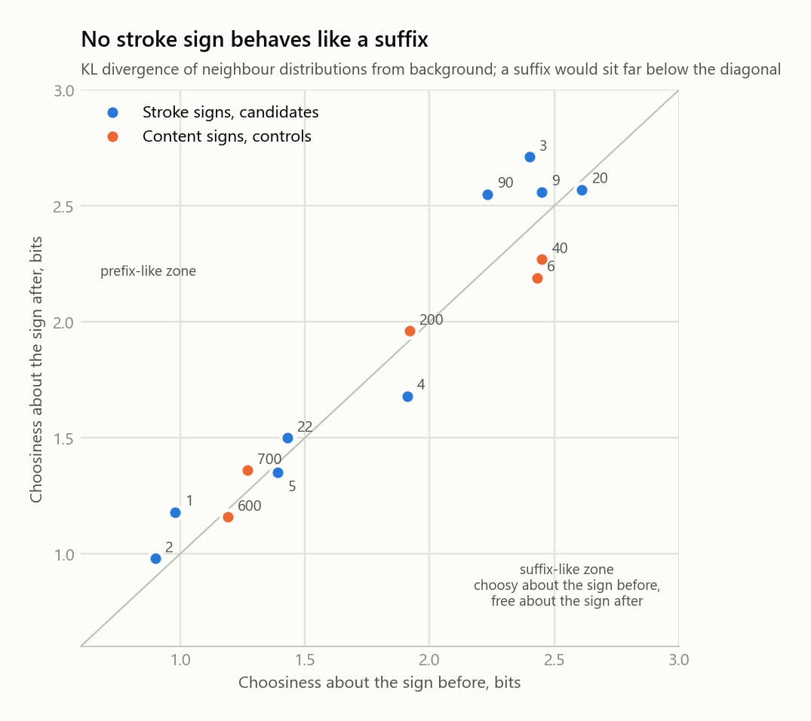

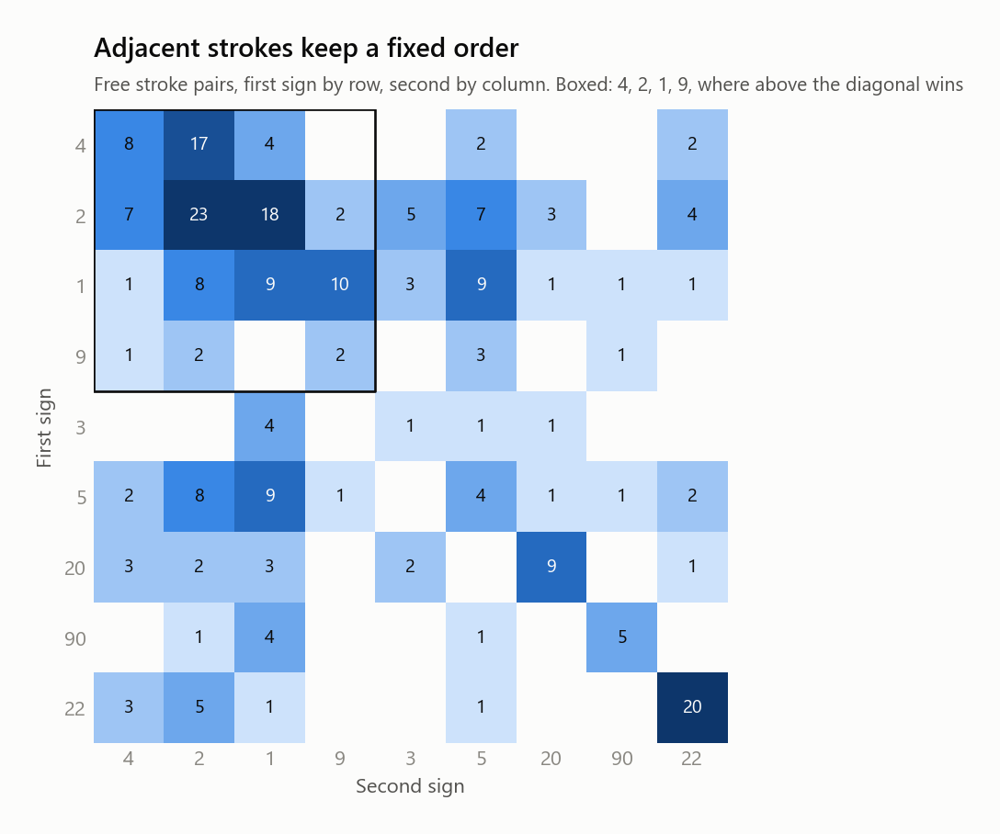

## 19. What it means and what it does not

Nothing here reads a sign. Fish 700 appears five times on Keiti's verso, always inside a formula or a list slot; the verso's commonest signs are strokes, the delimiter, and sign 22, none of them pictures of anything. A rendering into English sentences would be invention.

What the evidence supports is a genre-level and layer-level description. The texts are recited formulaic material: copied sets on H, P, and Q, a condensed copy on K, delimited lists whose items are mostly unique, refrains and alternating series. Within a text, three layers behave differently. The head sign is the open, content-bearing class. The attached component is a small closed class that copyists treated as optional and that carries whatever host selectivity exists. The compound unit is the word-sized thing. This picture is consistent with the mixed logo-syllabic reading most specialists favour, and it argues against both the picture-reading and the pure-cipher framings.

What is probably known already: the families, the 380.1 lists, and the size of Barthel's inventory. What is worth checking against the literature: the negative affix result for free strokes, the fixed stacking order 4, 2, 1, 9, the finding that copies vary in attachments rather than head signs, the word-like statistics of whole units, the result that shape merging alone cannot reach a syllabary-sized inventory, the shuffled-null test showing the Staff's sign-76 triads are a real structure with the shape of the 1886 creation chant while the 380.1 lists are not, the finding that those triads neither chain nor repeat parents nor keep separate slot vocabularies, which the genealogical reading predicts, and the measurement that Metoro's 1873 chant names signs consistently against a shuffled null, with a vocabulary that tracks what the signs depict.

### Open questions and next tests

- **Are units words?** Section 13 compares them with the 1886 recitations: units are shorter than words and the particle layer is thinner, which points to logographic signs with particles either unwritten or carried by attachments. A cleaner and larger Rapa Nui sample would sharpen this.
- **What is the stacking order?** Chains of the small signs in the order 4, 2, 1, 9 could be a numeral system or an affix sequence. Counting how often each chain length occurs, and where in a list entry it falls, would separate the two.
- **What does 380.1 do?** It never repeats and it separates word-length items. Whether its own attachments, 3 on G and K, 52 on N, correlate with the entries around it is testable.
- **Are Keiti's refrains strophic?** The recto refrain on Er1, Er2, Er3, and Er6 and the Ev7 series both look like chant structure. Measuring the distance between refrains against the line lengths of documented Rapa Nui chants is a test that needs no reading.
- **Do compounds decompose?** Section 12 finds no shape evidence that the rare signs are built from the frequent ones, at the resolution a pixel matcher allows. A stroke-graph matcher that compares limb structure rather than ink would be the way to press the question.

## 20. Method, data, reproducibility

The data is the CEIPP numerical transliteration of the whole corpus, Thomas Barthel's numbering as extended by the Cercle d'Études sur l'Île de Pâques et la Polynésie, served at kohaumotu.org, and Barthel's sign catalogue drawings from the same site. Each unit is one compound as Barthel drew it; components are joined by dots, variant letters mark drawn variants, a question mark marks doubt, and 000 marks an illegible sign. Matching throughout strips variant letters and doubt marks, and most comparisons use only the first component so ligature differences do not break a match. Where copies would count the same evidence several times, the H, P, Q group and the G, K pair are down-weighted or reduced to one witness.

### Layout

```
data/html/          raw transliteration pages, one per object (A to Z)
data/corpus.json    parsed corpus: line id -> list of Barthel units
data/signs/         catalogue pages, row GIFs, rows.json (row -> five sign numbers)
docs/img/           line crops from Barthel's tracings used in this README
scripts/            one script per analysis, see below
out/                generated CSV and Markdown reports
```

### Run

Everything, in order, with data fetched on first use:

```bash
pip install -r requirements.txt
python run_all.py            # add --fast to skip the five-minute decomposition test
```

Or step by step:

```bash
python scripts/fetch_corpus.py                 # only to refresh data/html
python scripts/parse_corpus.py
python scripts/alternations.py
python scripts/lists_380.py
python scripts/affix_test.py
python scripts/parallels.py
python scripts/parallels.py --min-run 4 --mismatch 1 --suffix _fuzzy
python scripts/allographs.py
python scripts/parallels.py --merge out/allograph_merge.csv --suffix _merged
python scripts/inventory.py
python scripts/fetch_signs.py
python scripts/sign_shapes.py
python scripts/genre_entropy.py
python scripts/collocations.py
python scripts/decompose.py --tol 1    # about a minute per pass on 16 cores, 5 passes
python scripts/fetch_rapanui.py        # Thomson 1891 OCR text, public domain
python scripts/rapanui.py
python scripts/chant.py
python scripts/staff_chain.py
python scripts/staff_dividers.py
python scripts/fetch_metoro.py         # Metoro's readings, Jaussen 1893, public domain
python scripts/metoro.py
python scripts/charts.py
python scripts/glyphs.py
```

Requires Python 3.10 or later with numpy, scipy, Pillow and matplotlib. The kohaumotu site serves plain http only and its TLS certificate has expired.

| Script | Produces |
|---|---|
| fetch_corpus.py, parse_corpus.py | data/html, data/corpus.json |
| alternations.py | Every alternating series, filler inventories, affix-like against list-like |
| lists_380.py | The 93 list entries, exact and ligature-tolerant clusters, families, entry shape |
| affix_test.py | Host selectivity, enrichment, fused hosts, stacking order |
| parallels.py | Shared runs, blocks, side matrix, families; options for run length, substitutions, merges |
| allographs.py | Substitution pairs, component swaps, merge tables |
| inventory.py | Three inventories with coverage thresholds and Zipf slopes |
| fetch_signs.py, sign_shapes.py | Catalogue drawings, similarity, look-alike classes, contact sheet |
| genre_entropy.py | Vocabulary similarity of sides, clusters, 2-D map coordinates; unigram and conditional entropy per layer |
| collocations.py | Sign pairs and triples scored by log-likelihood ratio and PMI, spread across sides, stroke chains and their hosts |
| decompose.py | Tolerant template decomposition of rare signs into frequent ones, parallel, with random and positive controls; options --tol, --limit, --controls, --basic, --workers |
| fetch_rapanui.py, rapanui.py | Thomson 1891 OCR text; word length, reduplication and frequent-item comparison against rongorongo units |
| chant.py | Entry shape of the 1886 creation chant against the 380.1 lists and the sign-76 segmentation of the Staff, Gv and Ta, with a shuffled null |
| staff_chain.py | Chaining and parent-repetition of sign-76 segments on the Staff, Gv, Ta and in the chant, against shuffled order; slot vocabularies |
| staff_dividers.py | Stretches between the Staff's carved dividers: length, alignment with the 76 triads, openers and closers, cohesion, repeats, against random dividers |
| fetch_metoro.py, metoro.py | Metoro's 1873 readings line by line; word alignment to Barthel's signs, consistency against shuffled line pairing, words per series |
| charts.py | The thirteen charts in docs/img |
| glyphs.py | The labelled glyph strips in docs/img/glyphs, cut from the catalogue drawings |

### How to cite

The repository carries a citation file, so GitHub's "Cite this repository" button gives the reference in APA and BibTeX. Cite the tagged version you used, since the analyses change between versions:

> Rochala, P. (2026). *Structure Without Reading: a reproducible structural analysis of the rongorongo corpus* (Version 1.0.0) [Software and working report]. https://github.com/rochal/rongorongo

```bibtex
@software{rochala2026rongorongo,
  author  = {Rochala, Piotr},
  title   = {Structure Without Reading: a reproducible structural analysis of the rongorongo corpus},
  year    = {2026},
  version = {1.0.0},
  url     = {https://github.com/rochal/rongorongo},
  note    = {Software and working report}
}
```

To cite one result, name the section, for example "section 15, chaining test", and the version. The data behind every figure is in `out/`, and the script that produced it is named in the table above, so a claim can be checked against the exact numbers rather than the prose.

### Licence

The scripts, this README and the generated outputs are under the MIT licence in LICENSE. The downloaded transliteration and sign catalogue are not redistributed here and remain with the CEIPP; the line crops in docs/img are from Barthel's tracings as hosted on Wikimedia Commons, and the small glyph strips in docs/img/glyphs are cut from Barthel's catalogue drawings as reproduced on kohaumotu.org, included as quotations for the purpose of commentary.

### Conventions

Line ids are Barthel's: object letter, side, line (Ev04 = Keiti verso line 4). A unit like `380.001.003` is one compound glyph; `522fy` carries Barthel variant letters; `?` marks an uncertain reading and `000!` an illegible sign. In prose the leading zeros are dropped, so 380.001 is written 380.1.

### Sources

- Barthel, T. S. 1958. *Grundlagen zur Entzifferung der Osterinselschrift.* Hamburg.
- Pozdniakov, K. 1996. Les bases du déchiffrement de l'écriture de l'île de Pâques. *Journal de la Société des Océanistes* 103.
- Horley, P. 2005. Allographic variations and statistical analysis of the rongorongo corpus. *Rapa Nui Journal* 19.
- Fischer, S. R. 1997. *Rongorongo: The Easter Island Script.* Oxford.
- CEIPP transliteration and Barthel sign catalogue: http://kohaumotu.org/rongorongo_org/
- Jaussen, T. 1893. L'île de Pâques: historique, écriture, et répertoire des signes des tablettes ou bois d'hibiscus intelligents. *Bulletin de Géographie Historique et Descriptive.* Public domain; Metoro's readings as transcribed line by line on kohaumotu.org.
- Thomson, W. J. 1891. Te Pito te Henua, or Easter Island. Report of the U.S. National Museum for 1889. Public domain; OCR text from the Internet Archive, item cu31924105726222.
- Barthel tracings: Wikimedia Commons files Barthel_Ev.png, Barthel_Gr.png, Barthel_Hv.png, Barthel_Ra.jpg.
- Provenance and line counts of each object: the Wikipedia articles on the individual rongorongo texts.
